# 基础信息

|      |      |
|------|------|
| 名称 | spring-boot-examples |
| 编码语言 | .java |
| 代码路径 | spring-boot-examples |
| 概述说明 | 基于Spring Boot和React的全栈应用，涵盖课程管理、用户认证、跨域处理、JWT认证、CRUD操作，集成多种技术，提供高效、安全、可扩展的解决方案。 |

# 说明

## 概述

该代码模块是一个基于Spring Boot的全栈应用程序集合，涵盖了多个功能模块，包括课程管理、用户认证、跨域请求处理、JWT认证、CRUD操作等。模块通过集成Spring Boot、React、JPA、Hibernate、H2数据库、Spring Security等技术，提供了高效、安全且易于扩展的解决方案。每个子模块都专注于特定的业务场景，如课程资源管理、用户登录注销、跨域数据获取等，展示了如何构建现代Web应用的核心功能。

此外，模块还包含多个基于Spring Boot的REST服务示例，展示了如何实现API版本控制、动态过滤、异常处理、单元测试和集成测试等功能。模块通过分层设计和模块化开发，确保了代码的可维护性、可扩展性和灵活性。Spring Boot的自动配置和依赖注入机制贯穿整个模块，简化了开发流程，同时提供了强大的调试和监控能力。

## 主要业务场景

1. **课程管理**：
   - **获取课程信息**：通过控制器接口，用户可以查询特定课程或所有课程的详细信息。
   - **创建新课程**：接收课程数据并将其存储到数据库中。
   - **更新课程内容**：允许用户修改现有课程的信息并保存更改。
   - **删除课程**：从数据库中移除不再需要的课程。
   - **课程列表管理**：通过硬编码或数据库提供课程列表，支持用户获取和展示课程信息。

2. **用户认证**：
   - **登录与注销**：支持用户登录和注销操作，确保只有经过认证的用户可以访问受保护的资源。
   - **JWT认证**：通过JWT令牌进行用户身份验证，确保令牌的安全性和有效性。
   - **HTTP基本认证**：采用HTTP基本认证方式，确保用户身份验证的安全性。

3. **跨域请求处理**：
   - **跨域资源共享（CORS）**：允许前端应用从不同域请求后端数据，确保前后端数据交互的顺畅。
   - **跨站请求伪造（CSRF）保护**：通过Spring Security配置，禁用或启用CSRF保护，确保系统安全性。

4. **数据持久化**：
   - **数据库交互**：通过JPA和Hibernate进行数据库操作，确保数据的持久化存储和检索。
   - **H2数据库**：在开发和测试环境中使用H2数据库，简化数据库配置和管理流程。

5. **CRUD操作**：
   - **课程信息的增删改查**：提供对课程数据的CRUD操作，使用户能够方便地管理课程信息。

6. **跨域数据传输**：
   - **跨域控制器配置**：允许前端应用在不同端口下访问后端接口，确保前后端分离架构的兼容性和灵活性。

7. **学生信息管理**：
   - **学生信息的增删改查**：通过学生资源控制器，用户可以查询、创建、更新和删除学生信息。
   - **异常处理**：当系统未找到指定学生时，抛出`StudentNotFoundException`异常，确保系统的健壮性和可维护性。
   - **数据验证**：`Student`类包含验证方法，确保学生属性的有效性和完整性。

8. **API版本控制**：
   - **路径版本控制**：通过URL路径来区分不同版本的API。
   - **参数版本控制**：通过查询参数来区分不同版本的API。
   - **请求头版本控制**：通过请求头信息来区分不同版本的API。
   - **内容类型版本控制**：通过请求的内容类型来区分不同版本的API。

9. **动态过滤**：
   - **数据过滤**：通过`FilteringController`处理GET请求，实现对`Bean`或`Bean`列表的动态过滤，仅返回客户端请求的特定字段。

10. **单元测试和集成测试**：
    - **测试覆盖**：模块通过单元测试和集成测试，确保学生和课程管理的业务逻辑正确性，验证REST API的响应和行为符合预期。

11. **SOAP Web服务**：
    - **学生信息查询**：通过`StudentDetailsEndpoint`类，模块提供学生信息的查询服务，允许用户通过SOAP协议获取特定学生的基本身份信息。

12. **微服务管理**：
    - **货币兑换请求处理**：通过`ForexController`类处理与外汇兑换相关的请求，获取最新的货币兑换数据。
    - **服务发现与管理**：通过Eureka服务注册中心，实现微服务架构中的服务注册与发现功能。

通过这些功能模块，该代码集合为开发者提供了一个完整的全栈应用示例，展示了如何构建高效、安全且易于扩展的现代Web应用。

### 包内部结构视图

```mermaid
graph TD
    spring-boot-examples --> spring-boot-react-examples
    spring-boot-examples --> spring-boot-tutorial-basics-configuration
    spring-boot-examples --> spring-boot-2-rest-service-basic
    spring-boot-examples --> spring-boot-2-rest-service-filtering
    spring-boot-examples --> spring-boot-2-myBatis-with-h2
    spring-boot-examples --> spring-boot-web-application-bootstrap-jquery
    spring-boot-examples --> spring-boot-rest-services
    spring-boot-examples --> spring-boot-2-jdbc-with-h2
    spring-boot-examples --> spring-boot-2-rest-service-validation
    spring-boot-examples --> spring-boot-2-rest-service-versioning
    spring-boot-examples --> spring-boot-2-jpa-spring-data-rest
    spring-boot-examples --> spring-boot-basic-microservice
    spring-boot-examples --> spring-boot-web-application
    spring-boot-examples --> spring-boot-kotlin-basics-configuration
    spring-boot-examples --> spring-boot-tutorial-basics
    spring-boot-examples --> spring-boot-2-rest-service-content-negotiation
    spring-boot-examples --> spring-boot-tutorial-soap-web-services
    spring-boot-examples --> spring-boot-2-rest-service-with-swagger
    spring-boot-examples --> spring-boot-2-rest-service-exception-handling
    spring-boot-examples --> spring-boot-rest-services-with-unit-and-integration-tests
    spring-boot-examples --> spring-boot-2-jpa-with-hibernate-and-h2
    spring-boot-examples --> spring-boot-2-rest-service-with-hateoas
```

该流程图展示了`spring-boot-examples`目录下的所有子项目及其层级关系。每个子项目都是`spring-boot-examples`的直接子节点，涵盖了从基础配置到高级功能的多种Spring Boot示例项目。这些项目包括REST服务、微服务、Web应用、数据库集成等，展示了Spring Boot在不同场景下的应用。

# 文件列表 File List

| 名称   | 类型  | 说明 |
|-------|------|-------------|
| [spring-boot-basic-microservice](spring-boot-basic-microservice/spring-boot-microservice-eureka-naming-server/src/main/java/com/_module.md) | folder | Spring Boot微服务处理外汇业务，支持货币兑换、服务发现和动态调用。 |
| [spring-boot-2-jpa-spring-data-rest](spring-boot-2-jpa-spring-data-rest/src/main/java/com/_module.md) | folder | Spring Boot通过JPA和Spring Data REST实现学生数据持久化及RESTful API自动生成。 |
| [spring-boot-2-jdbc-with-h2](spring-boot-2-jdbc-with-h2/src/main/java/com/_module.md) | folder | Spring Boot与JDBC实现学生数据管理，支持增删改查，使用H2数据库确保高效交互。 |
| [spring-boot-2-rest-service-versioning](spring-boot-2-rest-service-versioning/src/main/java/com/_module.md) | folder | Spring Boot示例展示API版本控制，支持路径、参数、请求头和内容类型策略，管理学生信息，提升灵活性与可维护性。 |
| [spring-boot-2-rest-service-validation](spring-boot-2-rest-service-validation/src/main/java/com/_module.md) | folder | Spring Boot学生信息管理系统，支持增删改查，包含异常处理和数据验证。 |
| [spring-boot-2-rest-service-with-hateoas](spring-boot-2-rest-service-with-hateoas/src/main/java/com/_module.md) | folder | Spring Boot 2 RESTful服务示例，管理学生信息，支持增删改查和异常处理。 |
| [spring-boot-2-jpa-with-hibernate-and-h2](spring-boot-2-jpa-with-hibernate-and-h2/src/main/java/com/_module.md) | folder | Spring Boot应用结合JPA和H2数据库，实现学生数据的增删改查操作。 |
| [spring-boot-rest-services-with-unit-and-integration-tests](spring-boot-rest-services-with-unit-and-integration-tests/src/main/java/com/_module.md) | folder | Spring Boot REST服务示例，包含学生和课程管理，支持增删改查操作，并通过单元和集成测试确保服务正确性。 |
| [spring-boot-tutorial-basics](spring-boot-tutorial-basics/src/main/java/com/_module.md) | folder | Spring Boot自动扫描加载Bean，打印名称便于调试。支持Java和XML配置，实现灵活管理。分层设计分离业务与数据，AOP增强功能。数据获取与处理模块化，提升效率。学生信息管理系统处理HTTP请求与数据持久化。 |
| [spring-boot-2-rest-service-exception-handling](spring-boot-2-rest-service-exception-handling/src/main/java/com/_module.md) | folder | Spring Boot学生管理系统，支持增删改查，集成异常处理，确保系统稳定。 |
| [spring-boot-2-rest-service-with-swagger](spring-boot-2-rest-service-with-swagger/src/main/java/com/_module.md) | folder | 基于Spring Boot 2的REST服务，管理学生信息，集成Swagger生成API文档。 |
| [spring-boot-tutorial-soap-web-services](spring-boot-tutorial-soap-web-services/src/main/java/com/_module.md) | folder | Spring Boot SOAP Web服务模块，管理学生信息，支持查询、存储和响应。 |
| [spring-boot-2-rest-service-content-negotiation](spring-boot-2-rest-service-content-negotiation/src/main/java/com/_module.md) | folder | Spring Boot学生信息管理系统，支持增删改查，具备异常处理和数据访问功能。 |
| [spring-boot-web-application](spring-boot-web-application/src/main/java/com/_module.md) | folder | Spring Boot应用管理学生和课程信息，包含模型、控制器、服务和安全配置。 |
| [spring-boot-rest-services](spring-boot-rest-services/src/main/java/com/_module.md) | folder | Spring Boot项目包含欢迎控制器、学生管理、课程管理、配置管理、安全控制等核心功能模块。 |
| [spring-boot-web-application-bootstrap-jquery](spring-boot-web-application-bootstrap-jquery/src/main/java/com/_module.md) | folder | 欢迎控制器处理"/welcome"请求，返回"welcome"字符串。Spring Boot应用集成Bootstrap和jQuery，提升前端开发效率。 |
| [spring-boot-2-myBatis-with-h2](spring-boot-2-myBatis-with-h2/src/main/java/com/_module.md) | folder | Spring Boot集成MyBatis操作H2数据库，实现学生数据增删改查，自动记录日志，适用于快速开发和测试。 |
| [spring-boot-2-rest-service-filtering](spring-boot-2-rest-service-filtering/src/main/java/com/_module.md) | folder | Spring Boot REST服务示例，支持动态过滤和学生信息管理，提升数据检索效率与系统性能。 |
| [spring-boot-2-rest-service-basic](spring-boot-2-rest-service-basic/src/main/java/com/_module.md) | folder | Spring Boot RESTful服务，管理学生信息，支持CRUD操作和自定义异常处理。 |
| [spring-boot-tutorial-basics-configuration](spring-boot-tutorial-basics-configuration/src/main/java/com/_module.md) | folder | 欢迎资源控制器处理欢迎信息和动态配置，BasicConfiguration类管理多种属性，Spring Boot示例展示环境配置。 |
| [spring-boot-react-examples](spring-boot-react-examples/spring-boot-react-jpa-hibernate-with-h2-full-stack/backend-spring-boot-react-jpa-hibernate-with-h2-full-stack/src/main/java/com/_module.md) | folder | 基于Spring Boot和React的全栈应用，涵盖课程管理、JWT认证、跨域请求、用户登录注销等功能。 |

