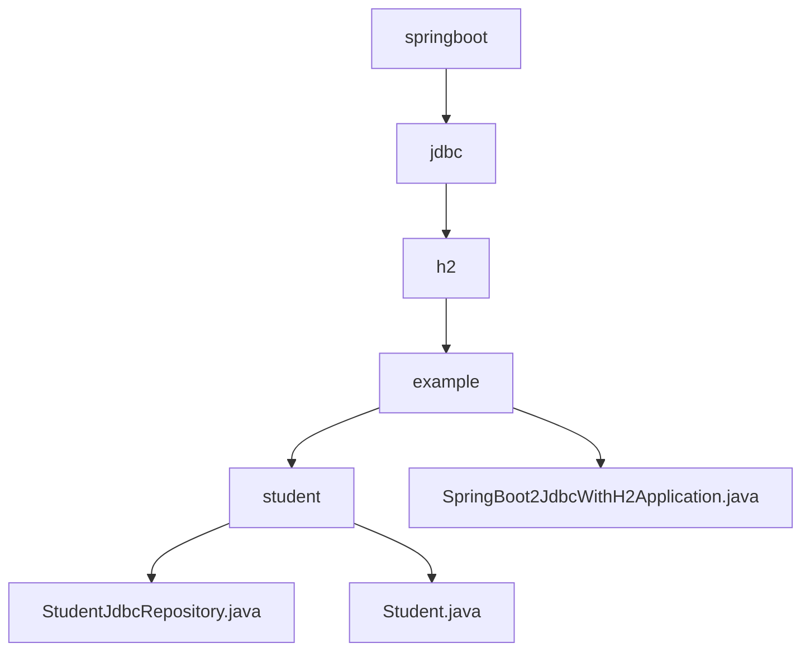

# 基础信息

|      |      |
|------|------|
| 名称 | springboot |
| 编码语言 | .java |
| 代码路径 | spring-boot-examples/spring-boot-2-jdbc-with-h2/src/main/java/com/in28minutes/springboot |
| 包名 | spring-boot-examples.spring-boot-2-jdbc-with-h2.src.main.java.com.in28minutes.springboot |
| 概述说明 | Spring Boot与JDBC实现学生数据管理，支持增删改查，使用H2数据库确保高效交互。 |

# 说明

## 概述
该代码模块实现了一个基于Spring Boot和JDBC的学生数据管理系统。模块的核心功能包括对学生数据的查询、插入、更新和删除操作，通过使用`JdbcTemplate`来实现与H2数据库的高效交互。模块中包含两个主要类：`StudentJdbcRepository`和`Student`。`StudentJdbcRepository`类负责处理数据库操作，而`Student`类则用于表示学生数据的基本结构。Spring Boot的自动配置简化了数据库连接的配置和管理，使得开发者能够便捷地实现对数据库的基本操作，确保数据的一致性和完整性，同时提升应用的开发效率和性能。

## 主要业务场景
1. **学生数据管理**：模块适用于需要频繁进行学生数据操作的场景，如学生信息管理系统。通过`StudentJdbcRepository`类，可以方便地执行对学生数据的增删改查操作，确保数据的一致性和准确性。
2. **数据库交互**：模块利用`JdbcTemplate`与H2数据库进行交互，适用于需要轻量级数据库解决方案的应用场景。H2数据库作为轻量级的内存数据库，提供了快速的数据访问和测试环境。
3. **对象属性操作**：`Student`类提供了学生数据的基本结构，并通过构造方法和getter/setter方法，使得外部代码可以方便地创建和操作学生对象。

### 包内部结构视图

该流程图展示了Spring Boot项目中JDBC与H2数据库集成的文件层级结构。从`springboot`目录开始，逐步深入到`jdbc`、`h2`、`example`和`student`子目录，最终显示了`StudentJdbcRepository.java`、`Student.java`和`SpringBoot2JdbcWithH2Application.java`文件。每个节点仅显示路径的最后一级元素，清晰地反映了文件之间的层级关系。

# 文件列表 File List

| 名称   | 类型  | 说明 |
|-------|------|-------------|
| [jdbc](jdbc/_module.md) | package | Spring Boot与JDBC实现学生数据管理，支持增删改查，使用H2数据库确保高效交互。 |

