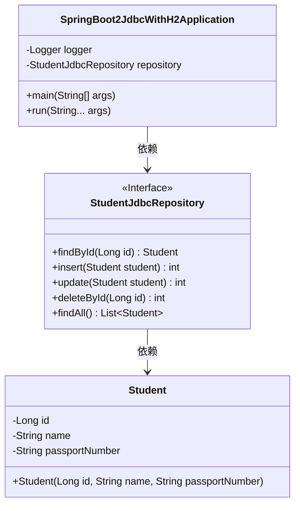
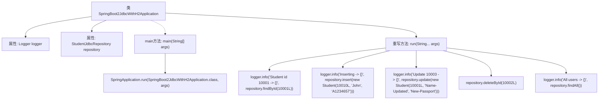

# 基础信息

|      |      |
|------|------|
| 名称 | SpringBoot2JdbcWithH2Application |
| 编码语言 | .java |
| 代码路径 | spring-boot-examples/spring-boot-2-jdbc-with-h2/src/main/java/com/in28minutes/springboot/jdbc/h2/example/SpringBoot2JdbcWithH2Application.java |
| 包名 | com.in28minutes.springboot.jdbc.h2.example |
| 依赖项 | ['com.in28minutes.springboot.jdbc.h2.example.student.Student', 'com.in28minutes.springboot.jdbc.h2.example.student.StudentJdbcRepository', 'org.slf4j.Logger', 'org.slf4j.LoggerFactory', 'org.springframework.beans.factory.annotation.Autowired', 'org.springframework.boot.CommandLineRunner', 'org.springframework.boot.SpringApplication', 'org.springframework.boot.autoconfigure.SpringBootApplication'] |
| 概述说明 | Spring Boot应用通过JDBC操作H2数据库，支持增删改查。 |

# 说明

Spring Boot应用通过JDBC与H2数据库进行交互，实现了对数据的增删改查操作。该应用利用Spring Boot的简化配置和开发特性，结合JDBC技术，高效地管理数据库连接和数据操作。H2数据库作为轻量级的内存数据库，提供了快速的数据访问和测试环境。通过这种方式，开发者能够便捷地实现对数据库的基本操作，确保数据的一致性和完整性，同时提升应用的开发效率和性能。

# 类列表 Class Summary

| 名称   | 类型  | 说明 |
|-------|------|-------------|
| SpringBoot2JdbcWithH2Application | class | Spring Boot应用，使用JDBC与H2数据库交互，实现增删改查操作。 |

## 类 SpringBoot2JdbcWithH2Application

|      |      |
|------|------|
| 访问范围 | @SpringBootApplication;public |
| 类型 | class |
| 名称 | SpringBoot2JdbcWithH2Application |
| 说明 | Spring Boot应用，使用JDBC与H2数据库交互，实现增删改查操作。 |

### UML类图

这段代码是一个Spring Boot应用程序的启动类，实现了`CommandLineRunner`接口，用于在应用启动后执行一些初始化操作。`SpringBoot2JdbcWithH2Application`类依赖于`StudentJdbcRepository`接口，该接口定义了对`Student`实体的数据库操作。`Student`类表示学生实体，包含学生的ID、姓名和护照号。`SpringBoot2JdbcWithH2Application`类在`run`方法中通过`StudentJdbcRepository`接口执行了查找、插入、更新和删除操作，并记录日志。

### 内部方法调用关系图

这段代码是一个Spring Boot应用程序的入口类，实现了`CommandLineRunner`接口。`main`方法启动Spring Boot应用程序，而`run`方法在应用程序启动后执行一系列数据库操作，包括查找、插入、更新和删除学生记录，并记录操作结果。`StudentJdbcRepository`负责与数据库交互，`Logger`用于记录操作日志。

### 字段列表 Field List

| 名称  | 类型  | 说明 |
|-------|-------|------|
| repository | StudentJdbcRepository | 自动装配StudentJdbcRepository实例。 |
| logger = LoggerFactory.getLogger(this.getClass()) | Logger | 私有日志记录器实例化并绑定当前类。 |

### 方法列表 Method List

| 名称  | 类型  | 说明 |
|-------|-------|------|
| run | void | 执行学生数据操作：查询、插入、更新、删除及查询所有记录。 |
| main | void | Spring Boot 应用启动主类，运行Spring Boot 2与H2数据库集成。 |

