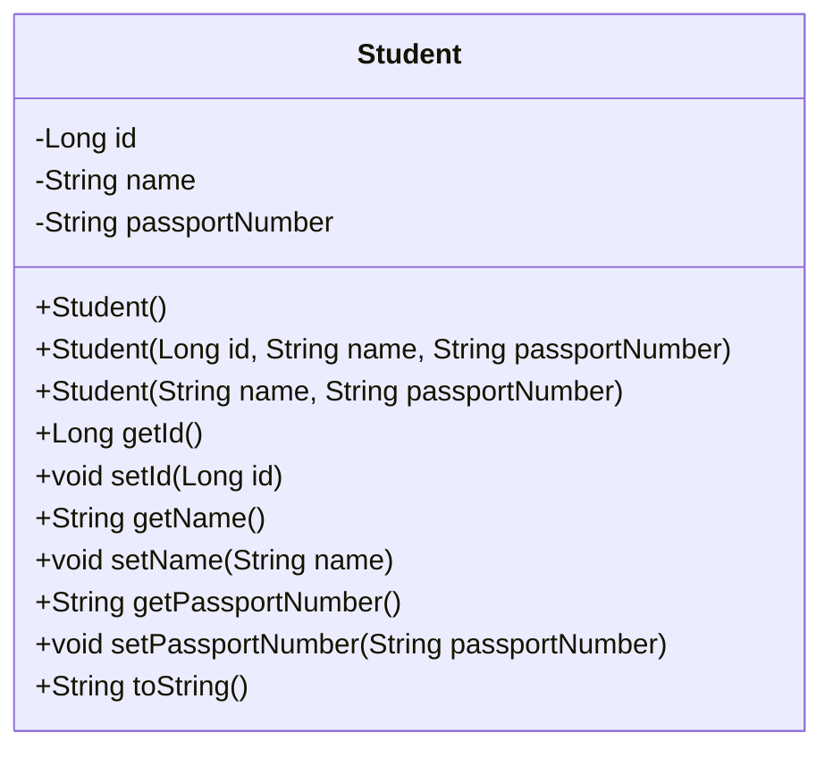

# 基础信息

|      |      |
|------|------|
| 名称 | Student |
| 编码语言 | .java |
| 代码路径 | spring-boot-examples/spring-boot-2-jdbc-with-h2/src/main/java/com/in28minutes/springboot/jdbc/h2/example/student/Student.java |
| 包名 | com.in28minutes.springboot.jdbc.h2.example.student |
| 依赖项 | [] |
| 概述说明 | Student类包含id、name、passportNumber属性，提供构造和getter/setter方法。 |

# 说明

Student类是一个包含三个主要属性的类，分别是id、name和passportNumber。该类提供了构造方法，用于在创建对象时初始化这些属性。此外，Student类还提供了getter和setter方法，用于获取和设置这些属性的值。这些方法使得外部代码可以方便地访问和修改Student对象的属性。

# 类列表 Class Summary

| 名称   | 类型  | 说明 |
|-------|------|-------------|
| Student | class | Student类包含id、name、passportNumber属性，提供构造方法和getter/setter方法。 |

## 类 Student

|      |      |
|------|------|
| 访问范围 | public |
| 类型 | class |
| 名称 | Student |
| 说明 | Student类包含id、name、passportNumber属性，提供构造方法和getter/setter方法。 |

### UML类图

这段代码定义了一个`Student`类，该类包含三个私有属性：`id`、`name`和`passportNumber`。类中提供了三个构造函数，分别用于无参初始化、带所有参数的初始化以及不带`id`的初始化。此外，类中还提供了这些属性的getter和setter方法，以及一个`toString`方法用于返回对象的字符串表示。这个类主要用于表示学生信息，包含学生的唯一标识、姓名和护照号码。

### 内部方法调用关系图

```mermaid
graph TD
    A["类Student"]
    B["属性: Long id"]
    C["属性: String name"]
    D["属性: String passportNumber"]
    E["构造方法: Student()"]
    F["构造方法: Student(Long id, String name, String passportNumber)"]
    G["构造方法: Student(String name, String passportNumber)"]
    H["方法: Long getId()"]
    I["方法: void setId(Long id)"]
    J["方法: String getName()"]
    K["方法: void setName(String name)"]
    L["方法: String getPassportNumber()"]
    M["方法: void setPassportNumber(String passportNumber)"]
    N["重写方法: String toString()"]

    A --> B
    A --> C
    A --> D
    A --> E
    A --> F
    A --> G
    A --> H
    A --> I
    A --> J
    A --> K
    A --> L
    A --> M
    A --> N
```

这段代码定义了一个名为`Student`的类，包含了三个属性：`id`、`name`和`passportNumber`。类中提供了三个构造方法，分别用于无参初始化、全参数初始化和部分参数初始化。此外，类中还提供了获取和设置这些属性的方法，并重写了`toString`方法以格式化输出学生信息。流程图展示了类的结构及其内部方法的调用关系。

### 字段列表 Field List

| 名称  | 类型  | 说明 |
|-------|-------|------|
| passportNumber | String | 私有字符串变量存储护照号码。 |
| id | Long | 定义了一个名为id的长整型私有变量。 |
| name | String | 定义了一个私有的字符串类型变量name。 |

### 方法列表 Method List

| 名称  | 类型  | 说明 |
|-------|-------|------|
| getPassportNumber | String | 获取护照号码的方法。 |
| setName | void | 定义方法设置名称属性。 |
| setId | void | 该方法用于设置对象的ID属性。 |
| getName | String | 该方法返回字符串类型的name属性值。 |
| getId | Long | 获取对象ID的方法。 |
| toString | String | 重写toString方法，返回学生ID、姓名和护照号。 |
| setPassportNumber | void | 设置护照号码的方法，将传入值赋给实例变量。 |

