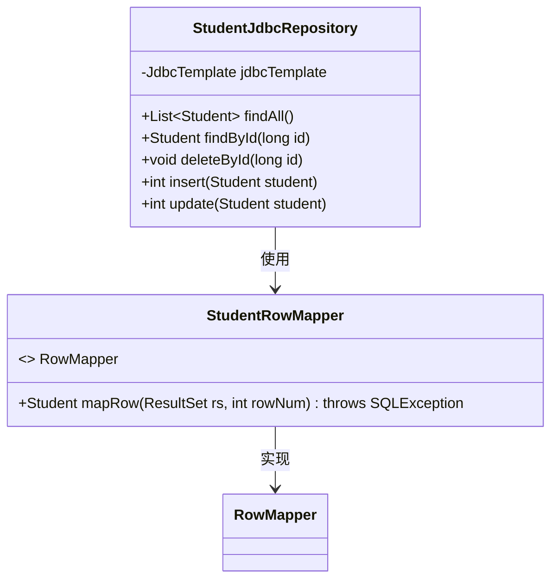
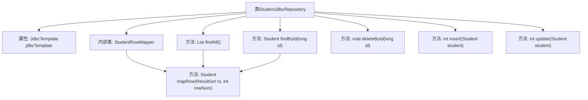

# 基础信息

|      |      |
|------|------|
| 名称 | StudentJdbcRepository |
| 编码语言 | .java |
| 代码路径 | spring-boot-examples/spring-boot-2-jdbc-with-h2/src/main/java/com/in28minutes/springboot/jdbc/h2/example/student/StudentJdbcRepository.java |
| 包名 | com.in28minutes.springboot.jdbc.h2.example.student |
| 依赖项 | ['java.sql.ResultSet', 'java.sql.SQLException', 'java.util.List', 'org.springframework.beans.factory.annotation.Autowired', 'org.springframework.jdbc.core.BeanPropertyRowMapper', 'org.springframework.jdbc.core.JdbcTemplate', 'org.springframework.jdbc.core.RowMapper', 'org.springframework.stereotype.Repository'] |
| 概述说明 | StudentJdbcRepository类利用JdbcTemplate实现学生数据的增删改查操作。 |

# 说明

StudentJdbcRepository类利用JdbcTemplate实现了对学生数据的全面操作，涵盖了查询、插入、更新和删除等核心功能。通过JdbcTemplate，该类能够高效地执行数据库交互，确保数据的准确性和一致性。这一设计使得学生数据的管理更加便捷和可靠，适用于需要频繁进行数据库操作的应用场景。

# 类列表 Class Summary

| 名称   | 类型  | 说明 |
|-------|------|-------------|
| StudentJdbcRepository | class | StudentJdbcRepository类使用JdbcTemplate进行学生数据操作，包括查询、插入、更新和删除。 |

## 类 StudentJdbcRepository

|      |      |
|------|------|
| 访问范围 | @Repository;public |
| 类型 | class |
| 名称 | StudentJdbcRepository |
| 说明 | StudentJdbcRepository类使用JdbcTemplate进行学生数据操作，包括查询、插入、更新和删除。 |

### UML类图

这段代码定义了一个 `StudentJdbcRepository` 类，用于通过 JDBC 模板操作数据库中的学生数据。类中包含了对学生表的增删改查操作，并使用了 `StudentRowMapper` 类来映射查询结果到 `Student` 对象。`StudentRowMapper` 实现了 `RowMapper` 接口，用于将数据库记录转换为 `Student` 对象。代码通过依赖注入的方式使用 `JdbcTemplate` 来执行 SQL 语句，实现了对数据库的访问和操作。

### 内部方法调用关系图

该流程图展示了`StudentJdbcRepository`类的结构及其内部方法之间的调用关系。类中包含一个`JdbcTemplate`属性和一个内部类`StudentRowMapper`，后者实现了`RowMapper`接口并重写了`mapRow`方法。类中的`findAll`、`findById`、`deleteById`、`insert`和`update`方法分别用于执行不同的数据库操作，其中`findAll`和`findById`方法调用了`mapRow`方法来进行结果集映射。

### 字段列表 Field List

| 名称  | 类型  | 说明 |
|-------|-------|------|
| jdbcTemplate | JdbcTemplate | 自动注入JdbcTemplate实例。 |

### 方法列表 Method List

| 名称  | 类型  | 说明 |
|-------|-------|------|
| deleteById | void | 该方法通过JDBC模板删除指定ID的学生记录。 |
| insert | int | 插入学生数据到数据库，返回更新行数。 |
| findById | Student | 通过ID查询学生信息并返回Student对象。 |
| findAll | List<Student> | 该方法查询并返回所有学生信息。 |
| update | int | 该方法通过JDBC模板更新学生信息，包括姓名和护照号，根据ID定位。 |

