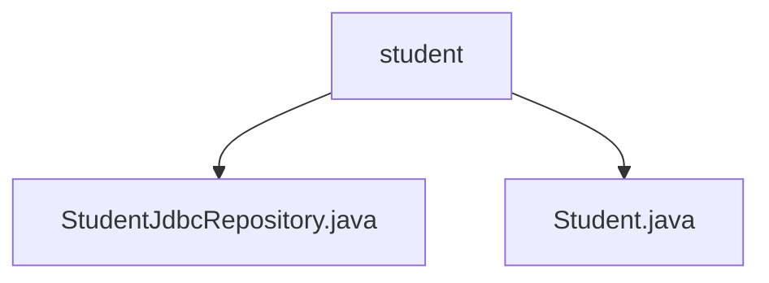

# 基础信息

|      |      |
|------|------|
| 名称 | student |
| 编码语言 | .java |
| 代码路径 | spring-boot-examples/spring-boot-2-jdbc-with-h2/src/main/java/com/in28minutes/springboot/jdbc/h2/example/student |
| 包名 | spring-boot-examples.spring-boot-2-jdbc-with-h2.src.main.java.com.in28minutes.springboot.jdbc.h2.example.student |
| 概述说明 | StudentJdbcRepository类通过JdbcTemplate实现学生数据操作，Student类包含id、name和passportNumber属性及其访问方法。 |

# 说明

## 概述
该代码模块主要实现了一个基于Spring Boot和JDBC的学生数据管理系统。模块的核心功能包括对学生数据的查询、插入、更新和删除操作，通过使用`JdbcTemplate`来实现与H2数据库的高效交互。模块中包含两个主要类：`StudentJdbcRepository`和`Student`。`StudentJdbcRepository`类负责处理数据库操作，而`Student`类则用于表示学生数据的基本结构。

## 主要业务场景
1. **学生数据管理**：模块适用于需要频繁进行学生数据操作的场景，如学生信息管理系统。通过`StudentJdbcRepository`类，可以方便地执行对学生数据的增删改查操作，确保数据的一致性和准确性。
2. **数据库交互**：模块利用`JdbcTemplate`与H2数据库进行交互，适用于需要轻量级数据库解决方案的应用场景。通过Spring Boot的自动配置，简化了数据库连接的配置和管理。
3. **对象属性操作**：`Student`类提供了学生数据的基本结构，并通过构造方法和getter/setter方法，使得外部代码可以方便地创建和操作学生对象。

### 包内部结构视图

该流程图展示了`student`文件夹与其内部文件之间的层级关系。`student`文件夹包含两个文件：`StudentJdbcRepository.java`和`Student.java`。这两个文件直接位于`student`文件夹下，没有进一步的子文件夹结构。这种简单的层级关系反映了项目中的文件组织方式，便于开发者快速定位和管理相关代码文件。

# 文件列表 File List

| 名称   | 类型  | 说明 |
|-------|------|-------------|
| [Student.java](Student.md) | file | Student类包含id、name、passportNumber属性，提供构造和getter/setter方法。 |
| [StudentJdbcRepository.java](StudentJdbcRepository.md) | file | StudentJdbcRepository类利用JdbcTemplate实现学生数据的增删改查操作。 |

