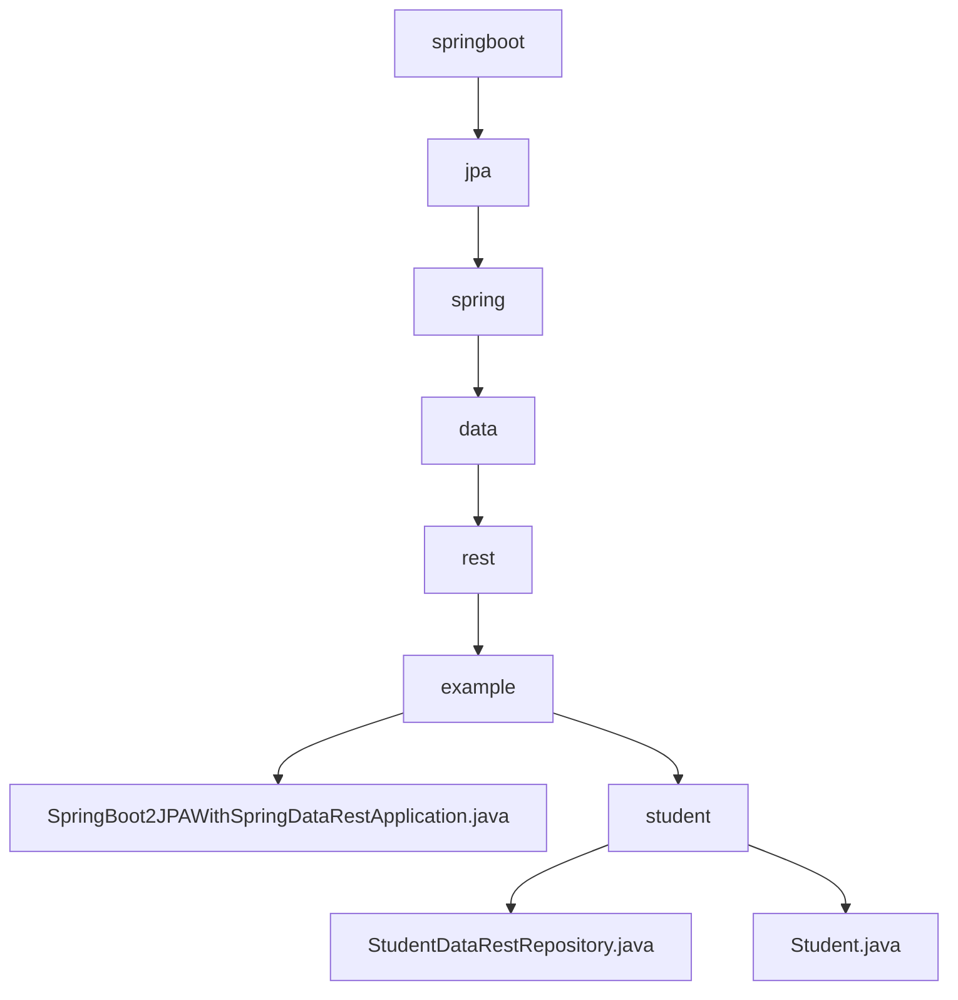

# 基础信息

|      |      |
|------|------|
| 名称 | springboot |
| 编码语言 | .java |
| 代码路径 | spring-boot-examples/spring-boot-2-jpa-spring-data-rest/src/main/java/com/in28minutes/springboot |
| 包名 | spring-boot-examples.spring-boot-2-jpa-spring-data-rest.src.main.java.com.in28minutes.springboot |
| 概述说明 | Spring Boot通过JPA和Spring Data REST实现学生数据持久化及RESTful API自动生成。 |

# 说明

## 概述
该代码模块是一个基于Spring Boot和JPA的Spring Data REST示例项目，主要用于管理学生的基本信息。模块通过定义`Student`实体类和`StudentDataRestRepository`接口，实现了对学生数据的持久化操作和RESTful API的暴露。整体架构遵循Spring Boot的约定优于配置原则，减少了手动配置的工作量。

## 主要业务场景
1. **学生信息管理**：通过`Student`类封装学生的基本信息，包括ID、姓名和护照号。该类提供了构造方法和访问器方法，确保数据的完整性和安全性。
2. **数据持久化**：通过`StudentDataRestRepository`接口，利用Spring Data JPA提供的功能，实现对`Student`实体的增删改查操作。
3. **RESTful API**：Spring Data REST自动生成基于`StudentDataRestRepository`的RESTful API，允许客户端通过HTTP请求访问和操作学生数据。

### 包内部结构视图

该流程图展示了Spring Boot项目中JPA与Spring Data REST的模块层级关系。从`springboot`开始，依次经过`jpa`、`spring`、`data`、`rest`，最终到达`example`模块。`example`模块下包含主应用类`SpringBoot2JPAWithSpringDataRestApplication.java`和`student`子模块，`student`模块下包含`StudentDataRestRepository.java`和`Student.java`两个文件。

# 文件列表 File List

| 名称   | 类型  | 说明 |
|-------|------|-------------|
| [jpa](jpa/_module.md) | package | Spring Boot通过JPA和Spring Data REST实现学生数据持久化及RESTful API自动生成。 |

