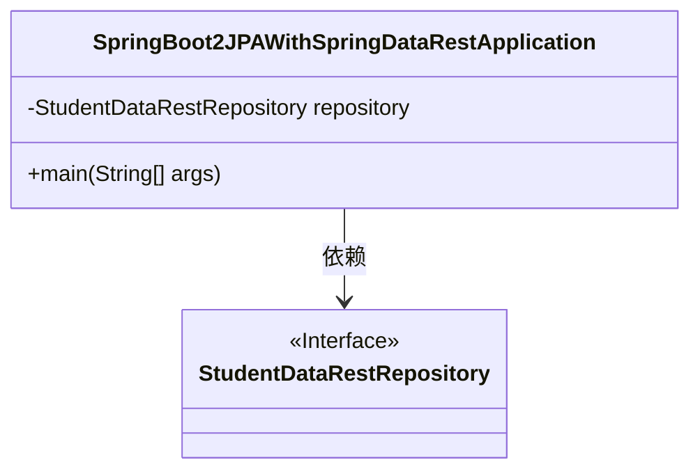
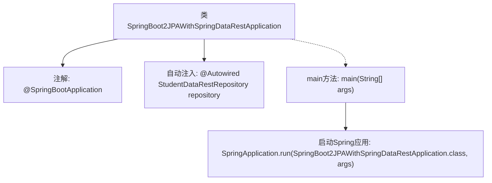

# 基础信息

|      |      |
|------|------|
| 名称 | SpringBoot2JPAWithSpringDataRestApplication |
| 编码语言 | .java |
| 代码路径 | spring-boot-examples/spring-boot-2-jpa-spring-data-rest/src/main/java/com/in28minutes/springboot/jpa/spring/data/rest/example/SpringBoot2JPAWithSpringDataRestApplication.java |
| 包名 | com.in28minutes.springboot.jpa.spring.data.rest.example |
| 依赖项 | ['org.springframework.beans.factory.annotation.Autowired', 'org.springframework.boot.SpringApplication', 'org.springframework.boot.autoconfigure.SpringBootApplication', 'com.in28minutes.springboot.jpa.spring.data.rest.example.student.StudentDataRestRepository'] |
| 概述说明 | Spring Boot应用集成JPA与Spring Data REST，自动注入学生数据仓库。 |

# 说明

Spring Boot应用通过JPA（Java Persistence API）和Spring Data REST实现数据持久化和RESTful API的自动生成。该应用利用Spring Data JPA的自动注入功能，将学生数据仓库（Repository）集成到系统中，简化了数据访问层的开发。JPA负责实体与数据库的映射，而Spring Data REST则自动暴露CRUD操作的REST端点，提升了开发效率。整体架构遵循Spring Boot的约定优于配置原则，减少了手动配置的工作量。

# 类列表 Class Summary

| 名称   | 类型  | 说明 |
|-------|------|-------------|
| SpringBoot2JPAWithSpringDataRestApplication | class | Spring Boot应用，使用JPA和Spring Data REST，自动注入学生数据仓库。 |

## 类 SpringBoot2JPAWithSpringDataRestApplication

|      |      |
|------|------|
| 访问范围 | @SpringBootApplication;public |
| 类型 | class |
| 名称 | SpringBoot2JPAWithSpringDataRestApplication |
| 说明 | Spring Boot应用，使用JPA和Spring Data REST，自动注入学生数据仓库。 |

### UML类图

**描述：**
`SpringBoot2JPAWithSpringDataRestApplication` 是一个Spring Boot应用程序类，通过 `@SpringBootApplication` 注解标记为Spring Boot应用的入口。该类依赖于 `StudentDataRestRepository` 接口，该接口用于处理与学生数据相关的数据库操作。`main` 方法是应用的启动入口，通过 `SpringApplication.run` 方法启动应用。

### 内部方法调用关系图

这段代码是一个Spring Boot应用程序的入口类，使用`@SpringBootApplication`注解标记，表示这是一个Spring Boot应用。类中通过`@Autowired`注解自动注入了一个`StudentDataRestRepository`实例。`main`方法中调用了`SpringApplication.run`来启动Spring应用，传入当前类和命令行参数。该代码主要用于启动Spring Boot应用并初始化数据仓库。

### 字段列表 Field List

| 名称  | 类型  | 说明 |
|-------|-------|------|
| repository | StudentDataRestRepository | 自动注入学生数据仓库实例。 |

### 方法列表 Method List

| 名称  | 类型  | 说明 |
|-------|-------|------|
| main | void | Spring Boot应用启动主类，运行Spring Data REST示例。 |

