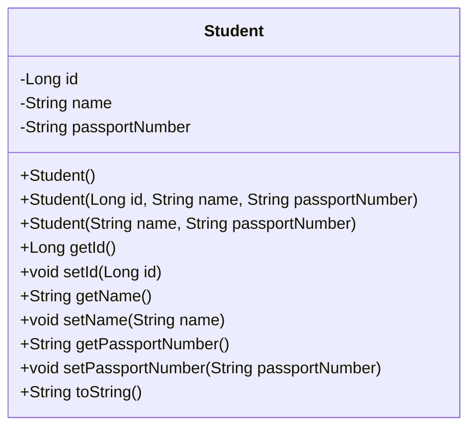

# 基础信息

|      |      |
|------|------|
| 名称 | Student |
| 编码语言 | .java |
| 代码路径 | spring-boot-examples/spring-boot-2-jpa-spring-data-rest/src/main/java/com/in28minutes/springboot/jpa/spring/data/rest/example/student/Student.java |
| 包名 | com.in28minutes.springboot.jpa.spring.data.rest.example.student |
| 依赖项 | ['jakarta.persistence.Entity', 'jakarta.persistence.GeneratedValue', 'jakarta.persistence.Id'] |
| 概述说明 | Java类Student包含ID、姓名、护照号属性，提供构造方法和访问器。 |

# 说明

Java类Student定义了三个属性：ID、姓名和护照号。该类提供了构造方法，用于初始化这些属性，并包含了访问器方法，以便外部代码能够获取和修改这些属性的值。这个类的主要功能是封装学生的基本信息，确保数据的完整性和安全性。

# 类列表 Class Summary

| 名称   | 类型  | 说明 |
|-------|------|-------------|
| Student | class | Java类Student包含ID、姓名和护照号属性，提供构造方法和访问器。 |

## 类 Student

|      |      |
|------|------|
| 访问范围 | @Entity;public |
| 类型 | class |
| 名称 | Student |
| 说明 | Java类Student包含ID、姓名和护照号属性，提供构造方法和访问器。 |

### UML类图

**描述：**  
`Student` 类是一个实体类，用于表示学生信息。它包含三个私有属性：`id`、`name` 和 `passportNumber`，分别表示学生的唯一标识、姓名和护照号码。类中提供了三个构造函数，分别用于无参初始化、全参数初始化和部分参数初始化。此外，类中还提供了相应的 getter 和 setter 方法，用于访问和修改这些属性。`toString` 方法用于返回学生对象的字符串表示形式，方便调试和日志记录。

### 内部方法调用关系图

```mermaid
graph TD
    A["类Student"]
    B["属性: Long id"]
    C["属性: String name"]
    D["属性: String passportNumber"]
    E["无参构造方法: Student()"]
    F["带参构造方法: Student(Long id, String name, String passportNumber)"]
    G["带参构造方法: Student(String name, String passportNumber)"]
    H["方法: Long getId()"]
    I["方法: void setId(Long id)"]
    J["方法: String getName()"]
    K["方法: void setName(String name)"]
    L["方法: String getPassportNumber()"]
    M["方法: void setPassportNumber(String passportNumber)"]
    N["重写方法: String toString()"]

    A --> B
    A --> C
    A --> D
    A --> E
    A --> F
    A --> G
    A --> H
    A --> I
    A --> J
    A --> K
    A --> L
    A --> M
    A --> N
```

这段代码定义了一个名为`Student`的实体类，包含三个属性：`id`、`name`和`passportNumber`。类中提供了三个构造方法，分别用于无参初始化、带全部参数初始化和带部分参数初始化。此外，类中还提供了对属性的getter和setter方法，以及重写了`toString`方法，用于返回对象的字符串表示。该类的设计符合实体类的常见模式，适合用于数据库映射或持久化操作。

### 字段列表 Field List

| 名称  | 类型  | 说明 |
|-------|-------|------|
| id | Long | 实体类中自动生成的主键ID字段。 |
| name | String | 声明一个私有字符串变量name。 |
| passportNumber | String | 定义私有字符串变量护照号码。 |

### 方法列表 Method List

| 名称  | 类型  | 说明 |
|-------|-------|------|
| getPassportNumber | String | 获取护照号码的方法。 |
| getName | String | 方法getName返回变量name的值。 |
| setId | void | 设置对象的ID值。 |
| setName | void | 该方法用于设置对象的名称属性。 |
| toString | String | 重写toString方法，返回学生ID、姓名和护照号。 |
| setPassportNumber | void | 设置护照号码的方法，将参数赋值给类成员变量。 |
| getId | Long | 获取对象ID的方法。 |

