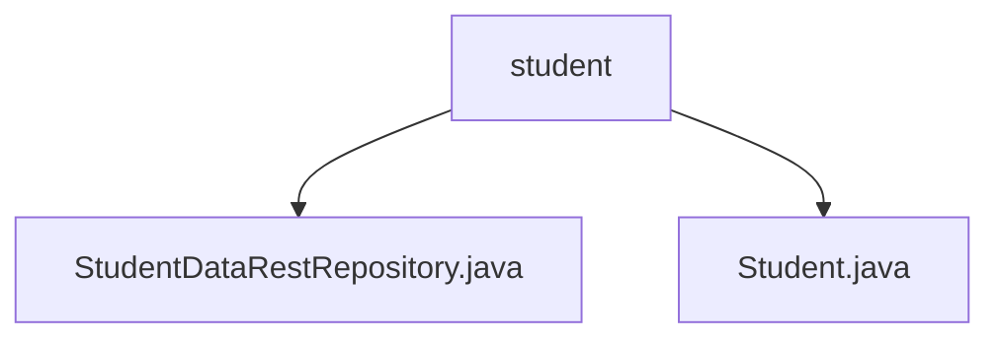

# 基础信息

|      |      |
|------|------|
| 名称 | student |
| 编码语言 | .java |
| 代码路径 | spring-boot-examples/spring-boot-2-jpa-spring-data-rest/src/main/java/com/in28minutes/springboot/jpa/spring/data/rest/example/student |
| 包名 | spring-boot-examples.spring-boot-2-jpa-spring-data-rest.src.main.java.com.in28minutes.springboot.jpa.spring.data.rest.example.student |
| 概述说明 | Java类Student封装学生信息，包含ID、姓名和护照号属性，提供构造方法和访问器。 |

# 说明

## 概述
该代码模块是一个基于Spring Boot和JPA的Spring Data REST示例项目，主要用于管理学生的基本信息。模块通过定义`Student`实体类和`StudentDataRestRepository`接口，实现了对学生数据的持久化操作和RESTful API的暴露。

## 主要业务场景
1. **学生信息管理**：通过`Student`类封装学生的基本信息，包括ID、姓名和护照号。该类提供了构造方法和访问器方法，确保数据的完整性和安全性。
2. **数据持久化**：通过`StudentDataRestRepository`接口，利用Spring Data JPA提供的功能，实现对`Student`实体的增删改查操作。
3. **RESTful API**：Spring Data REST自动生成基于`StudentDataRestRepository`的RESTful API，允许客户端通过HTTP请求访问和操作学生数据。

### 包内部结构视图

该流程图展示了Spring Boot项目中`student`目录下的文件层级关系。`student`作为根节点，包含两个子节点：`StudentDataRestRepository.java`和`Student.java`，分别表示数据仓库接口和实体类文件。这种结构清晰地反映了Spring Data REST模块中数据访问层的典型组织方式。

# 文件列表 File List

| 名称   | 类型  | 说明 |
|-------|------|-------------|
| [Student.java](Student.md) | file | Java类Student包含ID、姓名、护照号属性，提供构造方法和访问器。 |
| [StudentDataRestRepository.java](StudentDataRestRepository.md) | file | 无内容提供，无法生成概要描述。 |

