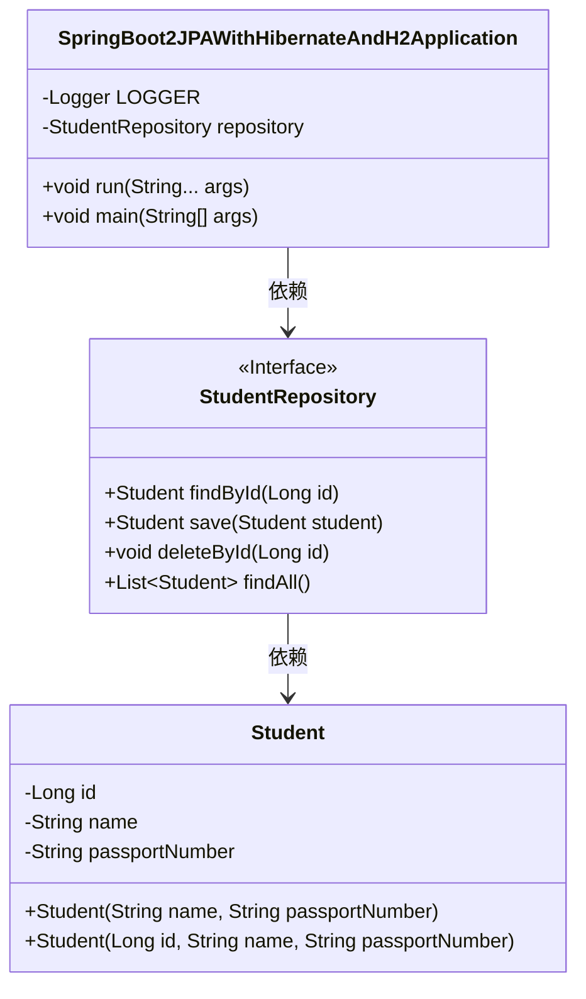
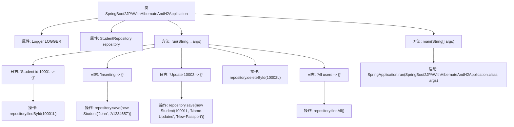

# 基础信息

|      |      |
|------|------|
| 名称 | SpringBoot2JPAWithHibernateAndH2Application |
| 编码语言 | .java |
| 代码路径 | spring-boot-examples/spring-boot-2-jpa-with-hibernate-and-h2/src/main/java/com/in28minutes/springboot/jpa/hibernate/h2/example/SpringBoot2JPAWithHibernateAndH2Application.java |
| 包名 | com.in28minutes.springboot.jpa.hibernate.h2.example |
| 依赖项 | ['org.slf4j.Logger', 'org.slf4j.LoggerFactory', 'org.springframework.beans.factory.annotation.Autowired', 'org.springframework.boot.CommandLineRunner', 'org.springframework.boot.SpringApplication', 'org.springframework.boot.autoconfigure.SpringBootApplication', 'com.in28minutes.springboot.jpa.hibernate.h2.example.student.Student', 'com.in28minutes.springboot.jpa.hibernate.h2.example.student.StudentRepository'] |
| 概述说明 | Spring Boot应用通过CommandLineRunner和JPA操作H2数据库，实现学生数据增删改查。 |

# 说明

Spring Boot应用通过实现CommandLineRunner接口，结合JPA和H2数据库，实现了学生数据的增删改查操作。JPA用于数据持久化，H2作为内存数据库提供数据存储支持。该应用在启动时执行CommandLineRunner的逻辑，完成对学生数据的初始化、查询、插入、更新和删除等操作，展示了Spring Boot在数据管理方面的便捷性和高效性。

# 类列表 Class Summary

| 名称   | 类型  | 说明 |
|-------|------|-------------|
| SpringBoot2JPAWithHibernateAndH2Application | class | Spring Boot应用实现CommandLineRunner，使用JPA和H2数据库进行学生数据增删改查操作。 |

## 类 SpringBoot2JPAWithHibernateAndH2Application

|      |      |
|------|------|
| 访问范围 | @SpringBootApplication;public |
| 类型 | class |
| 名称 | SpringBoot2JPAWithHibernateAndH2Application |
| 说明 | Spring Boot应用实现CommandLineRunner，使用JPA和H2数据库进行学生数据增删改查操作。 |

### UML类图

这段代码是一个Spring Boot应用程序，名为`SpringBoot2JPAWithHibernateAndH2Application`，实现了`CommandLineRunner`接口。它通过`StudentRepository`接口与数据库进行交互，执行查找、插入、更新和删除操作。`Student`类表示学生实体，包含ID、姓名和护照号等属性。代码通过日志记录操作结果，并在`main`方法中启动应用程序。

### 内部方法调用关系图

这段代码是一个Spring Boot应用程序的入口类，实现了`CommandLineRunner`接口，用于在应用启动时执行一些数据库操作。通过`StudentRepository`进行学生信息的增删改查操作，并使用`LOGGER`记录操作日志。`main`方法启动Spring Boot应用。

### 字段列表 Field List

| 名称  | 类型  | 说明 |
|-------|-------|------|
| LOGGER = LoggerFactory.getLogger(this.getClass()) | Logger | 私有日志记录器实例化，用于当前类的日志输出。 |
| repository | StudentRepository | 自动注入学生仓库实例。 |

### 方法列表 Method List

| 名称  | 类型  | 说明 |
|-------|-------|------|
| main | void | Spring Boot启动类，运行JPA和H2数据库应用。 |
| run | void | 执行学生数据操作：查询、插入、更新、删除及查询全部记录。 |

