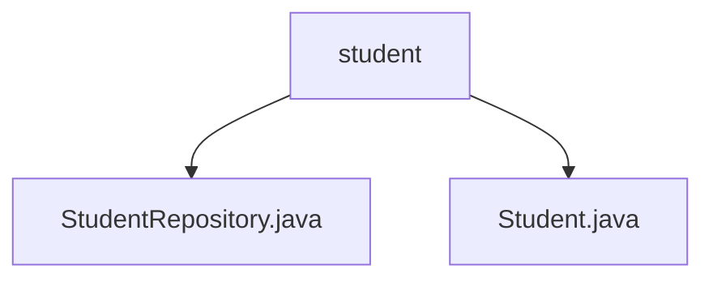

# 基础信息

|      |      |
|------|------|
| 名称 | student |
| 编码语言 | .java |
| 代码路径 | spring-boot-examples/spring-boot-2-jpa-with-hibernate-and-h2/src/main/java/com/in28minutes/springboot/jpa/hibernate/h2/example/student |
| 包名 | spring-boot-examples.spring-boot-2-jpa-with-hibernate-and-h2.src.main.java.com.in28minutes.springboot.jpa.hibernate.h2.example.student |
| 概述说明 | Student类定义id、name、passportNumber属性，提供构造方法和getter/setter方法。 |

# 说明

## 概述

该代码模块是一个基于Spring Boot 2、JPA、Hibernate和H2数据库的示例项目，主要用于演示如何使用这些技术来管理学生的基本信息。模块中包含了两个主要的Java类：`Student`和`StudentRepository`。`Student`类用于定义学生的实体，包含学生的ID、姓名和护照号码等属性，并提供了相应的构造方法、getter和setter方法。`StudentRepository`类则是一个JPA仓库接口，用于执行与数据库相关的操作，如保存、查询和删除学生信息。

## 主要业务场景

该模块的主要业务场景包括：

1. **学生信息管理**：通过`Student`类定义学生的基本信息，包括ID、姓名和护照号码，并提供对这些信息的访问和修改功能。
2. **数据持久化**：利用`StudentRepository`接口与H2数据库进行交互，实现学生信息的持久化存储、查询和删除等操作。
3. **技术演示**：通过这个示例项目，开发者可以学习如何在实际项目中使用Spring Boot、JPA、Hibernate和H2数据库来构建和管理数据实体。

这个模块适用于学习和理解Spring Boot与JPA、Hibernate的结合使用，特别是在小型项目或原型开发中，可以快速实现数据的存储和管理。

### 包内部结构视图

该流程图展示了`spring-boot-examples`项目中`student`目录的层级关系。`student`目录下包含两个文件：`StudentRepository.java`和`Student.java`。`StudentRepository.java`用于处理学生数据的存储和检索，而`Student.java`则定义了学生实体的属性和方法。

# 文件列表 File List

| 名称   | 类型  | 说明 |
|-------|------|-------------|
| [Student.java](Student.md) | file | Java类Student包含id、name和passportNumber属性，提供构造方法和getter/setter。 |
| [StudentRepository.java](StudentRepository.md) | file | 信息为空，无法生成概要描述。 |

