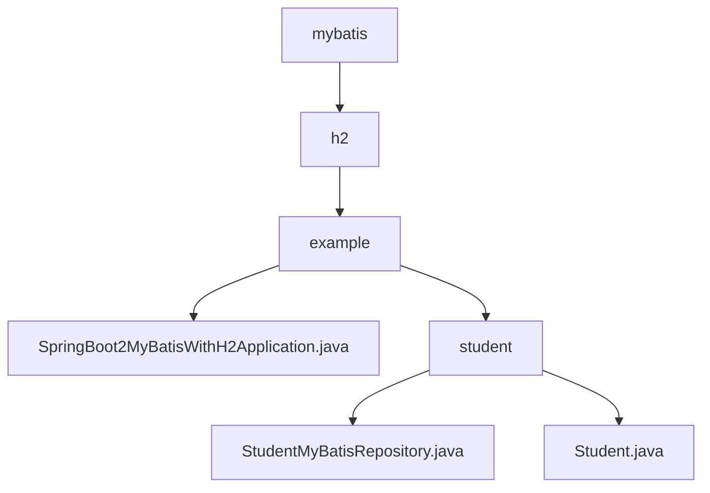

# 基础信息

|      |      |
|------|------|
| 名称 | mybatis |
| 编码语言 | .java |
| 代码路径 | spring-boot-examples/spring-boot-2-myBatis-with-h2/src/main/java/com/in28minutes/springboot/mybatis |
| 包名 | spring-boot-examples.spring-boot-2-myBatis-with-h2.src.main.java.com.in28minutes.springboot.mybatis |
| 概述说明 | Spring Boot集成MyBatis操作H2数据库，实现学生数据增删改查，自动记录日志，适用于快速开发和测试。 |

# 说明

## 概述
该代码模块基于Spring Boot 2框架，集成了MyBatis和H2数据库，主要用于处理与学生相关的数据操作。模块的核心功能包括学生的数据存储、查询和更新等操作，通过MyBatis实现与数据库的交互。Spring Boot的自动配置和H2内存数据库的特性使得该模块特别适用于快速开发和测试场景。

## 主要业务场景
1. **学生数据管理**：通过`Student`实体类定义学生的数据结构，包括学生的ID、姓名、护照号等字段，用于存储和操作学生信息。
2. **数据库交互**：通过`StudentMyBatisRepository`类实现与H2数据库的交互，利用MyBatis进行SQL映射，完成对学生数据的增删改查操作。
3. **日志记录与追踪**：在每次执行数据库操作时，系统会自动记录相应的日志信息，确保操作过程的可追踪性和可维护性，提高了系统的透明度和调试能力。
4. **快速开发与测试**：基于Spring Boot的自动配置和H2内存数据库的特性，模块适用于快速开发和测试场景，能够快速构建和验证与学生数据相关的业务逻辑。

### 包内部结构视图

该流程图展示了Spring Boot项目中MyBatis与H2数据库的集成结构。从`mybatis`模块开始，逐级展开到`h2`、`example`，并进一步细分为`student`子模块。`example`包含主应用程序文件，而`student`子模块则包含与学生相关的实体类和MyBatis仓库接口。整体结构清晰，反映了项目的模块化设计。

# 文件列表 File List

| 名称   | 类型  | 说明 |
|-------|------|-------------|
| [h2](h2/_module.md) | package | Spring Boot集成MyBatis操作H2数据库，实现学生数据增删改查，自动记录日志，适用于快速开发和测试。 |

