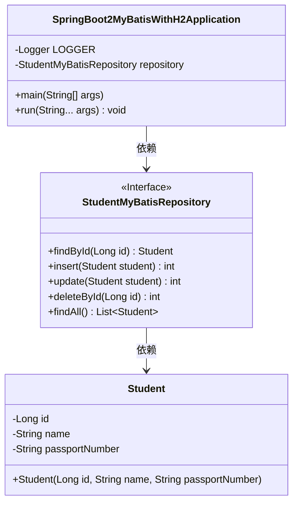
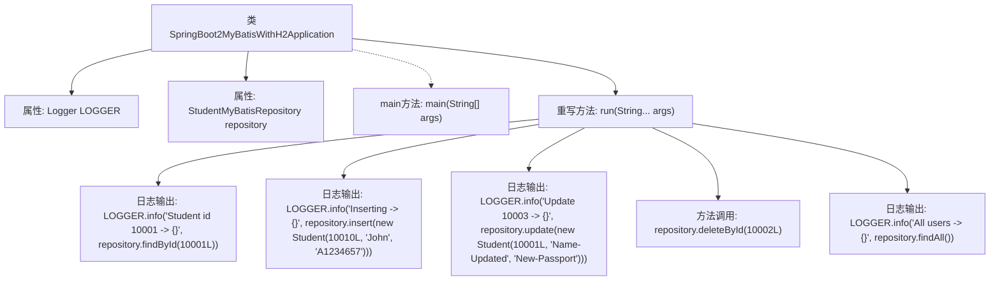

# 基础信息

|      |      |
|------|------|
| 名称 | SpringBoot2MyBatisWithH2Application |
| 编码语言 | .java |
| 代码路径 | spring-boot-examples/spring-boot-2-myBatis-with-h2/src/main/java/com/in28minutes/springboot/mybatis/h2/example/SpringBoot2MyBatisWithH2Application.java |
| 包名 | com.in28minutes.springboot.mybatis.h2.example |
| 依赖项 | ['org.slf4j.Logger', 'org.slf4j.LoggerFactory', 'org.springframework.beans.factory.annotation.Autowired', 'org.springframework.boot.CommandLineRunner', 'org.springframework.boot.SpringApplication', 'org.springframework.boot.autoconfigure.SpringBootApplication', 'com.in28minutes.springboot.mybatis.h2.example.student.Student', 'com.in28minutes.springboot.mybatis.h2.example.student.StudentMyBatisRepository'] |
| 概述说明 | Spring Boot集成MyBatis操作H2数据库，实现增删改查及日志记录。 |

# 说明

Spring Boot应用通过集成MyBatis框架实现对H2数据库的操作，支持数据的增删改查功能。该应用在每次执行数据库操作时，会自动记录相应的日志信息，确保操作过程的可追踪性和可维护性。这种设计不仅提高了数据操作的效率，还增强了系统的透明度和调试能力，适用于需要频繁进行数据库交互的场景。

# 类列表 Class Summary

| 名称   | 类型  | 说明 |
|-------|------|-------------|
| SpringBoot2MyBatisWithH2Application | class | Spring Boot应用使用MyBatis操作H2数据库，包含增删改查日志记录。 |

## 类 SpringBoot2MyBatisWithH2Application

|      |      |
|------|------|
| 访问范围 | @SpringBootApplication;public |
| 类型 | class |
| 名称 | SpringBoot2MyBatisWithH2Application |
| 说明 | Spring Boot应用使用MyBatis操作H2数据库，包含增删改查日志记录。 |

### UML类图

类图描述：  
`SpringBoot2MyBatisWithH2Application` 是一个 Spring Boot 应用程序类，实现了 `CommandLineRunner` 接口，用于在应用启动时执行特定逻辑。它依赖于 `StudentMyBatisRepository` 接口，该接口定义了与 `Student` 实体相关的数据库操作方法，包括查找、插入、更新、删除和查询所有记录。`Student` 类表示学生实体，包含学生的 ID、姓名和护照号码。整个类图展示了 Spring Boot 应用中数据访问层的典型结构。

### 内部方法调用关系图

这段代码是一个Spring Boot应用程序的入口类，实现了`CommandLineRunner`接口。类中包含了一个日志记录器和一个MyBatis仓库的自动注入。`main`方法启动Spring Boot应用，`run`方法在应用启动后执行，依次执行查找、插入、更新、删除和查找所有学生的操作，并通过日志记录这些操作的结果。

### 字段列表 Field List

| 名称  | 类型  | 说明 |
|-------|-------|------|
| LOGGER = LoggerFactory.getLogger(this.getClass()) | Logger | 定义私有日志记录器，用于记录当前类的日志信息。 |
| repository | StudentMyBatisRepository | 自动注入StudentMyBatisRepository实例。 |

### 方法列表 Method List

| 名称  | 类型  | 说明 |
|-------|-------|------|
| main | void | Spring Boot启动类，运行MyBatis与H2集成应用。 |
| run | void | 代码执行学生数据操作：查询、插入、更新、删除及显示全部。 |

