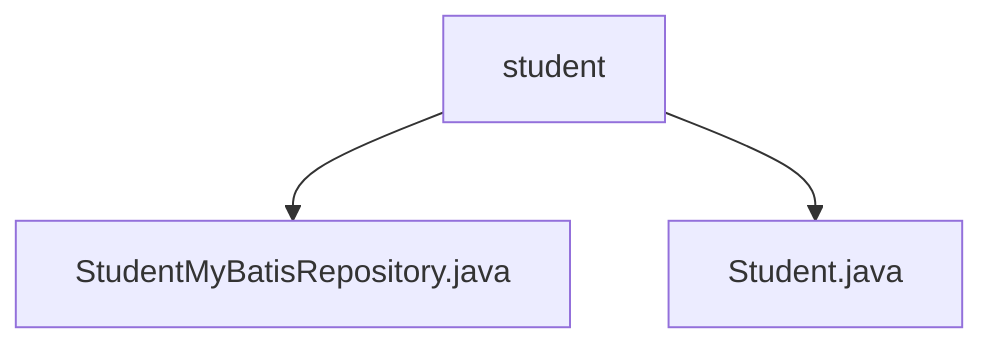

# 基础信息

|      |      |
|------|------|
| 名称 | student |
| 编码语言 | .java |
| 代码路径 | spring-boot-examples/spring-boot-2-myBatis-with-h2/src/main/java/com/in28minutes/springboot/mybatis/h2/example/student |
| 包名 | spring-boot-examples.spring-boot-2-myBatis-with-h2.src.main.java.com.in28minutes.springboot.mybatis.h2.example.student |
| 概述说明 | 内容为空，无法生成总结描述。 |

# 说明

## 概述
该代码模块基于Spring Boot 2框架，集成了MyBatis和H2数据库，主要用于处理与学生相关的数据操作。模块的核心功能包括学生的数据存储、查询和更新等操作，通过MyBatis实现与数据库的交互。

## 主要业务场景
1. **学生数据管理**：通过`Student`实体类定义学生的数据结构，包括学生的ID、姓名、护照号等字段，用于存储和操作学生信息。
2. **数据库交互**：通过`StudentMyBatisRepository`类实现与H2数据库的交互，利用MyBatis进行SQL映射，完成对学生数据的增删改查操作。
3. **快速开发与测试**：基于Spring Boot的自动配置和H2内存数据库的特性，模块适用于快速开发和测试场景，能够快速构建和验证与学生数据相关的业务逻辑。

### 包内部结构视图

该流程图展示了`student`文件夹与其内部文件`StudentMyBatisRepository.java`和`Student.java`之间的层级关系。`student`作为父节点，包含两个子节点，分别代表两个不同的Java文件。这种结构清晰地反映了文件在项目中的组织方式，便于开发者快速定位和理解相关代码文件。

# 文件列表 File List

| 名称   | 类型  | 说明 |
|-------|------|-------------|
| [Student.java](Student.md) | file | 无内容提供，无法生成概要描述。 |
| [StudentMyBatisRepository.java](StudentMyBatisRepository.md) | file | 无内容提供，无法生成概要描述。 |

