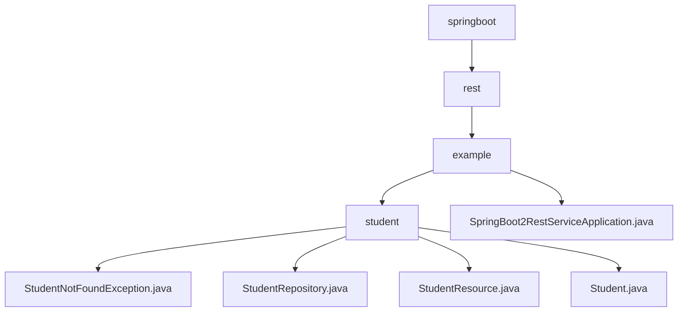

# 基础信息

|      |      |
|------|------|
| 名称 | springboot |
| 编码语言 | .java |
| 代码路径 | spring-boot-examples/spring-boot-2-rest-service-basic/src/main/java/com/in28minutes/springboot |
| 包名 | spring-boot-examples.spring-boot-2-rest-service-basic.src.main.java.com.in28minutes.springboot |
| 概述说明 | Spring Boot RESTful服务，管理学生信息，支持CRUD操作和自定义异常处理。 |

# 说明

## 概述

该代码模块是一个基于Spring Boot的RESTful服务，专注于学生信息的管理。模块包含多个组件，分别用于处理学生数据的存储、检索、更新和删除操作。通过自定义异常类，模块能够更精确地处理学生信息缺失或无法找到的情况，从而提高系统的健壮性和可维护性。Spring Boot应用启动类是项目的核心入口，负责启动和运行整个Spring应用，简化了传统Spring应用的配置和部署流程。

## 主要业务场景

1. **学生信息管理**：
   - **学生类（Student.java）**：定义了学生的基本属性（ID、姓名、护照号），并提供了构造方法和访问方法，用于管理和操作学生的基本信息。
   - **学生资源控制器（StudentResource.java）**：负责管理学生资源，执行标准的CRUD操作，包括查询学生信息、删除学生记录、创建新学生信息以及更新现有学生数据。
   - **学生仓库（StudentRepository.java）**：用于数据存储和检索，支持对学生信息的增删改查操作。

2. **异常处理**：
   - **学生未找到异常（StudentNotFoundException.java）**：自定义异常类，用于处理学生信息缺失或无法找到的特定错误场景。通过定义此类异常，开发者可以在代码中更精确地捕获和处理与学生相关的错误，提供更清晰的反馈和调试信息。

3. **应用启动**：
   - **Spring Boot应用启动类（SpringBoot2RestServiceApplication.java）**：Spring Boot项目的核心入口，包含主方法用于启动和运行整个Spring应用。通过该启动类，Spring Boot会自动配置和初始化应用程序所需的组件和环境，简化了传统Spring应用的配置和部署流程。启动类通常标注有`@SpringBootApplication`注解，用于标识这是一个Spring Boot应用，并自动启用默认配置和组件扫描。主方法通过`SpringApplication.run()`方法启动应用，完成依赖注入、配置加载和应用上下文的初始化，使应用能够正常运行并处理请求。

通过这些组件和功能，该模块能够全面管理学生资源，确保数据的准确性和完整性，并在出现错误时提供有效的异常处理机制。

### 包内部结构视图

该流程图展示了Spring Boot项目中各个文件和文件夹的层级关系。从`springboot`开始，依次展开`rest`、`example`和`student`文件夹，并在`student`文件夹下包含多个Java文件。同时，`example`文件夹下还有一个独立的Java文件`SpringBoot2RestServiceApplication.java`。

# 文件列表 File List

| 名称   | 类型  | 说明 |
|-------|------|-------------|
| [rest](rest/_module.md) | package | Spring Boot RESTful服务，管理学生信息，支持CRUD操作和自定义异常处理。 |

