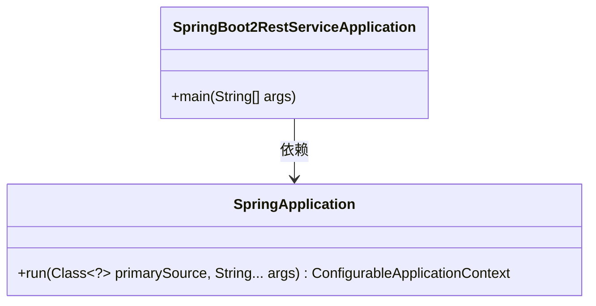
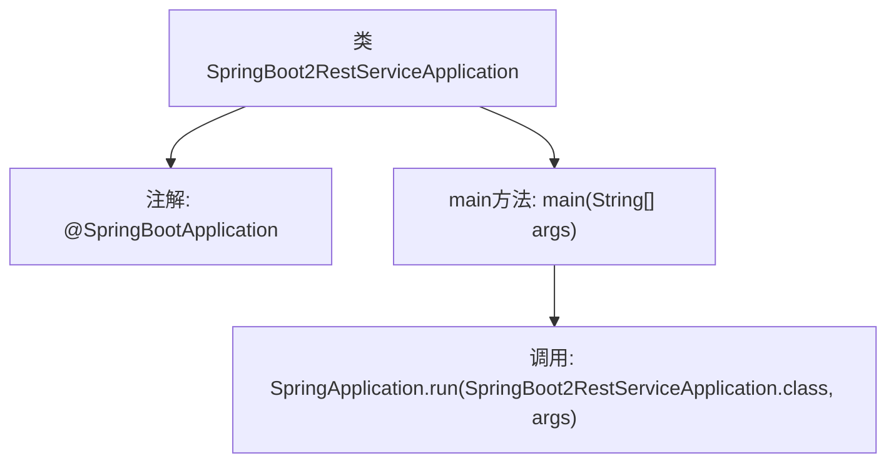

# 基础信息

|      |      |
|------|------|
| 名称 | SpringBoot2RestServiceApplication |
| 编码语言 | .java |
| 代码路径 | spring-boot-examples/spring-boot-2-rest-service-basic/src/main/java/com/in28minutes/springboot/rest/example/SpringBoot2RestServiceApplication.java |
| 包名 | com.in28minutes.springboot.rest.example |
| 依赖项 | ['org.springframework.boot.SpringApplication', 'org.springframework.boot.autoconfigure.SpringBootApplication'] |
| 概述说明 | Spring Boot应用启动类，包含主方法运行应用。 |

# 说明

Spring Boot应用启动类是Spring Boot项目的核心入口，包含主方法用于启动和运行整个Spring应用。通过该启动类，Spring Boot会自动配置和初始化应用程序所需的组件和环境，简化了传统Spring应用的配置和部署流程。启动类通常标注有@SpringBootApplication注解，用于标识这是一个Spring Boot应用，并自动启用默认配置和组件扫描。主方法通过SpringApplication.run()方法启动应用，完成依赖注入、配置加载和应用上下文的初始化，使应用能够正常运行并处理请求。

# 类列表 Class Summary

| 名称   | 类型  | 说明 |
|-------|------|-------------|
| SpringBoot2RestServiceApplication | class | Spring Boot应用启动类，包含主方法运行Spring应用。 |

## 类 SpringBoot2RestServiceApplication

|      |      |
|------|------|
| 访问范围 | @SpringBootApplication;public |
| 类型 | class |
| 名称 | SpringBoot2RestServiceApplication |
| 说明 | Spring Boot应用启动类，包含主方法运行Spring应用。 |

### UML类图

这段代码定义了一个名为 `SpringBoot2RestServiceApplication` 的类，它是一个 Spring Boot 应用的入口类。该类包含一个 `main` 方法，该方法通过调用 `SpringApplication.run` 方法来启动 Spring Boot 应用。`SpringApplication` 类是 Spring Boot 框架中的一个核心类，负责应用的启动和配置。`SpringBoot2RestServiceApplication` 类依赖于 `SpringApplication` 类来启动应用。

### 内部方法调用关系图

这段代码是一个简单的Spring Boot应用程序入口类。`@SpringBootApplication`注解用于标记该类为Spring Boot应用的主类，包含了自动配置、组件扫描等功能。`main`方法是应用的启动入口，通过调用`SpringApplication.run`方法来启动Spring Boot应用，并传入当前类及其命令行参数。该流程展示了Spring Boot应用的启动过程，从类定义到应用启动的完整步骤。

### 字段列表 Field List

| 名称  | 类型  | 说明 |
|-------|-------|------|

### 方法列表 Method List

| 名称  | 类型  | 说明 |
|-------|-------|------|
| main | void | 启动Spring Boot应用的主方法。 |

