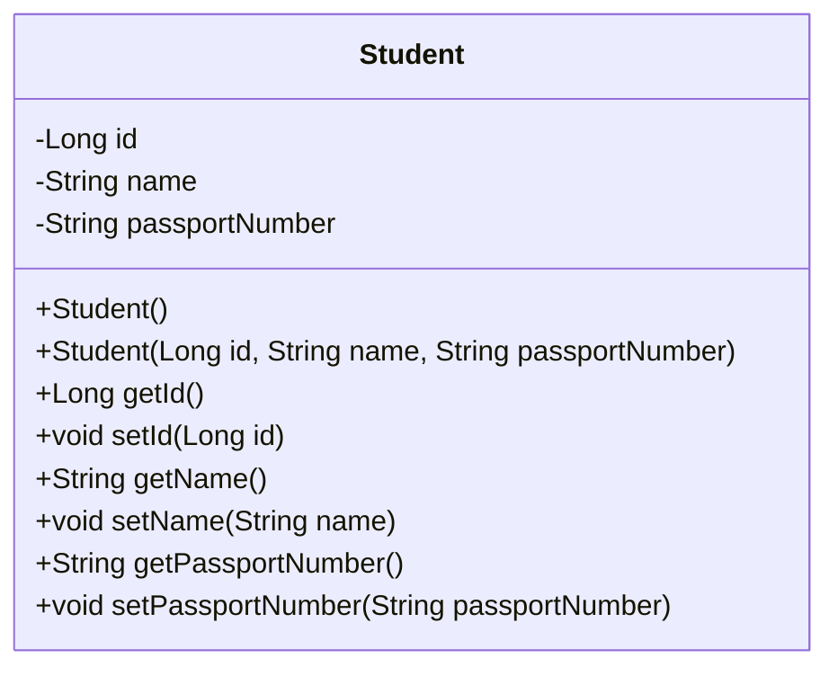
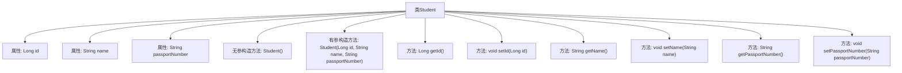

# 基础信息

|      |      |
|------|------|
| 名称 | Student |
| 编码语言 | .java |
| 代码路径 | spring-boot-examples/spring-boot-2-rest-service-basic/src/main/java/com/in28minutes/springboot/rest/example/student/Student.java |
| 包名 | com.in28minutes.springboot.rest.example.student |
| 依赖项 | ['jakarta.persistence.Entity', 'jakarta.persistence.GeneratedValue', 'jakarta.persistence.Id'] |
| 概述说明 | 定义学生类，含ID、姓名、护照号属性及构造、访问方法。 |

# 说明

定义了一个学生类，该类包含三个主要属性：ID、姓名和护照号。类中提供了构造方法，用于初始化这些属性。此外，还包含了访问方法，用于获取和设置这些属性的值。这个类设计用于管理和操作学生的基本信息。

# 类列表 Class Summary

| 名称   | 类型  | 说明 |
|-------|------|-------------|
| Student | class | 定义学生类，包含ID、姓名、护照号属性及构造、访问方法。 |

## 类 Student

|      |      |
|------|------|
| 访问范围 | @Entity;public |
| 类型 | class |
| 名称 | Student |
| 说明 | 定义学生类，包含ID、姓名、护照号属性及构造、访问方法。 |

### UML类图

这段代码定义了一个名为 `Student` 的实体类，包含三个私有属性：`id`、`name` 和 `passportNumber`。类中提供了两个构造函数，一个无参构造函数和一个带参构造函数，以及每个属性的 getter 和 setter 方法。这个类通常用于表示学生实体，并可能用于持久化到数据库中。

### 内部方法调用关系图

这段代码定义了一个名为`Student`的实体类，包含三个属性：`id`、`name`和`passportNumber`。类中提供了无参和有参的构造方法，以及每个属性的`getter`和`setter`方法。`id`属性使用了`@Id`和`@GeneratedValue`注解，表明它是主键且自动生成。流程图展示了类中各个属性和方法之间的层级关系，清晰地描述了类的结构。

### 字段列表 Field List

| 名称  | 类型  | 说明 |
|-------|-------|------|
| passportNumber | String | 护照号字段声明为私有字符串类型。 |
| name | String | 定义了一个私有字符串变量name。 |
| id | Long | 实体类中定义自增主键ID字段。 |

### 方法列表 Method List

| 名称  | 类型  | 说明 |
|-------|-------|------|
| getName | String | 获取对象名称的方法。 |
| getId | Long | 获取对象ID的方法。 |
| getPassportNumber | String | 该方法返回护照号码。 |
| setPassportNumber | void | 设置护照号码的方法。 |
| setName | void | 设置对象名称的方法，接受字符串参数并赋值给内部变量。 |
| setId | void | 设置对象的唯一标识符ID。 |

