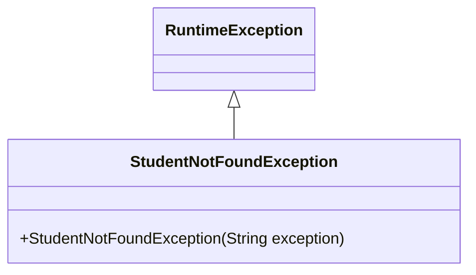
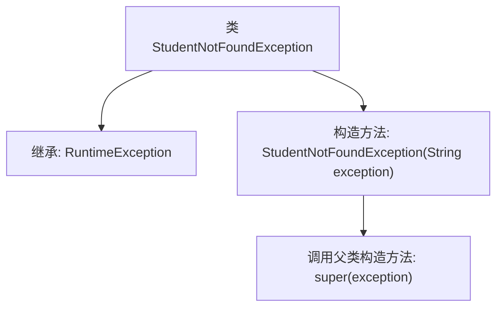

# 基础信息

|      |      |
|------|------|
| 名称 | StudentNotFoundException |
| 编码语言 | .java |
| 代码路径 | spring-boot-examples/spring-boot-2-rest-service-basic/src/main/java/com/in28minutes/springboot/rest/example/student/StudentNotFoundException.java |
| 包名 | com.in28minutes.springboot.rest.example.student |
| 依赖项 | [] |
| 概述说明 | 自定义异常类处理学生未找到情况。 |

# 说明

自定义异常类用于处理学生未找到的情况。该异常类旨在在系统中明确标识和处理学生信息缺失或无法找到的特定错误场景。通过定义此类异常，开发者可以在代码中更精确地捕获和处理与学生相关的错误，从而提高系统的健壮性和可维护性。这种异常类通常包含错误信息和可能的解决方案提示，以便在发生异常时提供更清晰的反馈和调试信息。

# 类列表 Class Summary

| 名称   | 类型  | 说明 |
|-------|------|-------------|
| StudentNotFoundException | class | 自定义异常类，用于处理学生未找到的情况。 |

## 类 StudentNotFoundException

|      |      |
|------|------|
| 访问范围 | public |
| 类型 | class |
| 名称 | StudentNotFoundException |
| 说明 | 自定义异常类，用于处理学生未找到的情况。 |

### UML类图

**描述：**  
`StudentNotFoundException` 是一个自定义的运行时异常类，继承自 `RuntimeException`。它通过构造函数接收一个字符串参数，并将其传递给父类的构造函数，用于在找不到学生时抛出异常。该异常类简化了异常处理流程，允许开发者在特定情况下抛出并捕获此异常。

### 内部方法调用关系图

这段代码定义了一个名为 `StudentNotFoundException` 的异常类，它继承自 `RuntimeException`。该类包含一个构造方法，接受一个字符串参数 `exception`，并在构造方法中调用父类 `RuntimeException` 的构造方法，将 `exception` 传递给父类。这个类通常用于在程序中抛出学生未找到的异常，便于捕获和处理特定类型的运行时错误。

### 字段列表 Field List

| 名称  | 类型  | 说明 |
|-------|-------|------|

### 方法列表 Method List

| 名称  | 类型  | 说明 |
|-------|-------|------|

