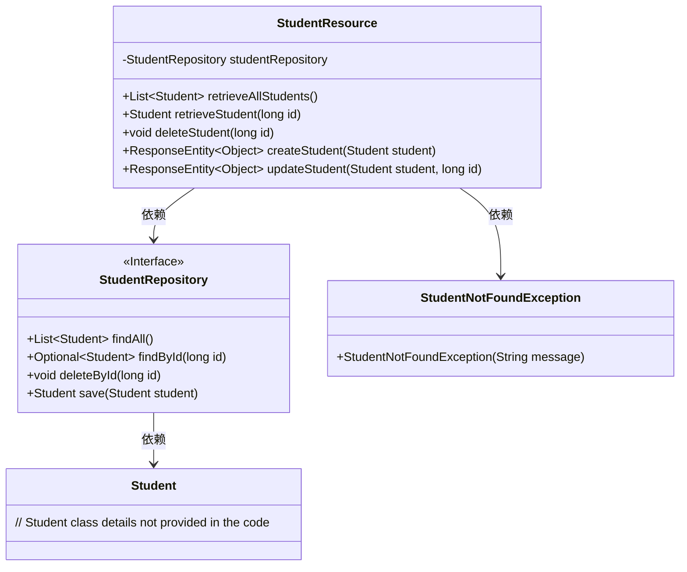
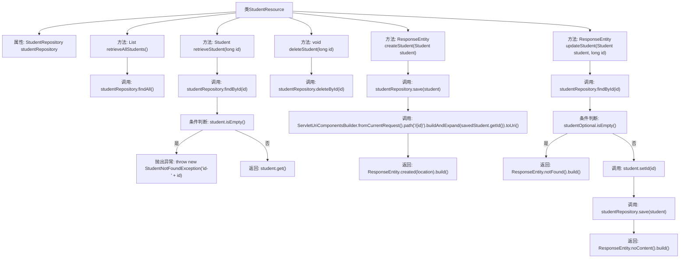

# 基础信息

|      |      |
|------|------|
| 名称 | StudentResource |
| 编码语言 | .java |
| 代码路径 | spring-boot-examples/spring-boot-2-rest-service-basic/src/main/java/com/in28minutes/springboot/rest/example/student/StudentResource.java |
| 包名 | com.in28minutes.springboot.rest.example.student |
| 依赖项 | ['java.net.URI', 'java.util.List', 'java.util.Optional', 'org.springframework.beans.factory.annotation.Autowired', 'org.springframework.http.ResponseEntity', 'org.springframework.web.bind.annotation.DeleteMapping', 'org.springframework.web.bind.annotation.GetMapping', 'org.springframework.web.bind.annotation.PathVariable', 'org.springframework.web.bind.annotation.PostMapping', 'org.springframework.web.bind.annotation.PutMapping', 'org.springframework.web.bind.annotation.RequestBody', 'org.springframework.web.bind.annotation.RestController', 'org.springframework.web.servlet.support.ServletUriComponentsBuilder'] |
| 概述说明 | 控制器实现学生信息的增删改查操作。 |

# 说明

该控制器专门用于管理学生资源，执行标准的CRUD操作。具体功能包括查询学生信息、删除学生记录、创建新学生信息以及更新现有学生数据。通过这些操作，该控制器能够全面管理学生资源，确保数据的准确性和完整性。

# 类列表 Class Summary

| 名称   | 类型  | 说明 |
|-------|------|-------------|
| StudentResource | class | 该控制器处理学生资源的CRUD操作，包括查询、删除、创建和更新学生信息。 |

## 类 StudentResource

|      |      |
|------|------|
| 访问范围 | @RestController;public |
| 类型 | class |
| 名称 | StudentResource |
| 说明 | 该控制器处理学生资源的CRUD操作，包括查询、删除、创建和更新学生信息。 |

### UML类图

这段代码描述了一个Spring Boot控制器类`StudentResource`，它通过`StudentRepository`接口与数据库进行交互，提供了对学生数据的增删改查操作。`StudentResource`类依赖于`StudentRepository`接口来执行数据库操作，并在找不到学生时抛出`StudentNotFoundException`异常。代码展示了典型的RESTful API设计，包括获取所有学生、获取单个学生、删除学生、创建学生和更新学生的功能。

### 内部方法调用关系图

这段代码是一个Spring Boot的REST控制器，用于管理学生资源。它提供了获取所有学生、根据ID获取学生、删除学生、创建学生和更新学生的功能。每个方法都通过`StudentRepository`与数据库进行交互，并根据不同的HTTP请求方法执行相应的操作。代码中还包含了对学生是否存在的条件判断，以及异常处理和响应实体的构建。

### 字段列表 Field List

| 名称  | 类型  | 说明 |
|-------|-------|------|
| studentRepository | StudentRepository | 自动注入学生仓库实例。 |

### 方法列表 Method List

| 名称  | 类型  | 说明 |
|-------|-------|------|
| retrieveAllStudents | List<Student> | GET请求获取所有学生信息并返回列表。 |
| deleteStudent | void | 删除指定ID的学生记录。 |
| updateStudent | ResponseEntity<Object> | 更新学生信息，若不存在则返回404。 |
| retrieveStudent | Student | 通过ID查询学生信息，若不存在则抛出异常。 |
| createStudent | ResponseEntity<Object> | 通过POST请求创建学生并返回资源位置。 |

