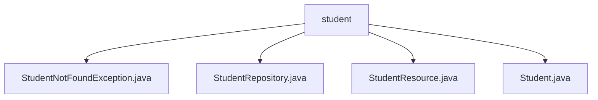

# 基础信息

|      |      |
|------|------|
| 名称 | student |
| 编码语言 | .java |
| 代码路径 | spring-boot-examples/spring-boot-2-rest-service-basic/src/main/java/com/in28minutes/springboot/rest/example/student |
| 包名 | spring-boot-examples.spring-boot-2-rest-service-basic.src.main.java.com.in28minutes.springboot.rest.example.student |
| 概述说明 | 自定义异常处理学生未找到，控制器管理学生CRUD操作，学生类含ID、姓名、护照号。 |

# 说明

## 概述

该代码模块是一个基于Spring Boot的RESTful服务，专注于学生信息的管理。模块包含多个组件，分别用于处理学生数据的存储、检索、更新和删除操作。通过自定义异常类，模块能够更精确地处理学生信息缺失或无法找到的情况，从而提高系统的健壮性和可维护性。

## 主要业务场景

1. **学生信息管理**：
   - **学生类（Student.java）**：定义了学生的基本属性（ID、姓名、护照号），并提供了构造方法和访问方法，用于管理和操作学生的基本信息。
   - **学生资源控制器（StudentResource.java）**：负责管理学生资源，执行标准的CRUD操作，包括查询学生信息、删除学生记录、创建新学生信息以及更新现有学生数据。
   - **学生仓库（StudentRepository.java）**：用于数据存储和检索，支持对学生信息的增删改查操作。

2. **异常处理**：
   - **学生未找到异常（StudentNotFoundException.java）**：自定义异常类，用于处理学生信息缺失或无法找到的特定错误场景。通过定义此类异常，开发者可以在代码中更精确地捕获和处理与学生相关的错误，提供更清晰的反馈和调试信息。

通过这些组件和功能，该模块能够全面管理学生资源，确保数据的准确性和完整性，并在出现错误时提供有效的异常处理机制。

### 包内部结构视图

该流程图展示了`student`目录下的文件结构，包括`StudentNotFoundException.java`、`StudentRepository.java`、`StudentResource.java`和`Student.java`四个文件。所有文件均直接隶属于`student`目录，清晰地反映了这些文件在同一层级中的关系。

# 文件列表 File List

| 名称   | 类型  | 说明 |
|-------|------|-------------|
| [Student.java](Student.md) | file | 定义学生类，含ID、姓名、护照号属性及构造、访问方法。 |
| [StudentResource.java](StudentResource.md) | file | 控制器实现学生信息的增删改查操作。 |
| [StudentRepository.java](StudentRepository.md) | file | 无内容提供，无法生成概要描述。 |
| [StudentNotFoundException.java](StudentNotFoundException.md) | file | 自定义异常类处理学生未找到情况。 |

