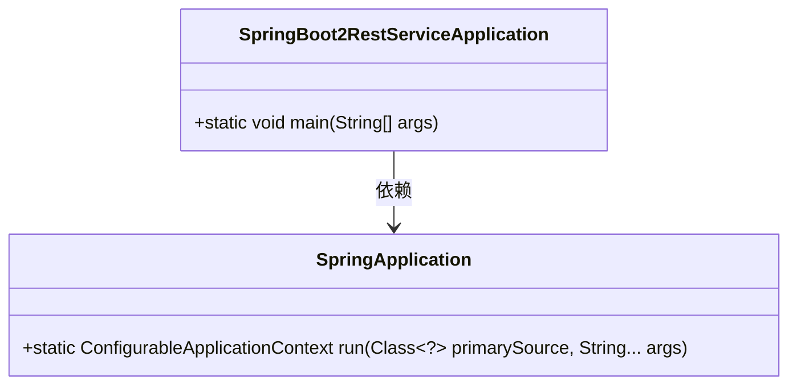
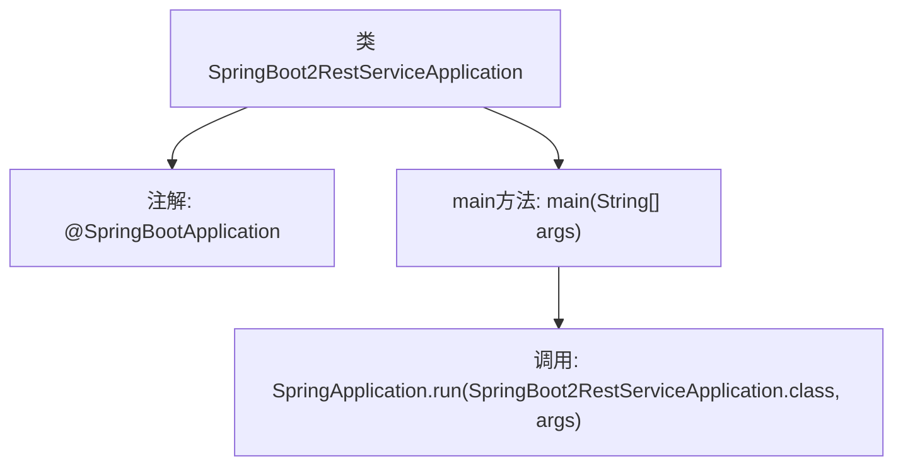

# 基础信息

|      |      |
|------|------|
| 名称 | SpringBoot2RestServiceApplication |
| 编码语言 | .java |
| 代码路径 | spring-boot-examples/spring-boot-2-rest-service-content-negotiation/src/main/java/com/in28minutes/springboot/rest/example/SpringBoot2RestServiceApplication.java |
| 包名 | com.in28minutes.springboot.rest.example |
| 依赖项 | ['org.springframework.boot.SpringApplication', 'org.springframework.boot.autoconfigure.SpringBootApplication'] |
| 概述说明 | Spring Boot应用启动类，包含主方法启动服务。 |

# 说明

Spring Boot应用启动类是应用程序的入口点，包含主方法用于启动服务。该类通常标记为Spring Boot应用的启动类，通过运行主方法可以初始化并启动整个应用。主方法会调用SpringApplication.run方法来加载应用上下文、配置组件扫描、自动配置等，最终使应用进入运行状态。启动类的位置通常位于项目的根包下，以确保Spring Boot能够正确扫描和加载所有相关组件。

# 类列表 Class Summary

| 名称   | 类型  | 说明 |
|-------|------|-------------|
| SpringBoot2RestServiceApplication | class | Spring Boot应用启动类，包含主方法启动服务。 |

## 类 SpringBoot2RestServiceApplication

|      |      |
|------|------|
| 访问范围 | @SpringBootApplication;public |
| 类型 | class |
| 名称 | SpringBoot2RestServiceApplication |
| 说明 | Spring Boot应用启动类，包含主方法启动服务。 |

### UML类图

这段代码定义了一个Spring Boot应用程序的入口类 `SpringBoot2RestServiceApplication`，其中 `main` 方法通过调用 `SpringApplication.run` 方法来启动Spring Boot应用。`SpringApplication` 类是Spring Boot框架提供的核心类，负责启动和管理Spring应用上下文。`SpringBoot2RestServiceApplication` 类依赖于 `SpringApplication` 类来启动应用。

### 内部方法调用关系图

这段代码是一个Spring Boot应用的启动类。`@SpringBootApplication`注解用于标记该类为Spring Boot应用的主配置类，它包含了`@Configuration`、`@EnableAutoConfiguration`和`@ComponentScan`三个注解的功能。`main`方法是应用的入口，通过调用`SpringApplication.run`方法来启动Spring Boot应用，并传入当前类和应用参数。该代码的作用是初始化并启动Spring Boot应用，使其能够处理HTTP请求。

### 字段列表 Field List

| 名称  | 类型  | 说明 |
|-------|-------|------|

### 方法列表 Method List

| 名称  | 类型  | 说明 |
|-------|-------|------|
| main | void | Spring Boot应用启动主类，运行REST服务。 |

