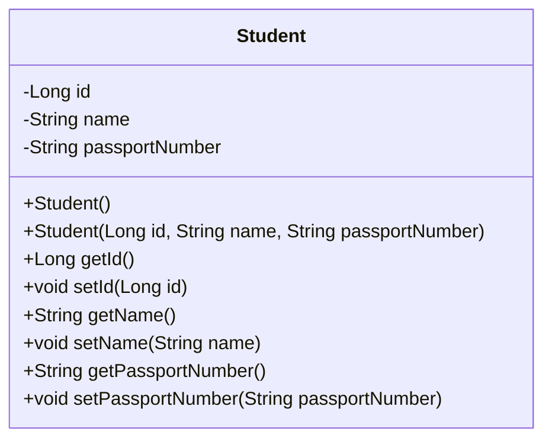
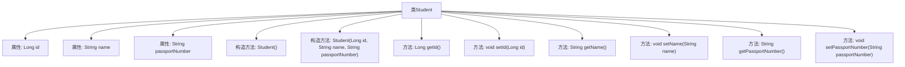

# 基础信息

|      |      |
|------|------|
| 名称 | Student |
| 编码语言 | .java |
| 代码路径 | spring-boot-examples/spring-boot-2-rest-service-content-negotiation/src/main/java/com/in28minutes/springboot/rest/example/student/Student.java |
| 包名 | com.in28minutes.springboot.rest.example.student |
| 依赖项 | ['jakarta.persistence.Entity', 'jakarta.persistence.GeneratedValue', 'jakarta.persistence.Id'] |
| 概述说明 | Java类Student包含id、name、passportNumber属性及其getter和setter方法。 |

# 说明

Java实体类Student包含三个属性：id、name和passportNumber。每个属性都有对应的getter和setter方法，用于获取和设置属性值。id通常用于唯一标识学生，name表示学生姓名，passportNumber则存储学生的护照号码。该实体类设计简洁，符合Java Bean规范，便于在应用程序中进行数据封装和操作。

# 类列表 Class Summary

| 名称   | 类型  | 说明 |
|-------|------|-------------|
| Student | class | Java实体类Student包含id、name和passportNumber属性及其getter和setter方法。 |

## 类 Student

|      |      |
|------|------|
| 访问范围 | @Entity;public |
| 类型 | class |
| 名称 | Student |
| 说明 | Java实体类Student包含id、name和passportNumber属性及其getter和setter方法。 |

### UML类图

**描述：**  
`Student` 类是一个实体类，包含三个私有属性：`id`、`name` 和 `passportNumber`。类中提供了两个构造函数，一个无参构造函数和一个带参构造函数，用于初始化对象。此外，类中还提供了每个属性的 getter 和 setter 方法，用于访问和修改这些属性。该类可能用于表示学生的基本信息，并可能在数据库中进行持久化操作。

### 内部方法调用关系图

这段代码定义了一个名为 `Student` 的实体类，包含三个属性：`id`、`name` 和 `passportNumber`。类中提供了两个构造方法，一个无参构造方法和一个带参构造方法，用于初始化对象的属性。此外，类中还定义了每个属性的 `getter` 和 `setter` 方法，用于访问和修改属性值。这个类通常用于表示学生信息，并通过 `id` 字段作为唯一标识。

### 字段列表 Field List

| 名称  | 类型  | 说明 |
|-------|-------|------|
| passportNumber | String | 定义私有字符串变量passportNumber。 |
| id | Long | 定义了一个自动生成的私有长整型ID字段。 |
| name | String | 定义私有字符串类型变量name。 |

### 方法列表 Method List

| 名称  | 类型  | 说明 |
|-------|-------|------|
| setId | void | 该方法用于设置对象的ID属性。 |
| setName | void | 该方法用于设置对象的名称属性。 |
| getPassportNumber | String | 获取护照号码的方法。 |
| getName | String | 该方法返回字符串类型的变量name。 |
| getId | Long | 该方法返回长整型变量id的值。 |
| setPassportNumber | void | 设置护照号码的方法，将输入值赋给成员变量。 |

