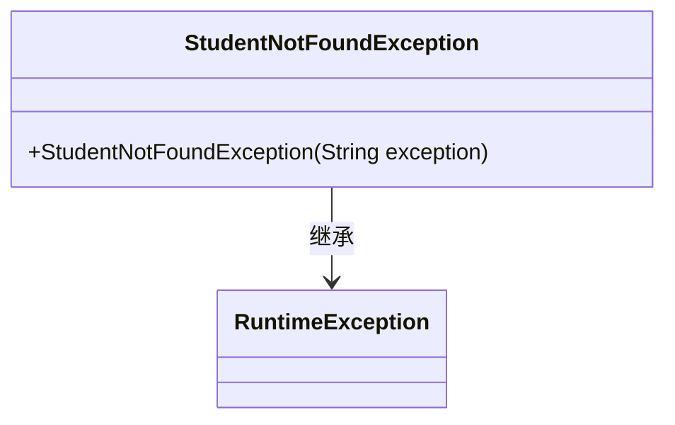
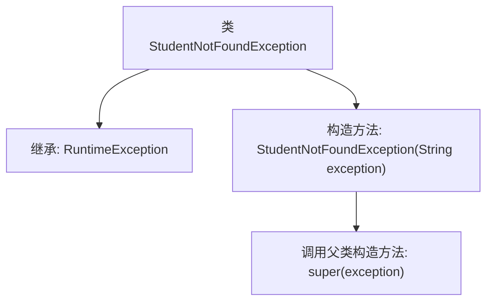

# 基础信息

|      |      |
|------|------|
| 名称 | StudentNotFoundException |
| 编码语言 | .java |
| 代码路径 | spring-boot-examples/spring-boot-2-rest-service-content-negotiation/src/main/java/com/in28minutes/springboot/rest/example/student/StudentNotFoundException.java |
| 包名 | com.in28minutes.springboot.rest.example.student |
| 依赖项 | ['org.springframework.http.HttpStatus', 'org.springframework.web.bind.annotation.ResponseStatus'] |
| 概述说明 | StudentNotFoundException继承RuntimeException，包含异常信息构造器。 |

# 说明

StudentNotFoundException类用于表示未找到学生的情况，它继承自RuntimeException类。该类包含一个构造器，允许传递异常信息，以便在抛出异常时提供详细的错误描述。通过继承RuntimeException，StudentNotFoundException属于非受检异常，不需要在方法签名中显式声明或捕获。这种设计使得在遇到未找到学生的场景时，能够方便地抛出并处理异常，从而提高代码的健壮性和可维护性。

# 类列表 Class Summary

| 名称   | 类型  | 说明 |
|-------|------|-------------|
| StudentNotFoundException | class | StudentNotFoundException类表示未找到学生，继承RuntimeException，带异常信息构造器。 |

## 类 StudentNotFoundException

|      |      |
|------|------|
| 访问范围 | @ResponseStatus(HttpStatus.NOT_FOUND);public |
| 类型 | class |
| 名称 | StudentNotFoundException |
| 说明 | StudentNotFoundException类表示未找到学生，继承RuntimeException，带异常信息构造器。 |

### UML类图

这段代码定义了一个名为 `StudentNotFoundException` 的异常类，它继承自 `RuntimeException`。该类用于表示当学生资源未找到时抛出的异常。通过 `@ResponseStatus(HttpStatus.NOT_FOUND)` 注解，该异常在抛出时会自动返回 HTTP 404 状态码。类中包含一个构造函数，接受一个字符串参数用于传递异常信息，并将其传递给父类的构造函数。

### 内部方法调用关系图

这段代码定义了一个名为 `StudentNotFoundException` 的异常类，它继承自 `RuntimeException`。该类包含一个构造方法，接收一个字符串参数 `exception`，并在构造方法中调用父类的构造方法 `super(exception)`。该异常类用于在应用程序中抛出学生未找到的异常，并通过 `@ResponseStatus(HttpStatus.NOT_FOUND)` 注解指定了HTTP响应状态码为404。

### 字段列表 Field List

| 名称  | 类型  | 说明 |
|-------|-------|------|

### 方法列表 Method List

| 名称  | 类型  | 说明 |
|-------|-------|------|

