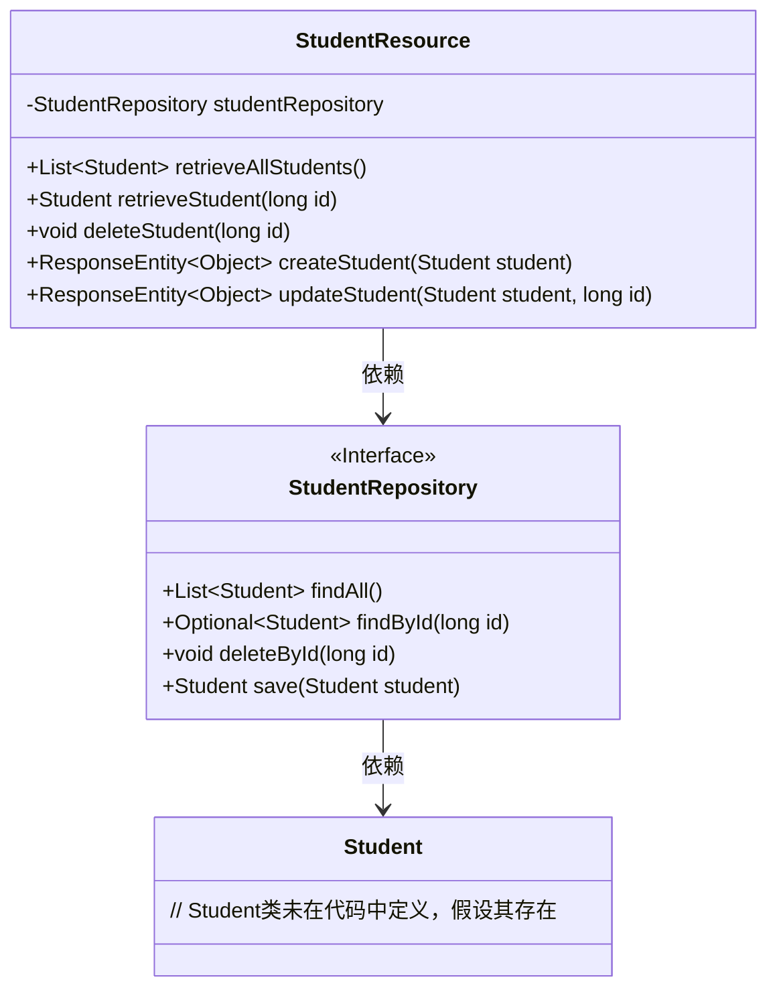
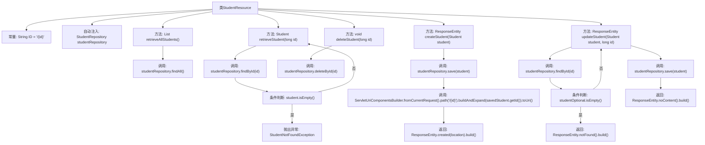

# 基础信息

|      |      |
|------|------|
| 名称 | StudentResource |
| 编码语言 | .java |
| 代码路径 | spring-boot-examples/spring-boot-2-rest-service-content-negotiation/src/main/java/com/in28minutes/springboot/rest/example/student/StudentResource.java |
| 包名 | com.in28minutes.springboot.rest.example.student |
| 依赖项 | ['java.net.URI', 'java.util.List', 'java.util.Optional', 'org.springframework.beans.factory.annotation.Autowired', 'org.springframework.http.ResponseEntity', 'org.springframework.web.bind.annotation.DeleteMapping', 'org.springframework.web.bind.annotation.GetMapping', 'org.springframework.web.bind.annotation.PathVariable', 'org.springframework.web.bind.annotation.PostMapping', 'org.springframework.web.bind.annotation.PutMapping', 'org.springframework.web.bind.annotation.RequestBody', 'org.springframework.web.bind.annotation.RequestMapping', 'org.springframework.web.bind.annotation.RestController', 'org.springframework.web.servlet.support.ServletUriComponentsBuilder'] |
| 概述说明 | 学生资源控制器支持查询、删除、创建和更新学生信息。 |

# 说明

学生资源控制器是一个用于管理学生信息的核心组件，具备查询、删除、创建和更新学生信息的功能。通过该控制器，用户可以高效地检索特定学生的详细信息，删除不再需要的学生记录，添加新学生的数据，以及对现有学生信息进行修改和更新。这些功能共同构成了一个完整的学生信息管理系统，确保数据的准确性和实时性，满足日常管理需求。

# 类列表 Class Summary

| 名称   | 类型  | 说明 |
|-------|------|-------------|
| StudentResource | class | 学生资源控制器，提供查询、删除、创建和更新学生信息的功能。 |

## 类 StudentResource

|      |      |
|------|------|
| 访问范围 | @RestController;@RequestMapping("/students");public |
| 类型 | class |
| 名称 | StudentResource |
| 说明 | 学生资源控制器，提供查询、删除、创建和更新学生信息的功能。 |

### UML类图

这段代码定义了一个`StudentResource`类，它是一个REST控制器，用于处理与学生相关的HTTP请求。`StudentResource`依赖于`StudentRepository`接口来访问数据库中的学生数据。`StudentRepository`提供了对学生数据进行增删改查的方法。`StudentResource`类中的方法分别处理获取所有学生、获取单个学生、删除学生、创建学生和更新学生的请求。

### 内部方法调用关系图

这段代码是一个Spring Boot的REST控制器，用于管理学生资源。它提供了获取所有学生、获取单个学生、删除学生、创建学生和更新学生的功能。每个方法都通过调用`StudentRepository`来执行数据库操作，并根据操作结果返回相应的HTTP响应。流程图展示了类中的各个方法及其内部调用关系，帮助理解代码的执行流程。

### 字段列表 Field List

| 名称  | 类型  | 说明 |
|-------|-------|------|
| studentRepository | StudentRepository | 自动注入学生仓库实例。 |
| ID = "/{id}" | String | 定义静态常量ID，值为"/{id}"。 |

### 方法列表 Method List

| 名称  | 类型  | 说明 |
|-------|-------|------|
| deleteStudent | void | 删除指定ID的学生记录。 |
| retrieveAllStudents | List<Student> | 获取所有学生信息的GET请求处理。 |
| retrieveStudent | Student | 通过ID获取学生信息，若不存在则抛出异常。 |
| createStudent | ResponseEntity<Object> | 通过POST请求创建学生信息，保存后返回创建的资源位置。 |
| updateStudent | ResponseEntity<Object> | 通过ID更新学生信息，若不存在返回404，存在则保存并返回204。 |

