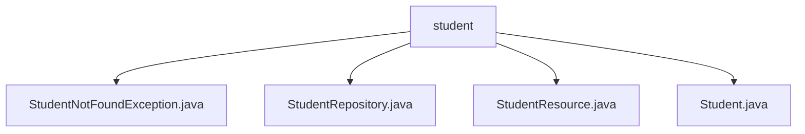

# 基础信息

|      |      |
|------|------|
| 名称 | student |
| 编码语言 | .java |
| 代码路径 | spring-boot-examples/spring-boot-2-rest-service-content-negotiation/src/main/java/com/in28minutes/springboot/rest/example/student |
| 包名 | spring-boot-examples.spring-boot-2-rest-service-content-negotiation.src.main.java.com.in28minutes.springboot.rest.example.student |
| 概述说明 | StudentNotFoundException表示未找到学生，继承RuntimeException。StudentRepository管理学生信息。StudentResource控制器处理学生操作。Student类包含id、name和passportNumber属性。 |

# 说明

## 概述

该代码模块是一个基于Spring Boot的学生信息管理系统，主要用于管理学生的基本信息。模块包含多个核心组件，包括实体类、资源控制器、异常处理以及数据访问层。通过这些组件的协同工作，系统能够提供学生信息的查询、创建、更新和删除功能，同时具备健壮的异常处理机制，确保系统的稳定性和可维护性。

## 主要业务场景

1. **学生信息管理**：
   - 通过`StudentResource`控制器，用户可以执行以下操作：
     - 查询特定学生的详细信息。
     - 删除不再需要的学生记录。
     - 添加新学生的数据。
     - 更新现有学生的信息。
   - 这些功能共同构成了一个完整的学生信息管理系统，确保数据的准确性和实时性，满足日常管理需求。

2. **异常处理**：
   - 当系统未找到指定学生时，`StudentNotFoundException`异常会被抛出。该异常继承自`RuntimeException`，属于非受检异常，不需要在方法签名中显式声明或捕获。通过这种设计，系统能够在遇到未找到学生的场景时，方便地抛出并处理异常，从而提高代码的健壮性和可维护性。

3. **数据封装与操作**：
   - `Student`实体类用于封装学生的基本信息，包含`id`、`name`和`passportNumber`三个属性。每个属性都有对应的getter和setter方法，便于在应用程序中进行数据封装和操作。该实体类设计简洁，符合Java Bean规范。

4. **数据访问**：
   - `StudentRepository`负责与数据库进行交互，提供对学生数据的增删改查操作。通过该组件，系统能够高效地访问和操作学生信息，确保数据的一致性和完整性。

### 包内部结构视图

该流程图展示了`student`目录下的文件层级关系。`student`作为根节点，包含了四个子节点，分别是`StudentNotFoundException.java`、`StudentRepository.java`、`StudentResource.java`和`Student.java`。这些文件都位于`student`目录下，没有进一步的嵌套层级。

# 文件列表 File List

| 名称   | 类型  | 说明 |
|-------|------|-------------|
| [StudentRepository.java](StudentRepository.md) | file | 信息为空，无法生成概要描述。 |
| [Student.java](Student.md) | file | Java类Student包含id、name、passportNumber属性及其getter和setter方法。 |
| [StudentResource.java](StudentResource.md) | file | 学生资源控制器支持查询、删除、创建和更新学生信息。 |
| [StudentNotFoundException.java](StudentNotFoundException.md) | file | StudentNotFoundException继承RuntimeException，包含异常信息构造器。 |

