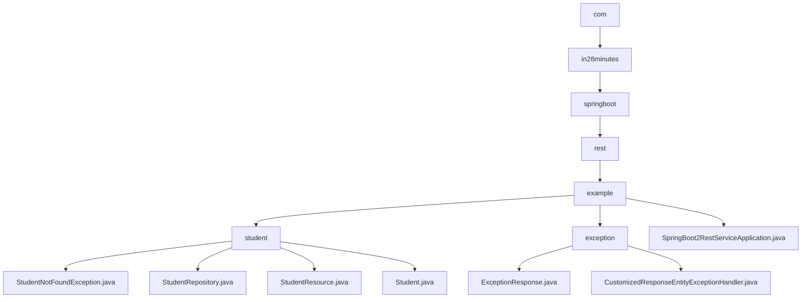

# 基础信息

|      |      |
|------|------|
| 名称 | com |
| 编码语言 | .java |
| 代码路径 | spring-boot-examples/spring-boot-2-rest-service-exception-handling/src/main/java/com |
| 包名 | spring-boot-examples.spring-boot-2-rest-service-exception-handling.src.main.java.com |
| 概述说明 | Spring Boot学生管理系统，支持增删改查，集成异常处理，确保系统稳定。 |

# 说明

## 概述

该代码模块是一个基于Spring Boot的学生信息管理系统，主要功能包括学生信息的查询、创建、更新和删除操作。模块通过RESTful API提供服务，并集成了异常处理机制，确保系统在遇到错误时能够优雅地处理，避免程序崩溃。模块中的核心组件包括学生实体类、资源控制器、数据访问层以及自定义异常类，共同构成了一个完整的学生信息管理解决方案。此外，模块还包含一个基于Spring Boot 2的REST服务异常处理模块，用于统一处理系统中的异常，并生成包含详细错误信息的响应实体，提高系统的健壮性和可维护性。

## 主要业务场景

1. **学生信息查询**：系统支持根据特定条件检索学生数据，用户可以通过API获取学生的详细信息，包括ID、姓名和护照号等。

2. **学生信息创建**：用户可以通过API添加新的学生信息，系统会验证输入数据的完整性，并确保学生对象在创建时具有完整的初始状态。

3. **学生信息更新**：系统允许用户修改现有学生信息的各个字段，确保数据的准确性和时效性。

4. **学生信息删除**：用户可以通过API移除不再需要的学生记录，系统会处理删除操作并确保数据的一致性。

5. **异常处理**：
   - **通用异常处理**：模块能够处理系统中发生的通用异常，并生成包含异常发生时间、错误消息和请求描述的响应实体。
   - **学生未找到异常处理**：专门处理学生未找到的异常，确保在查询学生信息时，如果学生不存在，系统能够返回详细的错误信息，便于前端或客户端进行处理。
   - **统一异常响应**：通过自定义异常处理类，模块能够统一生成异常响应，确保所有异常处理逻辑一致，减少重复代码，提高代码的可读性和可维护性。

6. **应用启动**：Spring Boot应用主类负责启动REST服务，通过Spring Boot的自动配置和依赖注入机制，快速搭建和运行基于RESTful架构的Web服务。启动时，Spring Boot会自动扫描并加载相关的组件、配置文件和依赖项，简化了传统Spring应用的复杂配置流程。

### 包内部结构视图

该流程图展示了Spring Boot项目中Java代码的层级结构。从根目录`com`开始，逐步深入到`in28minutes`、`springboot`、`rest`和`example`目录。`example`目录下包含`student`和`exception`两个子目录，分别存放与学生和异常处理相关的Java文件。同时，`example`目录下还包含一个Spring Boot应用的主启动类`SpringBoot2RestServiceApplication.java`。

# 文件列表 File List

| 名称   | 类型  | 说明 |
|-------|------|-------------|
| [in28minutes](in28minutes/_module.md) | package | Spring Boot学生管理系统，支持增删改查，集成异常处理，确保系统稳定。 |

