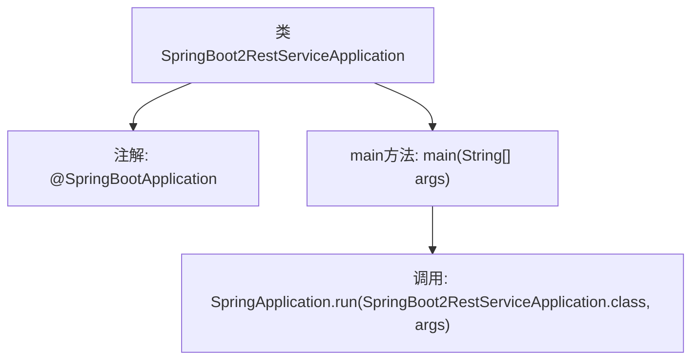

# 基础信息

|      |      |
|------|------|
| 名称 | SpringBoot2RestServiceApplication |
| 编码语言 | .java |
| 代码路径 | spring-boot-examples/spring-boot-2-rest-service-exception-handling/src/main/java/com/in28minutes/springboot/rest/example/SpringBoot2RestServiceApplication.java |
| 包名 | com.in28minutes.springboot.rest.example |
| 依赖项 | ['org.springframework.boot.SpringApplication', 'org.springframework.boot.autoconfigure.SpringBootApplication'] |
| 概述说明 | Spring Boot主类启动REST服务。 |

# 说明

Spring Boot应用主类负责启动REST服务。该类作为应用程序的入口点，通过Spring Boot的自动配置和依赖注入机制，快速搭建和运行基于RESTful架构的Web服务。启动时，Spring Boot会自动扫描并加载相关的组件、配置文件和依赖项，简化了传统Spring应用的复杂配置流程。主类通常包含`@SpringBootApplication`注解，该注解整合了`@Configuration`、`@EnableAutoConfiguration`和`@ComponentScan`，确保应用能够顺利启动并提供REST接口。

# 类列表 Class Summary

| 名称   | 类型  | 说明 |
|-------|------|-------------|
| SpringBoot2RestServiceApplication | class | Spring Boot应用主类，启动REST服务。 |


## 类 SpringBoot2RestServiceApplication

|      |      |
|------|------|
| 访问范围 | @SpringBootApplication;public |
| 类型 | class |
| 名称 | SpringBoot2RestServiceApplication |
| 说明 | Spring Boot应用主类，启动REST服务。 |


### UML类图

```mermaid
classDiagram
    class SpringBoot2RestServiceApplication {
        +static void main(String[] args)
    }
    // SpringBoot2RestServiceApplication 依赖 SpringApplication
    SpringBoot2RestServiceApplication --> SpringApplication : 依赖
```

这段代码定义了一个名为 `SpringBoot2RestServiceApplication` 的类，该类使用了 `@SpringBootApplication` 注解，表明这是一个 Spring Boot 应用程序的入口类。类中包含一个 `main` 方法，该方法通过调用 `SpringApplication.run` 方法来启动 Spring Boot 应用。`SpringBoot2RestServiceApplication` 类依赖于 `SpringApplication` 类，因为它在 `main` 方法中使用了 `SpringApplication` 的静态方法 `run` 来启动应用。


### 内部方法调用关系图



这段代码定义了一个Spring Boot应用程序的入口类`SpringBoot2RestServiceApplication`，并使用`@SpringBootApplication`注解标记该类。`main`方法是程序的启动点，通过调用`SpringApplication.run`方法来启动Spring Boot应用程序。这个流程展示了Spring Boot应用程序的初始化和启动过程，是Spring Boot框架的核心启动机制。

### 字段列表 Field List

| 名称  | 类型  | 说明 |
|-------|-------|------|

### 方法列表 Method List

| 名称  | 类型  | 说明 |
|-------|-------|------|
| main | void | Spring Boot应用启动主方法，运行指定类。 |


