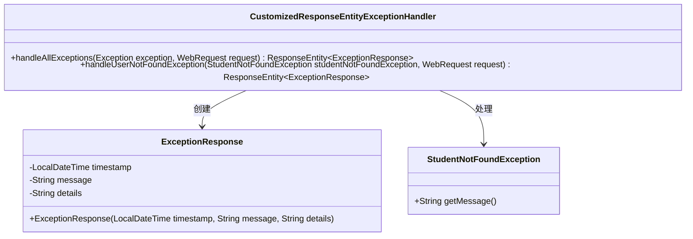
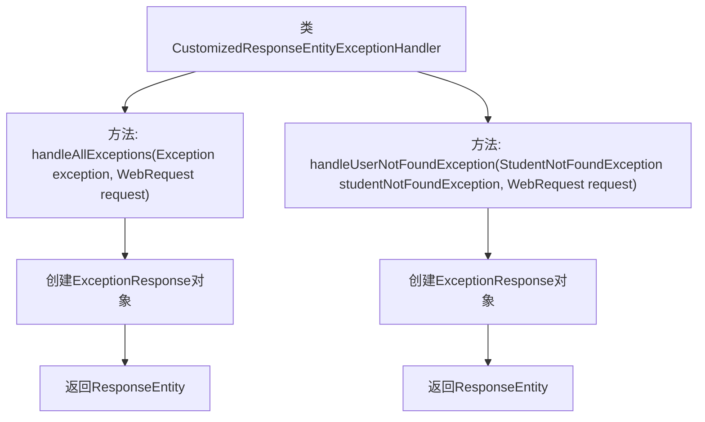

# 基础信息

|      |      |
|------|------|
| 名称 | CustomizedResponseEntityExceptionHandler |
| 编码语言 | .java |
| 代码路径 | spring-boot-examples/spring-boot-2-rest-service-exception-handling/src/main/java/com/in28minutes/springboot/rest/example/exception/CustomizedResponseEntityExceptionHandler.java |
| 包名 | com.in28minutes.springboot.rest.example.exception |
| 依赖项 | ['java.time.LocalDateTime', 'org.springframework.http.HttpStatus', 'org.springframework.http.ResponseEntity', 'org.springframework.web.bind.annotation.ExceptionHandler', 'org.springframework.web.bind.annotation.RestControllerAdvice', 'org.springframework.web.context.request.WebRequest', 'org.springframework.web.servlet.mvc.method.annotation.ResponseEntityExceptionHandler', 'com.in28minutes.springboot.rest.example.student.StudentNotFoundException'] |
| 概述说明 | 自定义异常类处理通用和学生未找到异常，返回时间、消息和请求描述。 |

# 说明

该内容描述了一个自定义异常处理类，专门用于处理通用异常和学生未找到异常。当这些异常发生时，该类会生成一个响应实体，其中包含异常发生的时间、具体的错误消息以及相关的请求描述。这种设计有助于在系统中统一处理异常，并提供详细的错误信息，便于开发和调试。

# 类列表 Class Summary

| 名称   | 类型  | 说明 |
|-------|------|-------------|
| CustomizedResponseEntityExceptionHandler | class | 自定义异常处理类，处理通用异常和学生未找到异常，返回包含时间、消息和请求描述的响应实体。 |

## 类 CustomizedResponseEntityExceptionHandler

|      |      |
|------|------|
| 访问范围 | @RestControllerAdvice;public |
| 类型 | class |
| 名称 | CustomizedResponseEntityExceptionHandler |
| 说明 | 自定义异常处理类，处理通用异常和学生未找到异常，返回包含时间、消息和请求描述的响应实体。 |

### UML类图

这段代码定义了一个`CustomizedResponseEntityExceptionHandler`类，用于处理全局异常。它包含两个方法：`handleAllExceptions`用于处理所有类型的异常，`handleUserNotFoundException`用于处理特定的`StudentNotFoundException`异常。两个方法都返回一个包含`ExceptionResponse`对象的`ResponseEntity`，`ExceptionResponse`类用于封装异常信息，包括时间戳、消息和详细信息。`StudentNotFoundException`是一个自定义异常类，提供异常消息。

### 内部方法调用关系图

这段代码定义了一个名为 `CustomizedResponseEntityExceptionHandler` 的类，它继承自 `ResponseEntityExceptionHandler`，用于全局处理应用程序中的异常。类中包含两个异常处理方法：`handleAllExceptions` 和 `handleUserNotFoundException`。`handleAllExceptions` 方法处理所有类型的异常，并返回一个包含异常信息的 `ResponseEntity`，状态码为 `500 Internal Server Error`。`handleUserNotFoundException` 方法专门处理 `StudentNotFoundException` 异常，并返回一个包含异常信息的 `ResponseEntity`，状态码为 `404 Not Found`。每个方法都会创建一个 `ExceptionResponse` 对象来封装异常信息，并最终返回给客户端。

### 字段列表 Field List

| 名称  | 类型  | 说明 |
|-------|-------|------|

### 方法列表 Method List

| 名称  | 类型  | 说明 |
|-------|-------|------|
| handleAllExceptions | ResponseEntity<ExceptionResponse> | 全局异常处理，返回自定义错误信息和HTTP状态码500。 |
| handleUserNotFoundException | ResponseEntity<ExceptionResponse> | 处理学生未找到异常，返回包含时间、消息和请求描述的响应，状态码为404。 |

