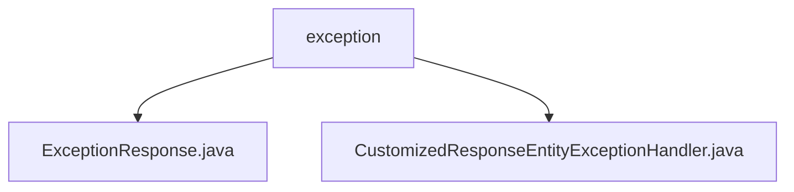

# 基础信息

|      |      |
|------|------|
| 名称 | exception |
| 编码语言 | .java |
| 代码路径 | spring-boot-examples/spring-boot-2-rest-service-exception-handling/src/main/java/com/in28minutes/springboot/rest/example/exception |
| 包名 | spring-boot-examples.spring-boot-2-rest-service-exception-handling.src.main.java.com.in28minutes.springboot.rest.example.exception |
| 概述说明 | 自定义异常处理类统一处理通用和学生未找到异常，生成包含时间、错误信息和请求描述的响应实体。 |

# 说明

## 概述
该代码模块主要是一个基于Spring Boot 2的REST服务异常处理模块。它通过自定义异常处理类来统一处理系统中的异常，并生成包含详细错误信息的响应实体。这种设计有助于在开发和调试过程中快速定位问题，并提高系统的健壮性和可维护性。

## 主要业务场景
1. **通用异常处理**：该模块能够处理系统中发生的通用异常，并生成包含异常发生时间、错误消息和请求描述的响应实体。
2. **学生未找到异常处理**：专门处理学生未找到的异常，确保在查询学生信息时，如果学生不存在，系统能够返回详细的错误信息，便于前端或客户端进行处理。
3. **统一异常响应**：通过自定义异常处理类，模块能够统一生成异常响应，确保所有异常处理逻辑一致，减少重复代码，提高代码的可读性和可维护性。

### 包内部结构视图

该流程图展示了`spring-boot-examples`项目中`exception`文件夹的层级关系。`exception`文件夹下包含两个文件：`ExceptionResponse.java`和`CustomizedResponseEntityExceptionHandler.java`。这两个文件分别用于处理异常响应和自定义异常处理逻辑，体现了项目中异常处理模块的结构。

# 文件列表 File List

| 名称   | 类型  | 说明 |
|-------|------|-------------|
| [CustomizedResponseEntityExceptionHandler.java](CustomizedResponseEntityExceptionHandler.md) | file | 自定义异常类处理通用和学生未找到异常，返回时间、消息和请求描述。 |
| [ExceptionResponse.java](ExceptionResponse.md) | file | 信息为空，无法生成概要描述。 |

