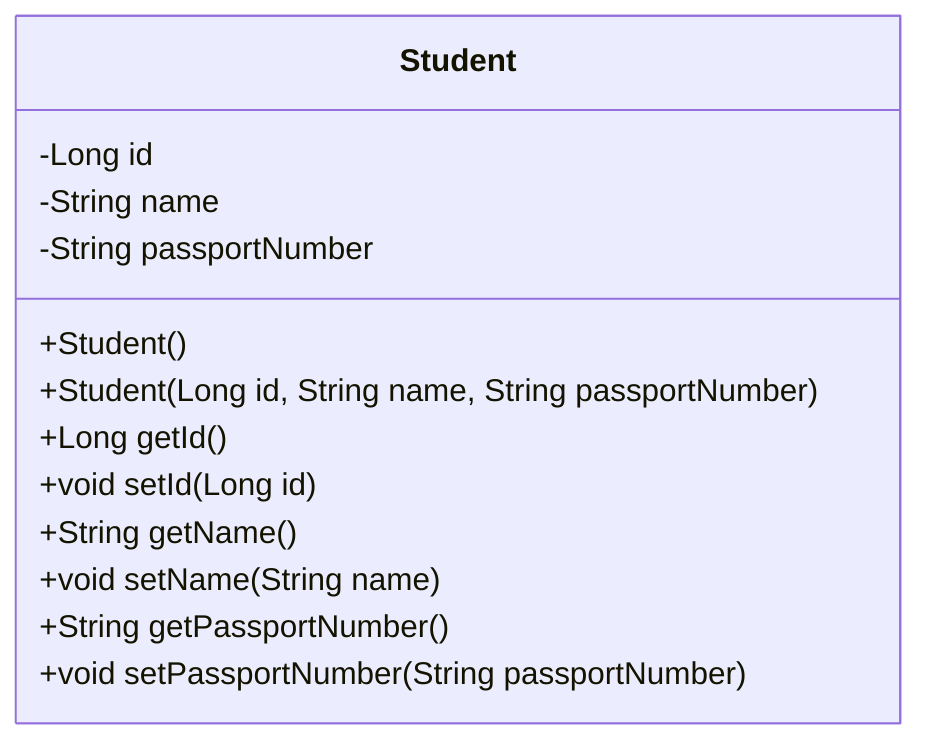

# 基础信息

|      |      |
|------|------|
| 名称 | Student |
| 编码语言 | .java |
| 代码路径 | spring-boot-examples/spring-boot-2-rest-service-exception-handling/src/main/java/com/in28minutes/springboot/rest/example/student/Student.java |
| 包名 | com.in28minutes.springboot.rest.example.student |
| 依赖项 | ['jakarta.persistence.Entity', 'jakarta.persistence.GeneratedValue', 'jakarta.persistence.Id'] |
| 概述说明 | 定义学生实体类，包含ID、姓名、护照号属性及构造方法。 |

# 说明

该内容定义了一个学生实体类，其中包含三个主要属性：ID、姓名和护照号。这些属性用于唯一标识和描述学生对象。此外，该实体类还包含一个构造方法，用于在创建学生对象时初始化这些属性。构造方法确保在实例化学生对象时，必须提供ID、姓名和护照号的具体值，以便对象具有完整的初始状态。

# 类列表 Class Summary

| 名称   | 类型  | 说明 |
|-------|------|-------------|
| Student | class | 定义学生实体类，包含ID、姓名和护照号属性及其构造方法。 |

## 类 Student

|      |      |
|------|------|
| 访问范围 | @Entity;public |
| 类型 | class |
| 名称 | Student |
| 说明 | 定义学生实体类，包含ID、姓名和护照号属性及其构造方法。 |

### UML类图

### 描述：
`Student` 类是一个实体类，通常用于表示数据库中的学生记录。它包含三个私有属性：`id`、`name` 和 `passportNumber`，分别表示学生的唯一标识、姓名和护照号码。类中提供了两个构造函数：一个无参构造函数和一个带参构造函数，用于初始化对象。此外，类中还提供了每个属性的 `getter` 和 `setter` 方法，用于访问和修改这些属性。这个类通常用于持久化数据，并通过 ORM（对象关系映射）框架与数据库进行交互。

### 内部方法调用关系图

```mermaid
graph TD
    A["类Student"]
    B["注解: @Entity"]
    C["注解: @Id"]
    D["注解: @GeneratedValue"]
    E["属性: Long id"]
    F["属性: String name"]
    G["属性: String passportNumber"]
    H["构造方法: Student()"]
    I["构造方法: Student(Long id, String name, String passportNumber)"]
    J["方法: Long getId()"]
    K["方法: void setId(Long id)"]
    L["方法: String getName()"]
    M["方法: void setName(String name)"]
    N["方法: String getPassportNumber()"]
    O["方法: void setPassportNumber(String passportNumber)"]

    A --> B
    A --> C
    A --> D
    A --> E
    A --> F
    A --> G
    A --> H
    A --> I
    A --> J
    A --> K
    A --> L
    A --> M
    A --> N
    A --> O
```

这段代码定义了一个名为`Student`的实体类，使用了`@Entity`、`@Id`和`@GeneratedValue`注解来标识该类为JPA实体，并指定了主键的生成策略。类中包含三个属性：`id`、`name`和`passportNumber`，并提供了相应的构造方法和getter/setter方法。流程图展示了类与属性、方法之间的关系，清晰地描述了类的结构和功能。

### 字段列表 Field List

| 名称  | 类型  | 说明 |
|-------|-------|------|
| passportNumber | String | 定义私有字符串变量护照号码。 |
| name | String | 定义了一个私有字符串变量name。 |
| id | Long | 实体类中定义自增长主键字段。 |

### 方法列表 Method List

| 名称  | 类型  | 说明 |
|-------|-------|------|
| setId | void | 该方法用于设置对象的ID属性。 |
| getId | Long | 该方法返回一个长整型ID值。 |
| getName | String | 该方法返回字符串类型的name变量值。 |
| setName | void | 设置对象名称的方法，将传入的字符串赋值给内部变量。 |
| getPassportNumber | String | 该方法返回护照号码字符串。 |
| setPassportNumber | void | 设置护照号的方法，将传入值赋给类变量。 |

