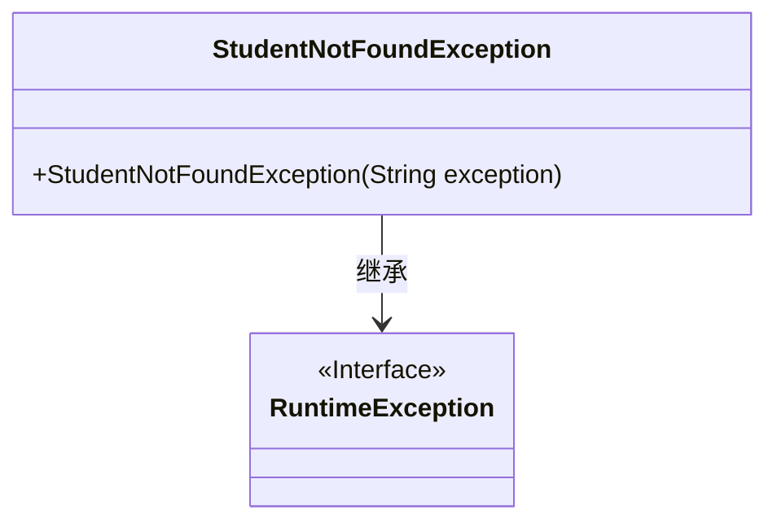
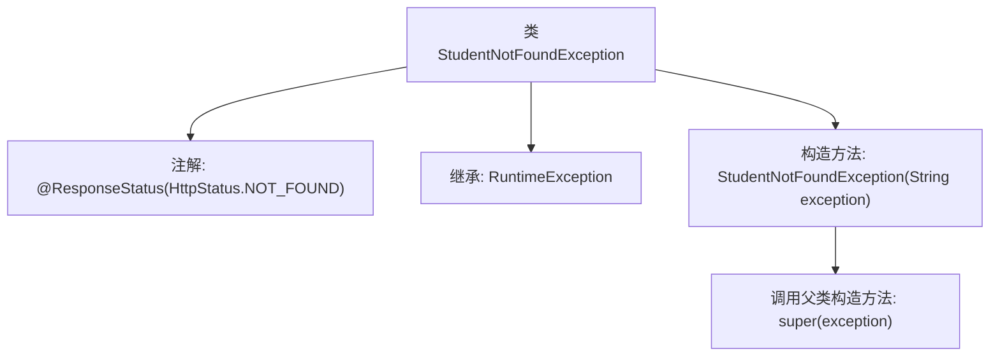

# 基础信息

|      |      |
|------|------|
| 名称 | StudentNotFoundException |
| 编码语言 | .java |
| 代码路径 | spring-boot-examples/spring-boot-2-rest-service-exception-handling/src/main/java/com/in28minutes/springboot/rest/example/student/StudentNotFoundException.java |
| 包名 | com.in28minutes.springboot.rest.example.student |
| 依赖项 | ['org.springframework.http.HttpStatus', 'org.springframework.web.bind.annotation.ResponseStatus'] |
| 概述说明 | StudentNotFoundException继承RuntimeException，处理404状态。 |

# 说明

StudentNotFoundException类继承自RuntimeException，专门用于处理404状态码的异常情况。该类的主要作用是在应用程序中捕获并处理学生信息未找到的情况，从而确保系统能够优雅地处理此类错误，避免程序崩溃或产生不可预见的后果。通过继承RuntimeException，该类属于非检查型异常，开发者可以选择在适当的地方捕获和处理该异常，以提高代码的健壮性和用户体验。

# 类列表 Class Summary

| 名称   | 类型  | 说明 |
|-------|------|-------------|
| StudentNotFoundException | class | StudentNotFoundException类继承RuntimeException，用于处理404状态。 |

## 类 StudentNotFoundException

|      |      |
|------|------|
| 访问范围 | @ResponseStatus(HttpStatus.NOT_FOUND);public |
| 类型 | class |
| 名称 | StudentNotFoundException |
| 说明 | StudentNotFoundException类继承RuntimeException，用于处理404状态。 |

### UML类图

这段代码定义了一个 `StudentNotFoundException` 类，它继承自 `RuntimeException` 类。`StudentNotFoundException` 是一个自定义的异常类，用于在找不到学生时抛出异常。它包含一个构造函数，接受一个字符串参数 `exception`，并将其传递给父类 `RuntimeException` 的构造函数。通过 `@ResponseStatus(HttpStatus.NOT_FOUND)` 注解，该异常在抛出时会返回 HTTP 404 状态码，表示资源未找到。

### 内部方法调用关系图

这段代码定义了一个名为 `StudentNotFoundException` 的异常类，该类继承自 `RuntimeException`，并使用了 `@ResponseStatus(HttpStatus.NOT_FOUND)` 注解，表示当该异常被抛出时，HTTP 响应状态码应为 404。类中包含一个构造方法，接受一个字符串参数 `exception`，并调用父类的构造方法进行初始化。

### 字段列表 Field List

| 名称  | 类型  | 说明 |
|-------|-------|------|

### 方法列表 Method List

| 名称  | 类型  | 说明 |
|-------|-------|------|

