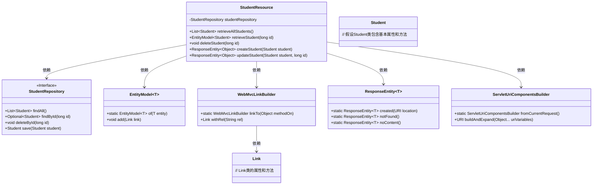

# 基础信息

|      |      |
|------|------|
| 名称 | StudentResource |
| 编码语言 | .java |
| 代码路径 | spring-boot-examples/spring-boot-2-rest-service-exception-handling/src/main/java/com/in28minutes/springboot/rest/example/student/StudentResource.java |
| 包名 | com.in28minutes.springboot.rest.example.student |
| 依赖项 | ['org.springframework.hateoas.server.mvc.WebMvcLinkBuilder.linkTo', 'org.springframework.hateoas.server.mvc.WebMvcLinkBuilder.methodOn', 'java.net.URI', 'java.util.List', 'java.util.Optional', 'org.springframework.beans.factory.annotation.Autowired', 'org.springframework.hateoas.EntityModel', 'org.springframework.hateoas.server.mvc.WebMvcLinkBuilder', 'org.springframework.http.ResponseEntity', 'org.springframework.web.bind.annotation.DeleteMapping', 'org.springframework.web.bind.annotation.GetMapping', 'org.springframework.web.bind.annotation.PathVariable', 'org.springframework.web.bind.annotation.PostMapping', 'org.springframework.web.bind.annotation.PutMapping', 'org.springframework.web.bind.annotation.RequestBody', 'org.springframework.web.bind.annotation.RequestMapping', 'org.springframework.web.bind.annotation.RestController', 'org.springframework.web.servlet.support.ServletUriComponentsBuilder'] |
| 概述说明 | 学生管理API支持查询、删除、创建和更新学生信息。 |

# 说明

学生管理API提供了一套完整的功能，用于处理学生信息的操作。该API支持查询学生信息，允许用户根据特定条件检索学生数据。删除功能可用于移除不再需要的学生记录。创建功能使用户能够添加新的学生信息到系统中。更新功能则允许修改现有学生信息的各个字段，确保数据的准确性和时效性。这些功能共同构成了一个全面的学生信息管理系统，便于用户高效地管理和维护学生数据。

# 类列表 Class Summary

| 名称   | 类型  | 说明 |
|-------|------|-------------|
| StudentResource | class | 学生管理API：查询、删除、创建、更新学生信息。 |

## 类 StudentResource

|      |      |
|------|------|
| 访问范围 | @RestController;@RequestMapping("/students");public |
| 类型 | class |
| 名称 | StudentResource |
| 说明 | 学生管理API：查询、删除、创建、更新学生信息。 |

### UML类图

### 描述
该代码实现了一个RESTful API控制器 `StudentResource`，用于管理学生信息。控制器通过 `StudentRepository` 接口与数据库交互，提供了获取所有学生、根据ID获取学生、删除学生、创建学生和更新学生的功能。代码中使用了 `EntityModel` 和 `WebMvcLinkBuilder` 来构建HATEOAS风格的响应，并通过 `ResponseEntity` 和 `ServletUriComponentsBuilder` 来处理HTTP响应和URI构建。

### 内部方法调用关系图

```mermaid
graph TD
    A["类StudentResource"]
    B["属性: StudentRepository studentRepository"]
    C["方法: List<Student> retrieveAllStudents()"]
    D["方法: EntityModel<Student> retrieveStudent(long id)"]
    E["方法: void deleteStudent(long id)"]
    F["方法: ResponseEntity<Object> createStudent(Student student)"]
    G["方法: ResponseEntity<Object> updateStudent(Student student, long id)"]
    H["操作: studentRepository.findAll()"]
    I["操作: studentRepository.findById(id)"]
    J["操作: throw new StudentNotFoundException('id-' + id)"]
    K["操作: EntityModel.of(student.get())"]
    L["操作: linkTo(methodOn(this.getClass()).retrieveAllStudents())"]
    M["操作: resource.add(linkTo.withRel('all-students'))"]
    N["操作: studentRepository.deleteById(id)"]
    O["操作: studentRepository.save(student)"]
    P["操作: ServletUriComponentsBuilder.fromCurrentRequest().path('/{id}').buildAndExpand(savedStudent.getId()).toUri()"]
    Q["操作: ResponseEntity.created(location).build()"]
    R["操作: ResponseEntity.notFound().build()"]
    S["操作: ResponseEntity.noContent().build()"]

    A --> B
    A --> C
    A --> D
    A --> E
    A --> F
    A --> G
    C --> H
    D --> I
    I --> J
    D --> K
    D --> L
    D --> M
    E --> N
    F --> O
    F --> P
    F --> Q
    G --> I
    I --> R
    G --> O
    G --> S
```

这段代码定义了一个名为 `StudentResource` 的 REST 控制器类，用于处理与学生相关的 HTTP 请求。它包含多个方法，分别用于获取所有学生、获取特定学生、删除学生、创建学生和更新学生信息。每个方法通过调用 `StudentRepository` 的相应方法来执行数据库操作，并根据操作结果返回适当的响应实体或抛出异常。代码中使用了 Spring 框架的注解和工具类来简化 RESTful API 的实现。

### 字段列表 Field List

| 名称  | 类型  | 说明 |
|-------|-------|------|
| studentRepository | StudentRepository | 自动注入学生仓库实例。 |

### 方法列表 Method List

| 名称  | 类型  | 说明 |
|-------|-------|------|
| deleteStudent | void | 删除指定ID的学生记录。 |
| createStudent | ResponseEntity<Object> | 创建学生并返回资源位置。 |
| retrieveAllStudents | List<Student> | 获取所有学生信息的GET请求处理接口。 |
| retrieveStudent | EntityModel<Student> | 通过ID获取学生信息，若不存在则抛出异常，并添加返回所有学生的链接。 |
| updateStudent | ResponseEntity<Object> | 通过ID更新学生信息，若存在则保存并返回无内容响应，否则返回未找到。 |

