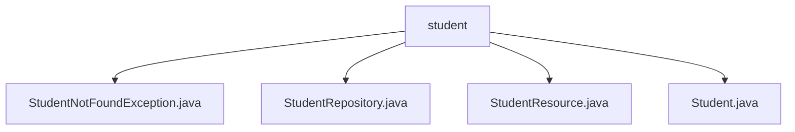

# 基础信息

|      |      |
|------|------|
| 名称 | student |
| 编码语言 | .java |
| 代码路径 | spring-boot-examples/spring-boot-2-rest-service-exception-handling/src/main/java/com/in28minutes/springboot/rest/example/student |
| 包名 | spring-boot-examples.spring-boot-2-rest-service-exception-handling.src.main.java.com.in28minutes.springboot.rest.example.student |
| 概述说明 | StudentNotFoundException处理404异常，StudentRepository提供学生信息管理API，StudentResource定义学生实体类。 |

# 说明

## 概述

该代码模块是一个基于Spring Boot的学生信息管理系统，主要功能包括学生信息的查询、创建、更新和删除操作。模块通过RESTful API提供服务，并集成了异常处理机制，确保系统在遇到错误时能够优雅地处理，避免程序崩溃。模块中的核心组件包括学生实体类、资源控制器、数据访问层以及自定义异常类，共同构成了一个完整的学生信息管理解决方案。

## 主要业务场景

1. **学生信息查询**：系统支持根据特定条件检索学生数据，用户可以通过API获取学生的详细信息，包括ID、姓名和护照号等。

2. **学生信息创建**：用户可以通过API添加新的学生信息，系统会验证输入数据的完整性，并确保学生对象在创建时具有完整的初始状态。

3. **学生信息更新**：系统允许用户修改现有学生信息的各个字段，确保数据的准确性和时效性。

4. **学生信息删除**：用户可以通过API移除不再需要的学生记录，系统会处理删除操作并确保数据的一致性。

5. **异常处理**：模块中自定义了`StudentNotFoundException`类，用于处理学生信息未找到的情况。该异常继承自`RuntimeException`，属于非检查型异常，开发者可以在适当的地方捕获并处理该异常，以提高系统的健壮性和用户体验。

### 包内部结构视图

该流程图展示了`student`目录下的文件结构，包括`StudentNotFoundException.java`、`StudentRepository.java`、`StudentResource.java`和`Student.java`四个文件。这些文件均位于`student`目录下，没有进一步的子目录层级。

# 文件列表 File List

| 名称   | 类型  | 说明 |
|-------|------|-------------|
| [StudentResource.java](StudentResource.md) | file | 学生管理API支持查询、删除、创建和更新学生信息。 |
| [Student.java](Student.md) | file | 定义学生实体类，包含ID、姓名、护照号属性及构造方法。 |
| [StudentRepository.java](StudentRepository.md) | file | 信息为空，无法生成概要描述。 |
| [StudentNotFoundException.java](StudentNotFoundException.md) | file | StudentNotFoundException继承RuntimeException，处理404状态。 |

