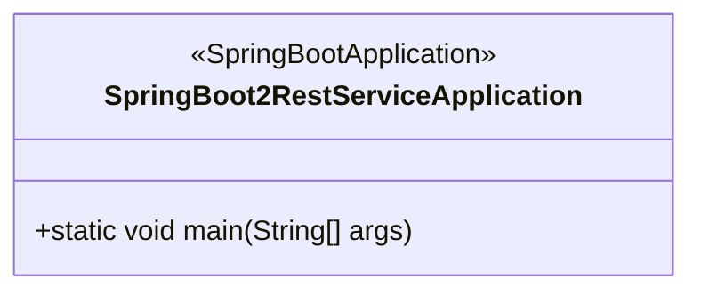
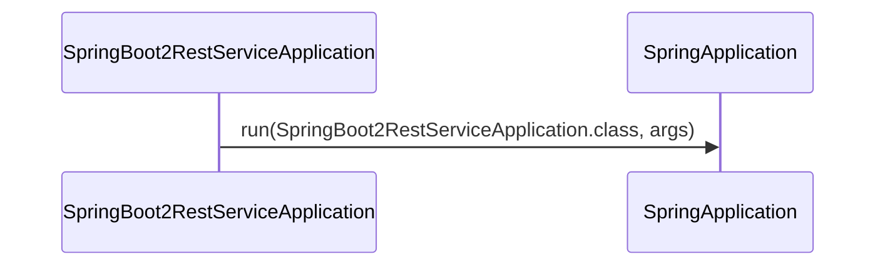
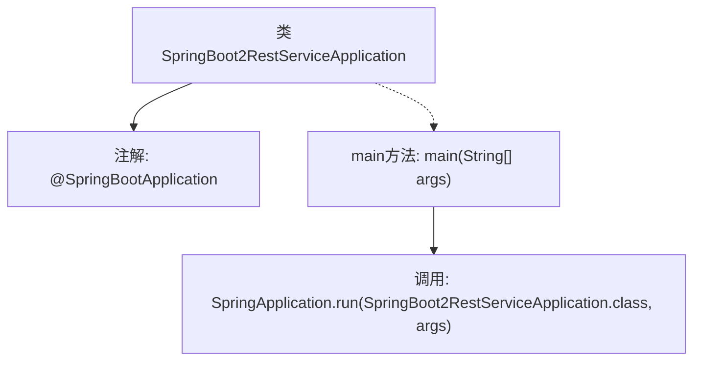

# 基础信息

|      |      |
|------|------|
| 名称 | SpringBoot2RestServiceApplication |
| 编码语言 | .java |
| 代码路径 | spring-boot-examples/spring-boot-2-rest-service-filtering/src/main/java/com/in28minutes/springboot/rest/example/SpringBoot2RestServiceApplication.java |
| 包名 | com.in28minutes.springboot.rest.example |
| 依赖项 | ['org.springframework.boot.SpringApplication', 'org.springframework.boot.autoconfigure.SpringBootApplication'] |
| 概述说明 | Spring Boot主类启动REST服务。 |

# 说明

Spring Boot应用的主类用于启动REST服务。该类是应用的入口点，负责初始化Spring Boot应用上下文并启动内嵌的Web服务器，以便提供RESTful API服务。通过该主类，Spring Boot应用能够自动配置并运行，简化了传统Java应用的部署和启动流程。

# 类列表 Class Summary

| 名称   | 类型  | 说明 |
|-------|------|-------------|
| SpringBoot2RestServiceApplication | class | Spring Boot应用主类，启动REST服务。 |

## 类 SpringBoot2RestServiceApplication

|      |      |
|------|------|
| 访问范围 | @SpringBootApplication;public |
| 类型 | class |
| 名称 | SpringBoot2RestServiceApplication |
| 说明 | Spring Boot应用主类，启动REST服务。 |

### UML类图

**描述**：`SpringBoot2RestServiceApplication` 是一个 Spring Boot 应用的主类，使用了 `@SpringBootApplication` 注解来标记该类为 Spring Boot 应用的入口。`main` 方法通过调用 `SpringApplication.run` 方法来启动 Spring Boot 应用。类图展示了 `SpringBoot2RestServiceApplication` 类的结构，时序图展示了应用启动时的调用流程。

### 内部方法调用关系图

这段代码是一个简单的Spring Boot应用程序入口类。`@SpringBootApplication`注解用于标记主类，表示这是一个Spring Boot应用程序。`main`方法是程序的入口点，调用`SpringApplication.run`方法来启动Spring Boot应用。该代码通过加载配置、初始化Spring上下文并启动内嵌的Web服务器，使得应用程序能够运行并提供REST服务。

### 字段列表 Field List

| 名称  | 类型  | 说明 |
|-------|-------|------|

### 方法列表 Method List

| 名称  | 类型  | 说明 |
|-------|-------|------|
| main | void | Spring Boot应用启动主方法，运行指定类。 |

