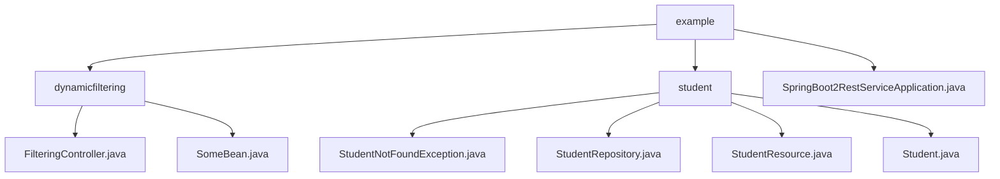

# 基础信息

|      |      |
|------|------|
| 名称 | example |
| 编码语言 | .java |
| 代码路径 | spring-boot-examples/spring-boot-2-rest-service-filtering/src/main/java/com/in28minutes/springboot/rest/example |
| 包名 | spring-boot-examples.spring-boot-2-rest-service-filtering.src.main.java.com.in28minutes.springboot.rest.example |
| 概述说明 | Spring Boot REST服务示例，支持动态过滤和学生信息管理，提升数据检索效率与系统性能。 |

# 说明

## 概述
该代码模块是一个基于Spring Boot 2的REST服务示例，主要包含两个核心功能：动态过滤功能和学生信息管理。模块通过`FilteringController`实现了对`Bean`或`Bean`列表的动态过滤，仅返回客户端指定的字段，从而简化数据查询过程，提高数据检索效率，并减少不必要的数据传输。同时，模块还通过`StudentResource`控制器提供了对学生信息的查询和管理功能，支持获取所有学生的列表或单个学生的详细信息，并通过自定义异常`StudentNotFoundException`处理学生信息查找失败的情况，确保程序的健壮性和可维护性。

## 主要业务场景
1. **数据过滤**：
   - 通过`FilteringController`处理GET请求，实现对`Bean`或`Bean`列表的动态过滤，仅返回客户端请求的特定字段。
   - 适用于需要高效、灵活地返回部分数据的REST服务场景，特别是在数据量较大或网络带宽有限的情况下。

2. **学生信息查询与管理**：
   - 通过`StudentResource`控制器提供的API接口，用户可以获取所有学生的列表或单个学生的详细信息。
   - `Student`类定义了学生数据模型，包含`id`和`name`字段，用于标识和描述学生对象。
   - `StudentRepository`负责学生数据的具体操作，提供对学生信息的增删改查功能，支持对数据的持久化和管理。

3. **异常处理**：
   - 当查找学生信息失败时，`StudentNotFoundException`异常会被抛出，帮助开发者快速定位和处理学生信息缺失的问题。
   - 该异常继承自`RuntimeException`，无需在编译时显式捕获或声明。

4. **应用启动**：
   - 通过`SpringBoot2RestServiceApplication`主类启动REST服务，负责初始化Spring Boot应用上下文并启动内嵌的Web服务器，以便提供RESTful API服务。

该模块通过动态过滤功能和学生信息管理功能，实现了对数据的高效管理和访问，同时确保了数据的安全性和程序的稳定性。

### 包内部结构视图

该流程图展示了Spring Boot示例项目的路径层级关系。根节点为`example`，包含`dynamicfiltering`和`student`两个子目录，以及`SpringBoot2RestServiceApplication.java`文件。`dynamicfiltering`目录下包含`FilteringController.java`和`SomeBean.java`文件，而`student`目录下包含`StudentNotFoundException.java`、`StudentRepository.java`、`StudentResource.java`和`Student.java`文件。

# 文件列表 File List

| 名称   | 类型  | 说明 |
|-------|------|-------------|
| [SpringBoot2RestServiceApplication.java](SpringBoot2RestServiceApplication.md) | file | Spring Boot主类启动REST服务。 |
| [student](student/_module.md) | package | StudentNotFoundException用于处理学生查找失败，继承RuntimeException。StudentRepository管理学生数据，提供查询接口。Student类包含id和name，忽略passportNumber。 |
| [dynamicfiltering](dynamicfiltering/_module.md) | package | FilteringController通过GET请求过滤Bean，仅返回指定字段，提升数据检索效率。 |

