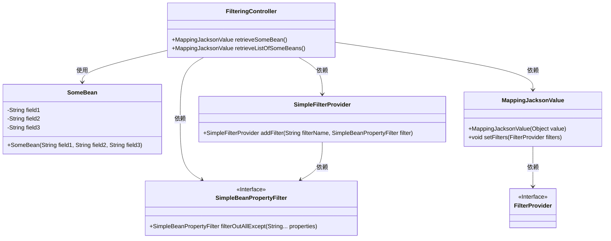

# 基础信息

|      |      |
|------|------|
| 名称 | FilteringController |
| 编码语言 | .java |
| 代码路径 | spring-boot-examples/spring-boot-2-rest-service-filtering/src/main/java/com/in28minutes/springboot/rest/example/dynamicfiltering/FilteringController.java |
| 包名 | com.in28minutes.springboot.rest.example.dynamicfiltering |
| 依赖项 | ['java.util.List', 'org.springframework.http.converter.json.MappingJacksonValue', 'org.springframework.web.bind.annotation.GetMapping', 'org.springframework.web.bind.annotation.RestController', 'com.fasterxml.jackson.databind.ser.FilterProvider', 'com.fasterxml.jackson.databind.ser.impl.SimpleBeanPropertyFilter', 'com.fasterxml.jackson.databind.ser.impl.SimpleFilterProvider'] |
| 概述说明 | FilteringController通过GET请求筛选并返回指定字段的Bean或Bean列表。 |

# 说明

FilteringController通过GET请求实现对Bean或Bean列表的过滤功能，仅返回指定的字段。该控制器简化了数据查询过程，提高了数据检索效率，确保客户端仅获取所需信息，减少了不必要的数据传输。

# 类列表 Class Summary

| 名称   | 类型  | 说明 |
|-------|------|-------------|
| FilteringController | class | FilteringController通过GET请求过滤返回指定字段的Bean或Bean列表。 |

## 类 FilteringController

|      |      |
|------|------|
| 访问范围 | @RestController;public |
| 类型 | class |
| 名称 | FilteringController |
| 说明 | FilteringController通过GET请求过滤返回指定字段的Bean或Bean列表。 |

### UML类图

这段代码描述了一个Spring Boot控制器`FilteringController`，它通过`@RestController`注解标记为REST控制器。该控制器包含两个方法：`retrieveSomeBean`和`retrieveListOfSomeBeans`，分别用于返回经过过滤的单个`SomeBean`对象和`SomeBean`对象列表。过滤是通过`SimpleBeanPropertyFilter`和`SimpleFilterProvider`实现的，最终结果通过`MappingJacksonValue`返回给客户端。代码展示了如何通过过滤器控制返回的JSON字段，提供了灵活的数据展示方式。

### 内部方法调用关系图

这段代码定义了一个`FilteringController`类，包含两个方法`retrieveSomeBean`和`retrieveListOfSomeBeans`。`retrieveSomeBean`方法创建一个`SomeBean`对象，并通过过滤器只保留`field1`和`field2`字段，最后返回过滤后的结果。`retrieveListOfSomeBeans`方法创建一个`SomeBean`对象列表，并通过过滤器只保留`field2`和`field3`字段，最后返回过滤后的列表。这两个方法都使用了`MappingJacksonValue`和`FilterProvider`来实现字段的动态过滤。

### 字段列表 Field List

| 名称  | 类型  | 说明 |
|-------|-------|------|

### 方法列表 Method List

| 名称  | 类型  | 说明 |
|-------|-------|------|
| retrieveSomeBean | MappingJacksonValue | GET请求过滤返回SomeBean，仅保留field1和field2字段。 |
| retrieveListOfSomeBeans | MappingJacksonValue | 通过过滤器返回部分字段的Bean列表。 |

