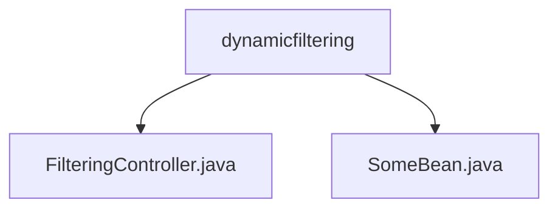

# 基础信息

|      |      |
|------|------|
| 名称 | dynamicfiltering |
| 编码语言 | .java |
| 代码路径 | spring-boot-examples/spring-boot-2-rest-service-filtering/src/main/java/com/in28minutes/springboot/rest/example/dynamicfiltering |
| 包名 | spring-boot-examples.spring-boot-2-rest-service-filtering.src.main.java.com.in28minutes.springboot.rest.example.dynamicfiltering |
| 概述说明 | FilteringController通过GET请求过滤Bean，仅返回指定字段，提升数据检索效率。 |

# 说明

## 概述
该代码模块是一个基于Spring Boot 2的REST服务示例，主要用于实现动态过滤功能。通过`FilteringController`控制器，模块支持对`Bean`或`Bean`列表进行过滤，仅返回客户端指定的字段。这种设计简化了数据查询过程，提高了数据检索效率，并减少了不必要的数据传输，确保客户端仅获取所需信息。

## 主要业务场景
1. **数据过滤**：通过`FilteringController`处理GET请求，实现对`Bean`或`Bean`列表的动态过滤，仅返回客户端请求的特定字段。
2. **提高效率**：通过减少返回数据的字段数量，降低网络传输负载，提升数据检索效率。
3. **简化查询**：提供一种简化的数据查询方式，避免客户端获取冗余信息，提升系统的整体性能和用户体验。

该模块适用于需要高效、灵活地返回部分数据的REST服务场景，特别是在数据量较大或网络带宽有限的情况下。

### 包内部结构视图

该流程图展示了`dynamicfiltering`文件夹下的文件结构。`dynamicfiltering`作为根节点，包含两个子节点：`FilteringController.java`和`SomeBean.java`。这两个文件分别代表了控制器和实体类，用于处理动态过滤的请求和定义相关数据结构。

# 文件列表 File List

| 名称   | 类型  | 说明 |
|-------|------|-------------|
| [SomeBean.java](SomeBean.md) | file | 信息为空，无法生成概要描述。 |
| [FilteringController.java](FilteringController.md) | file | FilteringController通过GET请求筛选并返回指定字段的Bean或Bean列表。 |

