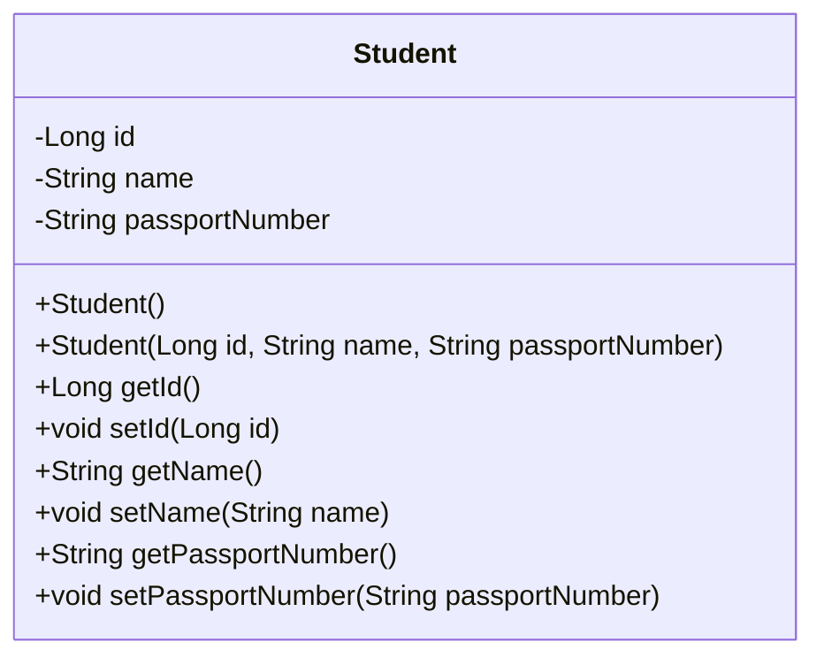
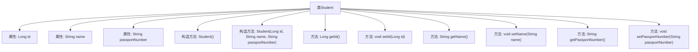

# 基础信息

|      |      |
|------|------|
| 名称 | Student |
| 编码语言 | .java |
| 代码路径 | spring-boot-examples/spring-boot-2-rest-service-filtering/src/main/java/com/in28minutes/springboot/rest/example/student/Student.java |
| 包名 | com.in28minutes.springboot.rest.example.student |
| 依赖项 | ['jakarta.persistence.Entity', 'jakarta.persistence.GeneratedValue', 'jakarta.persistence.Id', 'com.fasterxml.jackson.annotation.JsonIgnore', 'com.fasterxml.jackson.annotation.JsonIgnoreProperties'] |
| 概述说明 | Student类有id、name字段，忽略passportNumber。 |

# 说明

Student类包含三个字段：id、name和passportNumber。其中，passportNumber字段在类的处理过程中被忽略，不会被使用或存储。id和name字段则被保留，用于标识和描述学生对象。这种设计可能出于隐私或数据管理的考虑，避免存储敏感信息。

# 类列表 Class Summary

| 名称   | 类型  | 说明 |
|-------|------|-------------|
| Student | class | Student类包含id、name和passportNumber字段，passportNumber被忽略。 |

## 类 Student

|      |      |
|------|------|
| 访问范围 | @Entity;@JsonIgnoreProperties(value = {"passportNumber"});public |
| 类型 | class |
| 名称 | Student |
| 说明 | Student类包含id、name和passportNumber字段，passportNumber被忽略。 |

### UML类图

这段代码定义了一个名为 `Student` 的实体类，包含三个私有属性：`id`、`name` 和 `passportNumber`。类中提供了无参和有参的构造函数，以及各个属性的 getter 和 setter 方法。`@JsonIgnore` 和 `@JsonIgnoreProperties` 注解用于在序列化时忽略 `passportNumber` 属性。该类主要用于表示学生信息，并通过注解控制 JSON 序列化行为。

### 内部方法调用关系图

这段代码定义了一个名为`Student`的实体类，包含三个属性：`id`、`name`和`passportNumber`。类中提供了默认构造方法和带参数的构造方法，以及每个属性的getter和setter方法。`passportNumber`属性被标记为`@JsonIgnore`，表示在序列化时忽略该字段。`@JsonIgnoreProperties`注解则指定在序列化时忽略`passportNumber`字段。这个类主要用于表示学生信息，并提供了对这些信息进行访问和修改的方法。

### 字段列表 Field List

| 名称  | 类型  | 说明 |
|-------|-------|------|
| name | String | 声明一个私有字符串类型的变量name。 |
| id | Long | 实体类中使用注解定义自动生成的主键ID。 |
| passportNumber | String | 忽略护照号字段的序列化。 |

### 方法列表 Method List

| 名称  | 类型  | 说明 |
|-------|-------|------|
| setName | void | 该方法用于设置对象的名称属性。 |
| getName | String | 获取并返回名称的公共方法。 |
| setId | void | 设置对象ID的方法，接收长整型参数。 |
| getId | Long | 获取ID的公共方法。 |
| setPassportNumber | void | 设置护照号码的方法，将参数赋值给类成员变量。 |
| getPassportNumber | String | 获取护照号码的方法。 |

