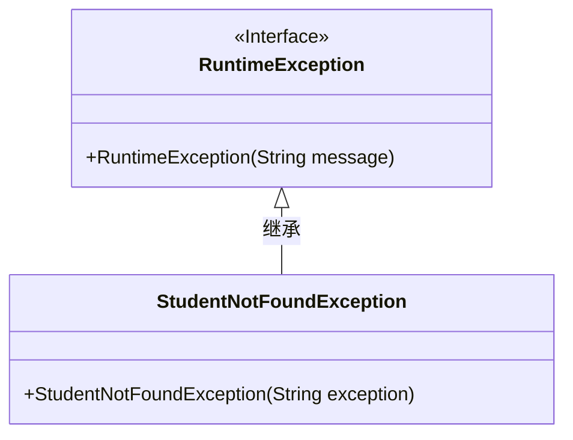
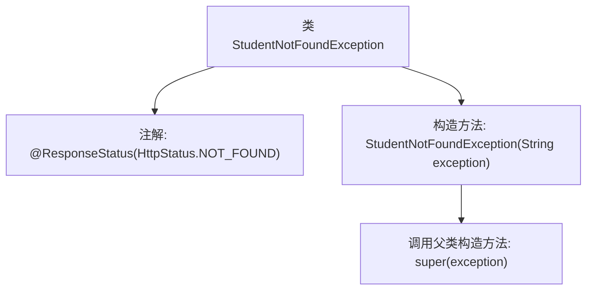

# 基础信息

|      |      |
|------|------|
| 名称 | StudentNotFoundException |
| 编码语言 | .java |
| 代码路径 | spring-boot-examples/spring-boot-2-rest-service-filtering/src/main/java/com/in28minutes/springboot/rest/example/student/StudentNotFoundException.java |
| 包名 | com.in28minutes.springboot.rest.example.student |
| 依赖项 | ['org.springframework.http.HttpStatus', 'org.springframework.web.bind.annotation.ResponseStatus'] |
| 概述说明 | StudentNotFoundException类继承RuntimeException，表示学生未找到异常。 |

# 说明

StudentNotFoundException类是一个用于表示学生未找到的异常类，它继承自RuntimeException。该异常类用于在程序中处理学生信息查找失败的情况，属于运行时异常，无需在编译时显式捕获或声明。通过继承RuntimeException，StudentNotFoundException可以在程序运行过程中抛出，帮助开发者快速定位和处理学生信息缺失的问题。

# 类列表 Class Summary

| 名称   | 类型  | 说明 |
|-------|------|-------------|
| StudentNotFoundException | class | StudentNotFoundException类表示学生未找到异常，继承RuntimeException。 |

## 类 StudentNotFoundException

|      |      |
|------|------|
| 访问范围 | @ResponseStatus(HttpStatus.NOT_FOUND);public |
| 类型 | class |
| 名称 | StudentNotFoundException |
| 说明 | StudentNotFoundException类表示学生未找到异常，继承RuntimeException。 |

### UML类图

**描述：**  
`StudentNotFoundException` 是一个自定义异常类，继承自 `RuntimeException`。它用于在找不到学生时抛出异常，并通过构造函数接收异常信息。类图中清晰地展示了 `StudentNotFoundException` 与 `RuntimeException` 之间的继承关系，表明 `StudentNotFoundException` 是一个运行时异常的子类。

### 内部方法调用关系图

这段代码定义了一个名为 `StudentNotFoundException` 的异常类，它继承自 `RuntimeException`。类上使用了 `@ResponseStatus(HttpStatus.NOT_FOUND)` 注解，表示当抛出此异常时，HTTP 响应状态码为 404（未找到）。类中包含一个构造方法，接收一个字符串参数 `exception`，并通过 `super(exception)` 调用父类的构造方法来初始化异常信息。

### 字段列表 Field List

| 名称  | 类型  | 说明 |
|-------|-------|------|

### 方法列表 Method List

| 名称  | 类型  | 说明 |
|-------|-------|------|

