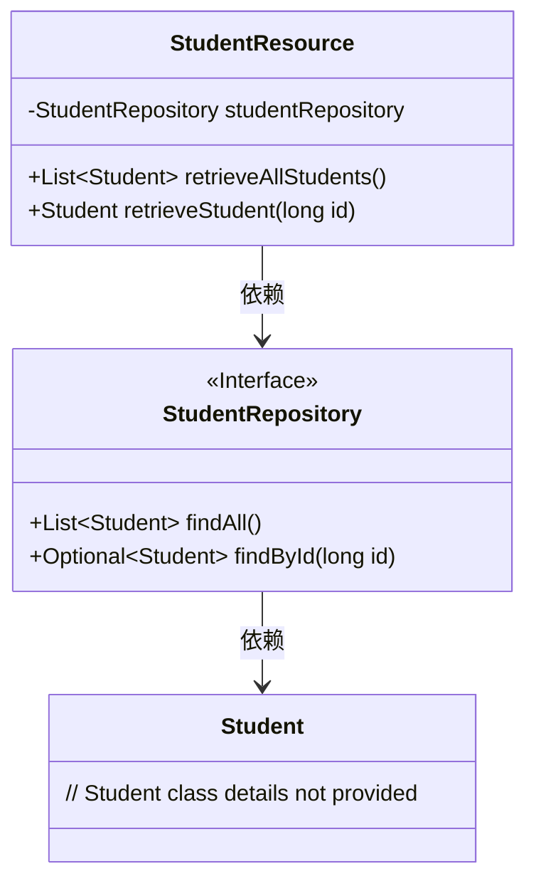
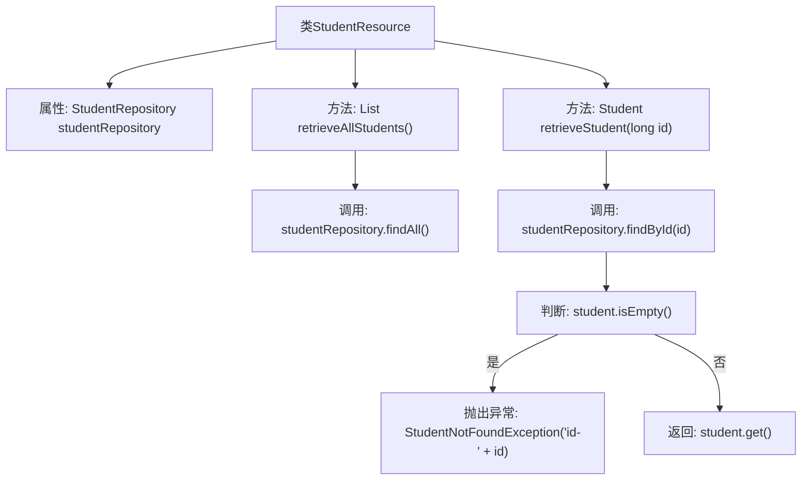

# 基础信息

|      |      |
|------|------|
| 名称 | StudentResource |
| 编码语言 | .java |
| 代码路径 | spring-boot-examples/spring-boot-2-rest-service-filtering/src/main/java/com/in28minutes/springboot/rest/example/student/StudentResource.java |
| 包名 | com.in28minutes.springboot.rest.example.student |
| 依赖项 | ['java.util.List', 'java.util.Optional', 'org.springframework.beans.factory.annotation.Autowired', 'org.springframework.web.bind.annotation.GetMapping', 'org.springframework.web.bind.annotation.PathVariable', 'org.springframework.web.bind.annotation.RequestMapping', 'org.springframework.web.bind.annotation.RestController'] |
| 概述说明 | 代码定义学生资源控制器，支持获取所有及单个学生信息的API接口。 |

# 说明

该代码实现了一个学生资源控制器，主要用于管理学生相关的数据操作。控制器提供了两个核心的API接口：一个用于获取所有学生的信息，另一个用于获取单个学生的详细信息。通过这两个接口，用户可以方便地查询学生数据，支持对学生的全面管理和访问。

# 类列表 Class Summary

| 名称   | 类型  | 说明 |
|-------|------|-------------|
| StudentResource | class | 该代码定义了一个学生资源控制器，提供获取所有学生和单个学生的API接口。 |

## 类 StudentResource

|      |      |
|------|------|
| 访问范围 | @RestController;@RequestMapping("/students");public |
| 类型 | class |
| 名称 | StudentResource |
| 说明 | 该代码定义了一个学生资源控制器，提供获取所有学生和单个学生的API接口。 |

### UML类图

**描述**：  
该代码定义了一个名为 `StudentResource` 的 REST 控制器类，用于处理与学生相关的 HTTP 请求。`StudentResource` 类依赖于 `StudentRepository` 接口，该接口提供了 `findAll` 和 `findById` 方法来检索学生数据。`StudentResource` 类通过 `retrieveAllStudents` 方法返回所有学生列表，通过 `retrieveStudent` 方法根据 ID 查找特定学生。如果学生不存在，则抛出 `StudentNotFoundException` 异常。

### 内部方法调用关系图

这段代码定义了一个Spring Boot的REST控制器`StudentResource`，用于处理与学生相关的HTTP请求。控制器通过`StudentRepository`与数据库交互，提供了两个GET请求处理方法：`retrieveAllStudents()`用于获取所有学生列表，`retrieveStudent(long id)`用于根据ID获取特定学生信息。如果找不到对应ID的学生，会抛出`StudentNotFoundException`异常。流程图展示了类的结构和方法之间的调用关系，清晰地反映了代码的执行流程。

### 字段列表 Field List

| 名称  | 类型  | 说明 |
|-------|-------|------|
| studentRepository | StudentRepository | 自动注入学生仓库实例。 |

### 方法列表 Method List

| 名称  | 类型  | 说明 |
|-------|-------|------|
| retrieveAllStudents | List<Student> | GET请求获取所有学生信息并返回列表。 |
| retrieveStudent | Student | 通过ID查询学生信息，若不存在则抛出异常。 |

