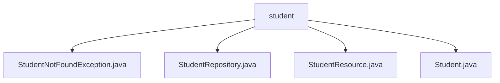

# 基础信息

|      |      |
|------|------|
| 名称 | student |
| 编码语言 | .java |
| 代码路径 | spring-boot-examples/spring-boot-2-rest-service-filtering/src/main/java/com/in28minutes/springboot/rest/example/student |
| 包名 | spring-boot-examples.spring-boot-2-rest-service-filtering.src.main.java.com.in28minutes.springboot.rest.example.student |
| 概述说明 | StudentNotFoundException用于处理学生查找失败，继承RuntimeException。StudentRepository管理学生数据，提供查询接口。Student类包含id和name，忽略passportNumber。 |

# 说明

## 概述

该代码模块是一个基于Spring Boot的REST服务示例，主要用于管理和访问学生信息。模块包括学生数据模型、资源控制器、数据仓库以及自定义异常处理，旨在提供对学生信息的查询和管理功能。通过REST API，用户可以获取所有学生的信息或单个学生的详细信息。模块还通过自定义异常类`StudentNotFoundException`来处理学生信息查找失败的情况，确保程序的健壮性和可维护性。

## 主要业务场景

1. **学生信息查询**：
   - 通过`StudentResource`控制器提供的API接口，用户可以获取所有学生的列表或单个学生的详细信息。
   - 支持对学生信息的全面访问和管理。

2. **异常处理**：
   - 当查找学生信息失败时，`StudentNotFoundException`异常会被抛出，帮助开发者快速定位和处理学生信息缺失的问题。
   - 该异常继承自`RuntimeException`，无需在编译时显式捕获或声明。

3. **数据管理**：
   - `Student`类定义了学生数据模型，包含`id`和`name`字段，用于标识和描述学生对象。
   - `passportNumber`字段被忽略，可能是出于隐私或数据管理的考虑，避免存储敏感信息。

4. **数据仓库**：
   - `StudentRepository`负责学生数据的具体操作，提供对学生信息的增删改查功能，支持对数据的持久化和管理。

通过以上业务场景，该模块实现了对学生信息的高效管理和访问，同时确保了数据的安全性和程序的稳定性。

### 包内部结构视图

该流程图展示了`student`目录下的文件层级关系。`student`作为根节点，包含了四个子节点，分别是`StudentNotFoundException.java`、`StudentRepository.java`、`StudentResource.java`和`Student.java`。这些文件均位于同一目录下，且没有进一步的嵌套层级。

# 文件列表 File List

| 名称   | 类型  | 说明 |
|-------|------|-------------|
| [StudentNotFoundException.java](StudentNotFoundException.md) | file | StudentNotFoundException类继承RuntimeException，表示学生未找到异常。 |
| [Student.java](Student.md) | file | Student类有id、name字段，忽略passportNumber。 |
| [StudentResource.java](StudentResource.md) | file | 代码定义学生资源控制器，支持获取所有及单个学生信息的API接口。 |
| [StudentRepository.java](StudentRepository.md) | file | 输入内容为空，无法生成概要描述。 |

