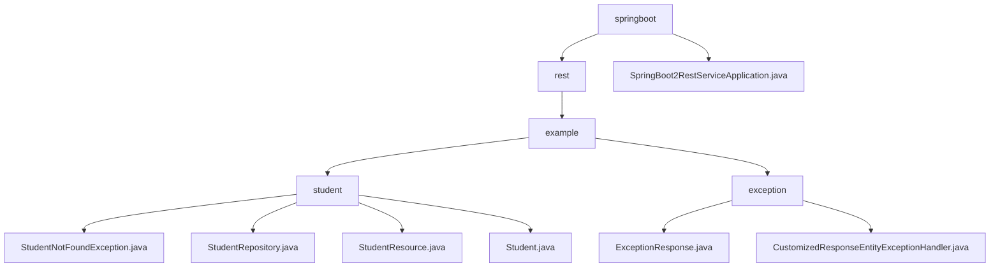

# 基础信息

|      |      |
|------|------|
| 名称 | springboot |
| 编码语言 | .java |
| 代码路径 | spring-boot-examples/spring-boot-2-rest-service-validation/src/main/java/com/in28minutes/springboot |
| 包名 | spring-boot-examples.spring-boot-2-rest-service-validation.src.main.java.com.in28minutes.springboot |
| 概述说明 | Spring Boot学生信息管理系统，支持增删改查，包含异常处理和数据验证。 |

# 说明

## 概述

该代码模块是一个基于Spring Boot的学生信息管理系统，旨在提供对学生信息的增删改查操作。模块包含多个关键组件，包括学生实体类、学生资源控制器、学生仓库接口以及自定义异常处理机制。通过这些组件的协作，系统能够高效地管理学生信息，并提供清晰的错误处理和日志记录，确保数据的安全性和完整性。此外，模块还实现了全局异常处理、特定业务异常处理以及参数验证失败异常处理，增强了系统的健壮性和用户友好性。

## 主要业务场景

1. **学生信息管理**：系统通过学生资源控制器实现对学生信息的增删改查操作。具体功能包括添加新学生记录、查询现有学生信息、修改学生数据以及删除学生记录。
2. **异常处理**：当系统检测到学生不存在时，会抛出`StudentNotFoundException`异常，并返回404状态码，表示资源未找到。这种设计有助于在应用程序中明确处理特定错误场景，提高代码的可读性和可维护性。
3. **数据验证**：`Student`类包含验证方法，用于确保学生属性的有效性和完整性。这些属性包括`id`、`name`和`passportNumber`，通过构造方法在创建对象时进行初始化，确保数据的准确性和一致性。
4. **数据持久化**：`StudentRepository`接口负责与学生数据进行交互，提供数据持久化功能，确保学生信息能够被有效地存储和检索。
5. **全局异常处理**：模块中的`CustomizedResponseEntityExceptionHandler`类负责处理所有未预见的异常，确保系统在遇到未知错误时能够提供统一的错误响应。
6. **参数验证失败异常**：用于处理输入参数不符合预期的情况，当用户输入的参数不符合业务逻辑或验证规则时，系统能够捕获并返回相应的错误信息，确保数据的有效性和一致性。
7. **应用启动**：Spring Boot应用的主类负责启动REST服务，通过Spring Boot的内置功能自动配置和启动Web服务器，使得开发者能够快速构建和部署RESTful API。应用启动后，将监听指定端口，处理HTTP请求，并返回相应的响应。

通过以上业务场景，该模块不仅实现了学生信息的高效管理，还提供了全面的异常处理机制，确保系统在面对各种异常情况时能够提供清晰、一致的错误处理，从而提升系统的稳定性和用户体验。

### 包内部结构视图

该流程图展示了Spring Boot项目中路径的层级关系。从`springboot`节点开始，分为`rest`和`SpringBoot2RestServiceApplication.java`两个分支。`rest`节点进一步分为`example`，`example`节点下又分为`student`和`exception`。`student`节点包含四个Java文件，`exception`节点包含两个Java文件。

# 文件列表 File List

| 名称   | 类型  | 说明 |
|-------|------|-------------|
| [rest](rest/_module.md) | package | Spring Boot学生信息管理系统，支持增删改查，包含异常处理和数据验证。 |

