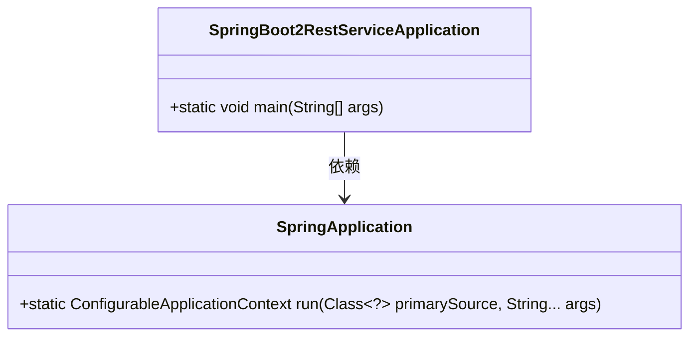
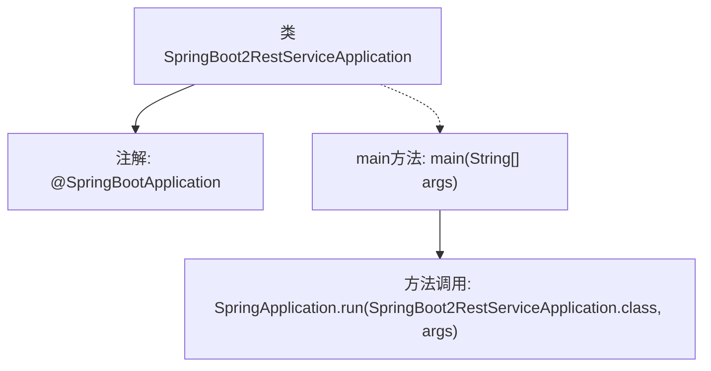

# 基础信息

|      |      |
|------|------|
| 名称 | SpringBoot2RestServiceApplication |
| 编码语言 | .java |
| 代码路径 | spring-boot-examples/spring-boot-2-rest-service-validation/src/main/java/com/in28minutes/springboot/rest/example/SpringBoot2RestServiceApplication.java |
| 包名 | com.in28minutes.springboot.rest.example |
| 依赖项 | ['org.springframework.boot.SpringApplication', 'org.springframework.boot.autoconfigure.SpringBootApplication'] |
| 概述说明 | Spring Boot主类启动REST服务。 |

# 说明

Spring Boot应用的主类负责启动REST服务。该类作为应用程序的入口点，通过Spring Boot的内置功能自动配置和启动Web服务器，使得开发者能够快速构建和部署RESTful API。主类通常包含@SpringBootApplication注解，该注解组合了@Configuration、@EnableAutoConfiguration和@ComponentScan，简化了配置和组件扫描过程。启动后，应用将监听指定端口，处理HTTP请求，并返回相应的响应。

# 类列表 Class Summary

| 名称   | 类型  | 说明 |
|-------|------|-------------|
| SpringBoot2RestServiceApplication | class | Spring Boot应用主类，启动REST服务。 |

## 类 SpringBoot2RestServiceApplication

|      |      |
|------|------|
| 访问范围 | @SpringBootApplication;public |
| 类型 | class |
| 名称 | SpringBoot2RestServiceApplication |
| 说明 | Spring Boot应用主类，启动REST服务。 |

### UML类图

**描述：**  
`SpringBoot2RestServiceApplication` 是一个 Spring Boot 应用的主类，通过 `@SpringBootApplication` 注解标记为 Spring Boot 应用的入口。该类包含一个 `main` 方法，用于启动 Spring Boot 应用。`main` 方法调用 `SpringApplication` 类的 `run` 方法，该方法负责启动 Spring 应用上下文并返回一个 `ConfigurableApplicationContext` 对象。`SpringBoot2RestServiceApplication` 依赖于 `SpringApplication` 类来完成应用的启动过程。

### 内部方法调用关系图

这段代码定义了一个Spring Boot应用程序的入口类`SpringBoot2RestServiceApplication`，并通过`@SpringBootApplication`注解标记该类为Spring Boot应用的主配置类。`main`方法中调用`SpringApplication.run`来启动Spring Boot应用，传入当前类和命令行参数。该流程展示了Spring Boot应用的启动过程，从类定义到应用启动的完整步骤。

### 字段列表 Field List

| 名称  | 类型  | 说明 |
|-------|-------|------|

### 方法列表 Method List

| 名称  | 类型  | 说明 |
|-------|-------|------|
| main | void | Spring Boot应用启动类，运行主程序。 |

