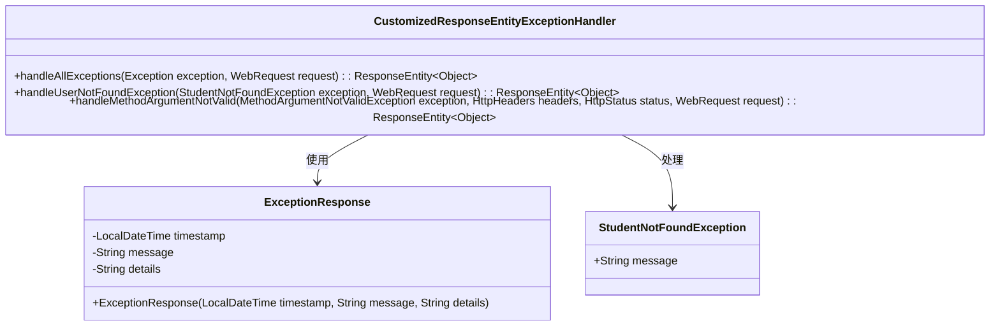
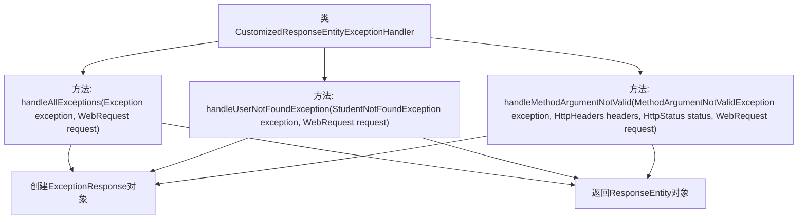

# 基础信息

|      |      |
|------|------|
| 名称 | CustomizedResponseEntityExceptionHandler |
| 编码语言 | .java |
| 代码路径 | spring-boot-examples/spring-boot-2-rest-service-validation/src/main/java/com/in28minutes/springboot/rest/example/exception/CustomizedResponseEntityExceptionHandler.java |
| 包名 | com.in28minutes.springboot.rest.example.exception |
| 依赖项 | ['java.time.LocalDateTime', 'org.springframework.http.HttpHeaders', 'org.springframework.http.HttpStatus', 'org.springframework.http.ResponseEntity', 'org.springframework.web.bind.MethodArgumentNotValidException', 'org.springframework.web.bind.annotation.ExceptionHandler', 'org.springframework.web.bind.annotation.RestControllerAdvice', 'org.springframework.web.context.request.WebRequest', 'org.springframework.web.servlet.mvc.method.annotation.ResponseEntityExceptionHandler', 'com.in28minutes.springboot.rest.example.student.StudentNotFoundException'] |
| 概述说明 | 自定义异常类处理全局、学生未找到及参数验证失败异常。 |

# 说明

自定义异常处理类用于处理全局异常、学生未找到异常及参数验证失败异常。该类能够捕获并处理应用程序中可能出现的各种异常情况，确保系统在遇到错误时能够提供明确的反馈和适当的处理机制。全局异常处理涵盖所有未预见的错误，学生未找到异常专门处理与查找学生相关的错误，参数验证失败异常则用于处理输入参数不符合预期的情况。通过这种方式，系统能够更加健壮和用户友好。

# 类列表 Class Summary

| 名称   | 类型  | 说明 |
|-------|------|-------------|
| CustomizedResponseEntityExceptionHandler | class | 自定义异常处理类，处理全局异常、学生未找到异常及参数验证失败异常。 |

## 类 CustomizedResponseEntityExceptionHandler

|      |      |
|------|------|
| 访问范围 | @RestControllerAdvice;public |
| 类型 | class |
| 名称 | CustomizedResponseEntityExceptionHandler |
| 说明 | 自定义异常处理类，处理全局异常、学生未找到异常及参数验证失败异常。 |

### UML类图

**描述：**
`CustomizedResponseEntityExceptionHandler` 类是一个全局异常处理器，继承自 `ResponseEntityExceptionHandler`。它通过 `@ExceptionHandler` 注解捕获并处理不同类型的异常，包括通用异常 `Exception`、自定义异常 `StudentNotFoundException` 以及验证失败异常 `MethodArgumentNotValidException`。处理后的异常信息被封装在 `ExceptionResponse` 对象中，并返回相应的 HTTP 状态码。`ExceptionResponse` 类用于存储异常的时间戳、消息和详细信息。

### 内部方法调用关系图

这段代码定义了一个`CustomizedResponseEntityExceptionHandler`类，用于处理不同类型的异常。它包含三个方法：`handleAllExceptions`用于处理所有异常，`handleUserNotFoundException`用于处理`StudentNotFoundException`异常，`handleMethodArgumentNotValid`用于处理`MethodArgumentNotValidException`异常。每个方法都会创建一个`ExceptionResponse`对象，并返回一个包含该对象和相应HTTP状态码的`ResponseEntity`对象。

### 字段列表 Field List

| 名称  | 类型  | 说明 |
|-------|-------|------|

### 方法列表 Method List

| 名称  | 类型  | 说明 |
|-------|-------|------|
| handleMethodArgumentNotValid | ResponseEntity<Object> | 处理参数验证失败，返回错误响应及状态码。 |
| handleAllExceptions | ResponseEntity<Object> | 处理所有异常，返回包含时间、消息和请求描述的响应实体，状态码为500。 |
| handleUserNotFoundException | ResponseEntity<Object> | 处理学生未找到异常，返回包含时间、消息和请求详情的响应实体。 |

