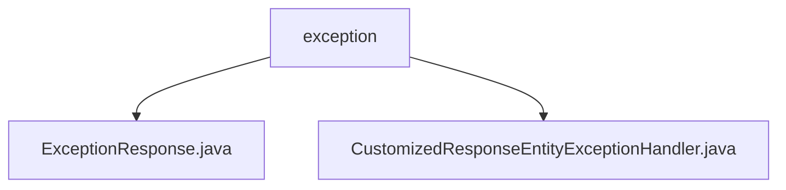

# 基础信息

|      |      |
|------|------|
| 名称 | exception |
| 编码语言 | .java |
| 代码路径 | spring-boot-examples/spring-boot-2-rest-service-validation/src/main/java/com/in28minutes/springboot/rest/example/exception |
| 包名 | spring-boot-examples.spring-boot-2-rest-service-validation.src.main.java.com.in28minutes.springboot.rest.example.exception |
| 概述说明 | 自定义异常处理类，处理全局、学生未找到及参数验证失败异常。 |

# 说明

## 概述
该代码模块主要涉及Spring Boot应用程序中的异常处理机制。通过自定义异常处理类，模块能够捕获并处理应用程序中可能出现的各种异常情况，确保系统在遇到错误时能够提供明确的反馈和适当的处理机制。模块涵盖了全局异常处理、特定业务异常（如学生未找到异常）以及参数验证失败异常的处理。

## 主要业务场景
1. **全局异常处理**：模块中的`CustomizedResponseEntityExceptionHandler`类负责处理所有未预见的异常，确保系统在遇到未知错误时能够提供统一的错误响应。
2. **学生未找到异常**：专门处理与查找学生相关的错误，当系统尝试查找一个不存在的学生时，能够捕获并返回相应的错误信息。
3. **参数验证失败异常**：用于处理输入参数不符合预期的情况，当用户输入的参数不符合业务逻辑或验证规则时，系统能够捕获并返回相应的错误信息，确保数据的有效性和一致性。

通过这种方式，模块增强了系统的健壮性和用户友好性，使得应用程序在面对各种异常情况时能够提供清晰、一致的错误处理机制。

### 包内部结构视图

该流程图展示了`exception`文件夹与其包含的两个Java文件之间的层级关系。`exception`作为父节点，包含了`ExceptionResponse.java`和`CustomizedResponseEntityExceptionHandler.java`两个子节点，清晰地反映了文件结构中的从属关系。

# 文件列表 File List

| 名称   | 类型  | 说明 |
|-------|------|-------------|
| [CustomizedResponseEntityExceptionHandler.java](CustomizedResponseEntityExceptionHandler.md) | file | 自定义异常类处理全局、学生未找到及参数验证失败异常。 |
| [ExceptionResponse.java](ExceptionResponse.md) | file | 信息为空，无法生成概要描述。 |

