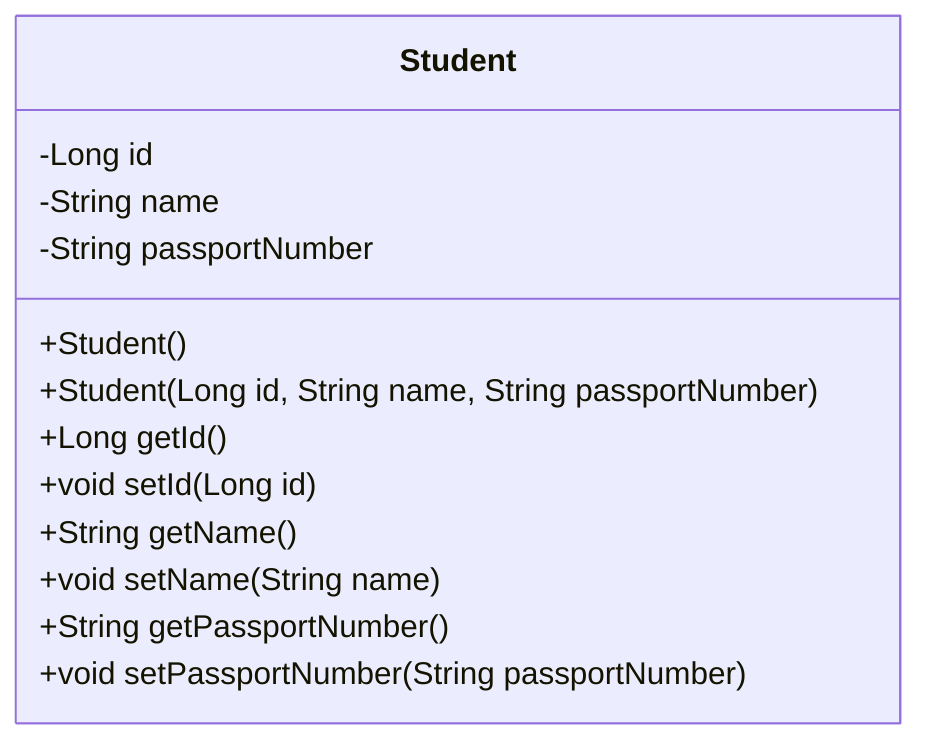
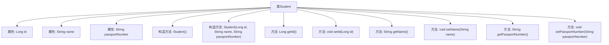

# 基础信息

|      |      |
|------|------|
| 名称 | Student |
| 编码语言 | .java |
| 代码路径 | spring-boot-examples/spring-boot-2-rest-service-validation/src/main/java/com/in28minutes/springboot/rest/example/student/Student.java |
| 包名 | com.in28minutes.springboot.rest.example.student |
| 依赖项 | ['jakarta.persistence.Entity', 'jakarta.persistence.GeneratedValue', 'jakarta.persistence.Id', 'jakarta.validation.constraints.NotNull', 'jakarta.validation.constraints.Size'] |
| 概述说明 | Student类含id、name、passportNumber属性，具备验证和构造方法。 |

# 说明

Student类包含三个主要属性：id、name和passportNumber。该类提供了验证方法，用于确保这些属性的有效性和完整性。此外，Student类还包含构造方法，用于在创建对象时初始化这些属性。通过这些设计，Student类能够有效地管理和维护学生的基本信息，确保数据的准确性和一致性。

# 类列表 Class Summary

| 名称   | 类型  | 说明 |
|-------|------|-------------|
| Student | class | Student类包含id、name和passportNumber属性，带有验证和构造方法。 |

## 类 Student

|      |      |
|------|------|
| 访问范围 | @Entity;public |
| 类型 | class |
| 名称 | Student |
| 说明 | Student类包含id、name和passportNumber属性，带有验证和构造方法。 |

### UML类图

这段代码定义了一个名为 `Student` 的实体类，用于表示学生信息。该类包含三个私有属性：`id`、`name` 和 `passportNumber`，分别表示学生的唯一标识、姓名和护照号码。类中提供了无参构造器和带参构造器，以及每个属性的 `getter` 和 `setter` 方法，用于访问和修改这些属性。通过 `@Entity` 注解，该类被标记为 JPA 实体，可以持久化到数据库中。`@Id` 和 `@GeneratedValue` 注解用于指定 `id` 为主键并自动生成。`@NotNull` 和 `@Size` 注解用于对 `name` 和 `passportNumber` 进行验证，确保其符合指定的约束条件。

### 内部方法调用关系图

这段代码定义了一个名为 `Student` 的实体类，包含三个属性：`id`、`name` 和 `passportNumber`。类中提供了两个构造方法，一个无参构造方法和一个带参构造方法，用于初始化对象。此外，类中还为每个属性提供了对应的 `getter` 和 `setter` 方法，用于访问和修改属性值。代码通过注解 `@Entity` 标记该类为实体类，并使用 `@Id` 和 `@GeneratedValue` 注解标识 `id` 为主键并自动生成。`@NotNull` 和 `@Size` 注解用于对 `name` 和 `passportNumber` 属性进行约束，确保其值不为空且满足最小长度要求。

### 字段列表 Field List

| 名称  | 类型  | 说明 |
|-------|-------|------|
| id | Long | 实体类中定义了自动生成的长整型ID字段。 |
| passportNumber | String | 护照号至少7个字符，不能为空。 |
| name | String | 名称至少需包含2个字符。 |

### 方法列表 Method List

| 名称  | 类型  | 说明 |
|-------|-------|------|
| getName | String | 返回字符串类型的name值。 |
| getId | Long | 该方法返回长整型变量id的值。 |
| getPassportNumber | String | 获取护照号码的方法。 |
| setId | void | 设置对象ID的方法。 |
| setPassportNumber | void | 设置护照号码的方法，将输入值赋给类变量。 |
| setName | void | 方法setName用于设置对象的名字属性。 |

