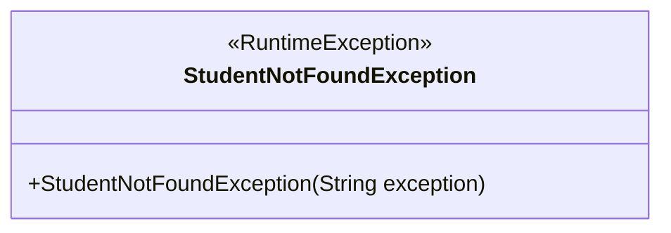
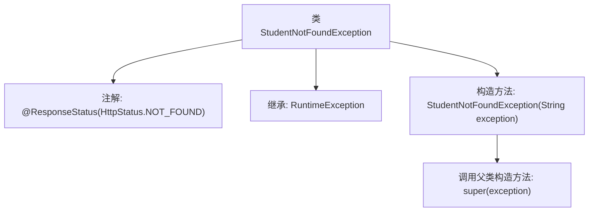

# 基础信息

|      |      |
|------|------|
| 名称 | StudentNotFoundException |
| 编码语言 | .java |
| 代码路径 | spring-boot-examples/spring-boot-2-rest-service-validation/src/main/java/com/in28minutes/springboot/rest/example/student/StudentNotFoundException.java |
| 包名 | com.in28minutes.springboot.rest.example.student |
| 依赖项 | ['org.springframework.http.HttpStatus', 'org.springframework.web.bind.annotation.ResponseStatus'] |
| 概述说明 | 自定义异常类处理学生未找到，返回404状态码。 |

# 说明

自定义异常类用于处理学生未找到的情况，当系统检测到学生不存在时，会抛出该异常，并返回404状态码，表示资源未找到。这种设计有助于在应用程序中明确处理特定错误场景，提高代码的可读性和可维护性。

# 类列表 Class Summary

| 名称   | 类型  | 说明 |
|-------|------|-------------|
| StudentNotFoundException | class | 自定义异常类，处理学生未找到情况，返回404状态码。 |

## 类 StudentNotFoundException

|      |      |
|------|------|
| 访问范围 | @ResponseStatus(HttpStatus.NOT_FOUND);public |
| 类型 | class |
| 名称 | StudentNotFoundException |
| 说明 | 自定义异常类，处理学生未找到情况，返回404状态码。 |

### UML类图

这段代码定义了一个名为 `StudentNotFoundException` 的类，该类继承自 `RuntimeException`。`StudentNotFoundException` 类是一个自定义的异常类，用于表示当学生资源未找到时抛出的异常。该类包含一个构造函数，接受一个字符串参数 `exception`，并将其传递给父类 `RuntimeException` 的构造函数。通过继承 `RuntimeException`，`StudentNotFoundException` 类具备了运行时异常的所有特性，可以在程序中抛出并捕获。

### 内部方法调用关系图

这段代码定义了一个名为`StudentNotFoundException`的异常类，它继承自`RuntimeException`，并使用了`@ResponseStatus(HttpStatus.NOT_FOUND)`注解，表示当该异常被抛出时，HTTP响应状态码为404。类中包含一个构造方法，接受一个字符串参数`exception`，并调用父类的构造方法进行初始化。该异常类通常用于处理学生信息未找到的场景。

### 字段列表 Field List

| 名称  | 类型  | 说明 |
|-------|-------|------|

### 方法列表 Method List

| 名称  | 类型  | 说明 |
|-------|-------|------|

