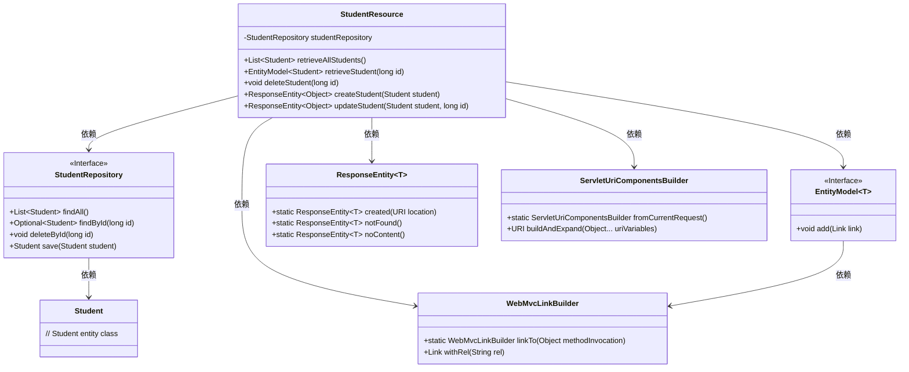

# 基础信息

|      |      |
|------|------|
| 名称 | StudentResource |
| 编码语言 | .java |
| 代码路径 | spring-boot-examples/spring-boot-2-rest-service-validation/src/main/java/com/in28minutes/springboot/rest/example/student/StudentResource.java |
| 包名 | com.in28minutes.springboot.rest.example.student |
| 依赖项 | ['org.springframework.hateoas.server.mvc.WebMvcLinkBuilder.linkTo', 'org.springframework.hateoas.server.mvc.WebMvcLinkBuilder.methodOn', 'java.net.URI', 'java.util.List', 'java.util.Optional', 'jakarta.validation.Valid', 'org.springframework.beans.factory.annotation.Autowired', 'org.springframework.hateoas.EntityModel', 'org.springframework.hateoas.server.mvc.WebMvcLinkBuilder', 'org.springframework.http.ResponseEntity', 'org.springframework.web.bind.annotation.DeleteMapping', 'org.springframework.web.bind.annotation.GetMapping', 'org.springframework.web.bind.annotation.PathVariable', 'org.springframework.web.bind.annotation.PostMapping', 'org.springframework.web.bind.annotation.PutMapping', 'org.springframework.web.bind.annotation.RequestBody', 'org.springframework.web.bind.annotation.RequestMapping', 'org.springframework.web.bind.annotation.RestController', 'org.springframework.web.servlet.support.ServletUriComponentsBuilder'] |
| 概述说明 | 学生资源控制器实现增删改查功能。 |

# 说明

学生资源控制器负责实现对学生信息的增删改查操作。该控制器通过接收请求，处理数据，并调用相应的服务层方法，完成对学生信息的创建、读取、更新和删除。具体功能包括添加新学生记录、查询现有学生信息、修改学生数据以及删除学生记录。控制器确保操作的安全性和数据的完整性，同时提供清晰的错误处理和日志记录，以便于维护和调试。

# 类列表 Class Summary

| 名称   | 类型  | 说明 |
|-------|------|-------------|
| StudentResource | class | 学生资源控制器实现增删改查操作。 |

## 类 StudentResource

|      |      |
|------|------|
| 访问范围 | @RestController;@RequestMapping("/students");public |
| 类型 | class |
| 名称 | StudentResource |
| 说明 | 学生资源控制器实现增删改查操作。 |

### UML类图

这段代码定义了一个Spring Boot的REST控制器`StudentResource`，用于处理学生信息的增删改查操作。`StudentResource`依赖于`StudentRepository`接口来访问数据库，并使用`EntityModel`和`ResponseEntity`来构建HTTP响应。`WebMvcLinkBuilder`和`ServletUriComponentsBuilder`用于生成HATEOAS链接和URI。

### 内部方法调用关系图

```mermaid
graph TD
    A["类StudentResource"]
    B["属性: StudentRepository studentRepository"]
    C["方法: List<Student> retrieveAllStudents()"]
    D["方法: EntityModel<Student> retrieveStudent(long id)"]
    E["方法: void deleteStudent(long id)"]
    F["方法: ResponseEntity<Object> createStudent(Student student)"]
    G["方法: ResponseEntity<Object> updateStudent(Student student, long id)"]
    H["StudentRepository: List<Student> findAll()"]
    I["StudentRepository: Optional<Student> findById(long id)"]
    J["StudentRepository: void deleteById(long id)"]
    K["StudentRepository: Student save(Student student)"]
    L["StudentNotFoundException: 抛出异常"]
    M["EntityModel: EntityModel<Student> of(Student student)"]
    N["WebMvcLinkBuilder: linkTo(methodOn(Class<?> clazz))"]
    O["EntityModel: add(Link link)"]
    P["ServletUriComponentsBuilder: URI fromCurrentRequest().path(String path)"]
    Q["ResponseEntity: ResponseEntity<Object> created(URI location)"]
    R["ResponseEntity: ResponseEntity<Object> notFound()"]
    S["ResponseEntity: ResponseEntity<Object> noContent()"]

    A --> B
    A --> C
    A --> D
    A --> E
    A --> F
    A --> G
    C --> H
    D --> I
    D --> L
    D --> M
    D --> N
    D --> O
    E --> J
    F --> K
    F --> P
    F --> Q
    G --> I
    G --> R
    G --> K
    G --> S
```

这段代码定义了一个`StudentResource`类，它是一个REST控制器，用于处理与学生相关的HTTP请求。类中包含了多个方法，分别用于获取所有学生、获取特定学生、删除学生、创建学生和更新学生信息。每个方法都与`StudentRepository`进行交互，执行数据库操作。代码中还使用了`EntityModel`和`WebMvcLinkBuilder`来构建响应资源，并通过`ResponseEntity`返回HTTP状态码。流程图展示了类中方法的调用关系以及与外部类的交互。

### 字段列表 Field List

| 名称  | 类型  | 说明 |
|-------|-------|------|
| studentRepository | StudentRepository | 自动注入学生仓库实例。 |

### 方法列表 Method List

| 名称  | 类型  | 说明 |
|-------|-------|------|
| createStudent | ResponseEntity<Object> | 创建学生信息并返回响应实体。 |
| retrieveAllStudents | List<Student> | 获取所有学生信息的API接口。 |
| deleteStudent | void | 删除指定ID的学生记录。 |
| retrieveStudent | EntityModel<Student> | 通过ID获取学生信息，若不存在则抛出异常，并添加获取所有学生链接。 |
| updateStudent | ResponseEntity<Object> | 通过ID更新学生信息，若不存在则返回404，否则保存并返回204。 |

