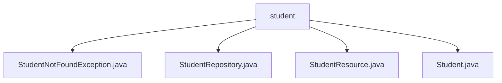

# 基础信息

|      |      |
|------|------|
| 名称 | student |
| 编码语言 | .java |
| 代码路径 | spring-boot-examples/spring-boot-2-rest-service-validation/src/main/java/com/in28minutes/springboot/rest/example/student |
| 包名 | spring-boot-examples.spring-boot-2-rest-service-validation.src.main.java.com.in28minutes.springboot.rest.example.student |
| 概述说明 | 自定义异常类处理学生未找到，返回404。控制器管理学生增删改查，确保安全与数据完整。Student类管理学生基本信息，验证属性有效性。 |

# 说明

## 概述
该代码模块是一个基于Spring Boot的学生信息管理系统，主要用于对学生信息进行增删改查操作。模块包含自定义异常类、学生实体类、学生资源控制器以及学生仓库接口。通过这些组件的协作，系统能够有效地管理学生信息，并提供清晰的错误处理和日志记录，确保数据的安全性和完整性。

## 主要业务场景
1. **学生信息管理**：系统通过学生资源控制器实现对学生信息的增删改查操作。具体功能包括添加新学生记录、查询现有学生信息、修改学生数据以及删除学生记录。
2. **异常处理**：当系统检测到学生不存在时，会抛出`StudentNotFoundException`异常，并返回404状态码，表示资源未找到。这种设计有助于在应用程序中明确处理特定错误场景，提高代码的可读性和可维护性。
3. **数据验证**：`Student`类包含验证方法，用于确保学生属性的有效性和完整性。这些属性包括`id`、`name`和`passportNumber`，通过构造方法在创建对象时进行初始化，确保数据的准确性和一致性。
4. **数据持久化**：`StudentRepository`接口负责与学生数据进行交互，提供数据持久化功能，确保学生信息能够被有效地存储和检索。

### 包内部结构视图

该流程图展示了Spring Boot项目中`student`目录下的文件结构。`student`作为根节点，包含了四个文件：`StudentNotFoundException.java`、`StudentRepository.java`、`StudentResource.java`和`Student.java`。这些文件分别用于处理学生数据的异常、存储、资源管理和实体定义，共同构成了一个完整的REST服务验证模块。

# 文件列表 File List

| 名称   | 类型  | 说明 |
|-------|------|-------------|
| [StudentResource.java](StudentResource.md) | file | 学生资源控制器实现增删改查功能。 |
| [StudentNotFoundException.java](StudentNotFoundException.md) | file | 自定义异常类处理学生未找到，返回404状态码。 |
| [Student.java](Student.md) | file | Student类含id、name、passportNumber属性，具备验证和构造方法。 |
| [StudentRepository.java](StudentRepository.md) | file | 信息为空，无法生成概要描述。 |

